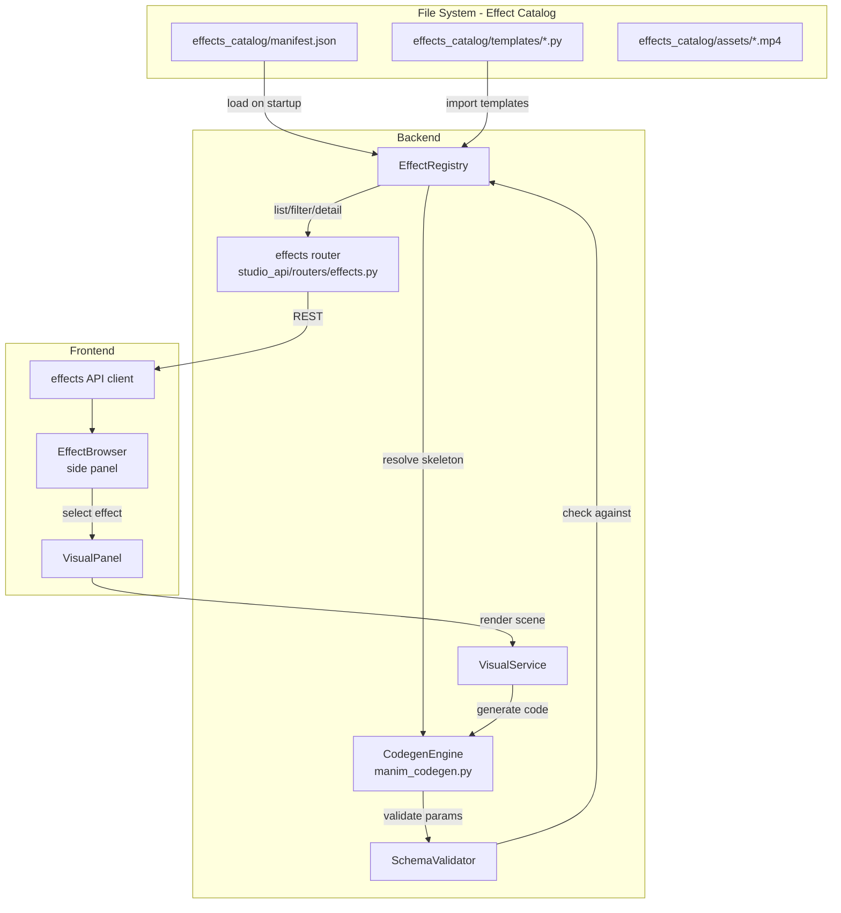
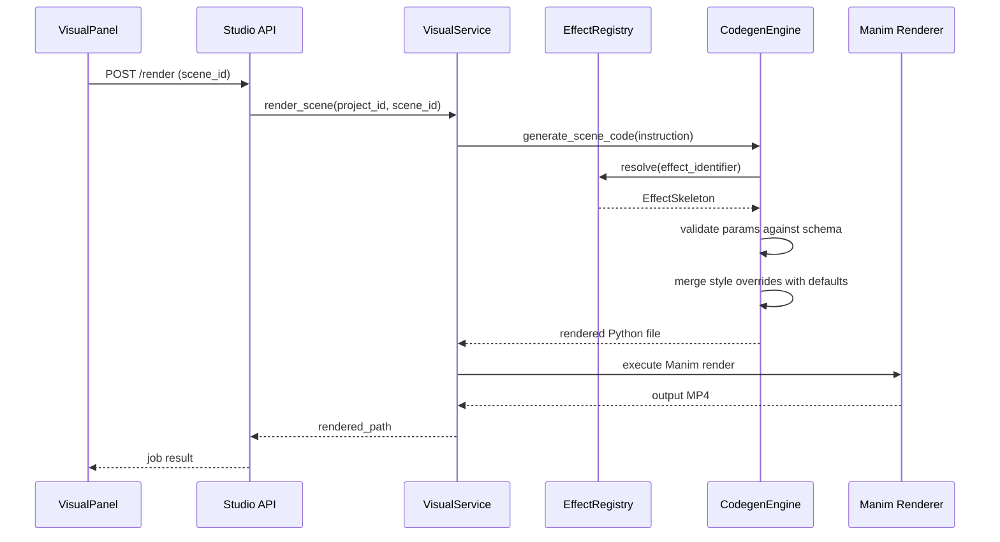
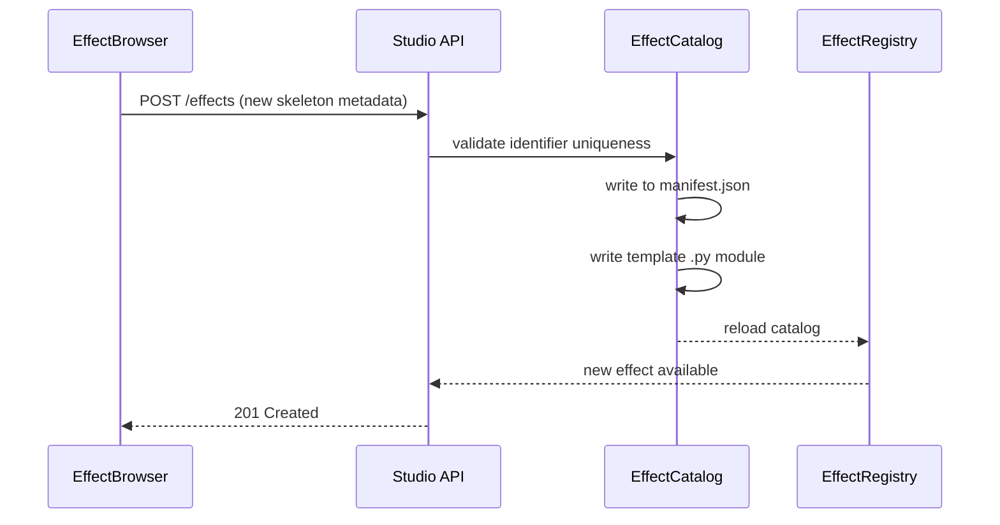
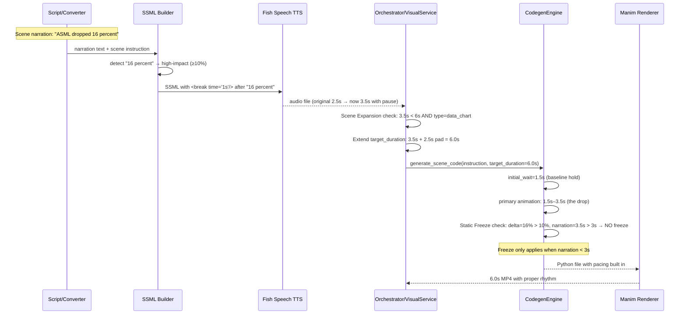

# Design Document: Animation Effects Library

## Overview

The Animation Effects Library extracts the hardcoded generator dispatch dictionary in `manim_codegen.py` into a catalog-driven, extensible system. Each animation effect becomes a self-contained skeleton — a parameterized Manim scene template with metadata, parameter schema, preview config, and a reference video. The catalog is a file-based store (JSON manifest + Python modules + MP4 assets) that the registry loads at startup and exposes through the API for browsing, filtering, and codegen dispatch.

The library introduces eight new finance-specific effects (PDF Forensic, Forensic Zoom, Volatility Shadow, Relative Velocity, Contextual Heatmap, Bull/Bear Projection, Moat Radar, Atomic Reveal) alongside the 17 existing scene types migrated as pre-registered skeletons. Eight additional cinematic/narrative effects (Liquidity Shock, Momentum Glow, Regime Shift, Speed Ramp, Capital Flow, Compounding Explosion, Market Share Territory, Historical Rank) extend the library with attention-direction overlays, motion language, and perceptual data visualizations. The frontend gains an Effect Browser panel accessible from the Visual Panel for discovering, previewing, and applying effects to scenes.

### Core Objectives

1. Replace the hardcoded `generators` dict in `generate_scene_code()` with a dynamic registry backed by the file-based catalog
2. Define a standard Effect Skeleton format that captures metadata, parameter schema, Manim template, preview config, reference video, sync points, and quality profiles
3. Migrate all 17 existing scene generators to the skeleton format without breaking existing video scripts
4. Add 8 new finance-specific effect skeletons (Req 9-16)
5. Expose the catalog through REST API endpoints for browsing, filtering, and detail retrieval
6. Build an Effect Browser UI component in the Visual Panel for discovery and application
7. Support organic library growth via a save-as-effect extraction workflow
8. Align animation beats to narration timestamps via sync_points (Req 17)
9. Support draft vs production render quality profiles optimized for M4 hardware (Req 18)
10. Provide a LegacyMapper for bulletproof backward compatibility with existing scene type strings (Req 19)
11. Implement narrative-aware pacing: scene expansion, pre-drawing initial wait, forensic slow-mo jump-cut, SSML data pauses, and static freeze for high-delta data points (Req 20-24)
12. Add 8 cinematic/narrative effect skeletons (Req 25-32) covering attention-direction overlays (liquidity_shock, regime_shift, capital_flow, compounding_explosion), motion language (momentum_glow, speed_ramp), and perceptual data effects (market_share_territory, historical_rank)

### Design Principles

- **File-Based Catalog**: JSON manifest + Python modules + MP4 assets — version-controlled alongside the codebase, no database migration
- **Backward Compatibility**: Existing `Scene_Instruction` formats continue to work unchanged; the registry maps old type strings to skeleton identifiers
- **Progressive Enhancement**: New effects are additive; the core codegen pipeline gains extensibility without rewriting
- **Manim Standards Compliance**: All effects follow the product animation standards — `MovingCameraScene` for camera tracking, `Indicate()` for highlights, `VGroup` for grouping, progressive build-up animations
- **Zero Stock Footage**: Every effect produces code-generated Manim output; no generic AI stock footage
- **Narrative-Aware Pacing**: High-impact data beats get automatic breathing room through a layered system — scene expansion at the orchestrator level, initial_wait at the codegen level, SSML pauses at the audio level, and static freeze at the render level. The "Calm" in Calm Capitalist is a pacing contract, not just a tone suggestion.

## Architecture

### System Architecture



### Data Flow: Scene Rendering with Effect Library



### Data Flow: Save Custom Effect



### Data Flow: Narrative-Aware Pacing Pipeline

The pacing system operates across four layers, each adding breathing room independently. They stack — a high-impact 3-second scene can receive SSML pause + scene expansion + initial_wait + static freeze, turning a rushed 3s delivery into a properly paced 10s visual experience.



## Components and Interfaces

### 1. EffectSkeleton (Data Class)

The core data structure representing a single reusable animation effect.

```python
@dataclass
class EffectSkeleton:
    identifier: str              # e.g. "timeseries", "pdf_forensic"
    display_name: str            # e.g. "Timeseries Chart"
    category: EffectCategory     # enum: "charts", "text", "social", "data", "editorial"
    description: str             # Human-readable description
    parameter_schema: dict       # JSON Schema defining accepted params
    preview_config: dict         # Sample param values for thumbnail render
    reference_video_path: str    # Relative path to MP4 in assets/
    template_module: str         # Python module path for the Manim template
    sync_points: list[str]       # Named animation anchors for narration alignment (e.g. ["drop_highlight", "event_reveal"])
    quality_profiles: dict       # Named render profiles: {"draft": {...}, "production": {...}}
    initial_wait: float          # Seconds to hold baseline state before primary animation (default 0, data effects default 1.5)
```

### 2. EffectCategory (Enum)

```python
class EffectCategory(str, Enum):
    CHARTS = "charts"
    TEXT = "text"
    SOCIAL = "social"
    DATA = "data"
    EDITORIAL = "editorial"
    NARRATIVE = "narrative"
    MOTION = "motion"
```

### 3. EffectCatalog (Persistence Layer)

Location: `effects_catalog/` at project root.

```
effects_catalog/
├── manifest.json          # Array of EffectSkeleton metadata objects
├── legacy_mappings.json   # Alias table for deprecated type strings → skeleton IDs
├── templates/
│   ├── text_overlay.py    # Manim template for text_overlay
│   ├── timeseries.py      # Manim template for timeseries
│   ├── pdf_forensic.py    # Manim template for PDF forensic
│   └── ...
└── assets/
    ├── text_overlay.mp4   # Reference video (rendered at draft quality)
    ├── timeseries.mp4
    └── ...
```

Interface:

```python
class EffectCatalog:
    def __init__(self, catalog_dir: str = "effects_catalog"):
        ...

    def load_all(self) -> list[EffectSkeleton]:
        """Load and deserialize all skeletons from manifest.json."""

    def get_by_id(self, identifier: str) -> EffectSkeleton | None:
        """Return a single skeleton by identifier."""

    def save(self, skeleton: EffectSkeleton) -> None:
        """Serialize and persist a new skeleton to the catalog.
        Raises ConflictError if identifier already exists."""

    def serialize(self, skeleton: EffectSkeleton) -> dict:
        """Convert EffectSkeleton to JSON-serializable dict."""

    def deserialize(self, data: dict) -> EffectSkeleton:
        """Convert JSON dict back to EffectSkeleton."""
```

### 4. EffectRegistry (Runtime Lookup)

Replaces the hardcoded `generators` dict in `generate_scene_code()`.

```python
class EffectRegistry:
    def __init__(self, catalog: EffectCatalog, legacy_mapper: LegacyMapper | None = None):
        self._index: dict[str, EffectSkeleton] = {}
        self._legacy_mapper = legacy_mapper or LegacyMapper()
        self.reload()

    def reload(self) -> None:
        """Re-index all skeletons from the catalog."""

    def resolve(self, identifier: str, instruction: dict | None = None) -> EffectSkeleton:
        """Return skeleton for identifier. Checks LegacyMapper first for alias resolution.
        Passes instruction for sub-type hint extraction (e.g. data_chart → timeseries).
        Raises UnknownEffectError listing available IDs."""

    def list_effects(self, category: EffectCategory | None = None) -> list[EffectSkeleton]:
        """Return all skeletons, optionally filtered by category."""

    def list_aliases(self) -> dict[str, str]:
        """Return the legacy alias table for the Effect_Browser."""
```

### 4a. LegacyMapper (Backward Compatibility Layer)

Alias table that transparently routes deprecated scene type strings to the correct Effect_Skeleton identifier, ensuring existing video scripts render without modification.

Location: `effects_catalog/legacy_mappings.json`

```json
{
  "data_chart": {
    "sub_type_field": "chart_type",
    "mappings": {
      "timeseries": "timeseries",
      "bar": "bar_chart",
      "donut": "donut",
      "horizontal_bar": "horizontal_bar",
      "grouped_bar": "grouped_bar",
      "line": "line_chart",
      "pie": "pie_chart"
    },
    "default": "timeseries"
  },
  "line_chart": { "target": "timeseries" },
  "pie_chart": { "target": "donut" }
}
```

```python
class LegacyMapper:
    def __init__(self, mappings_path: str = "effects_catalog/legacy_mappings.json"):
        self._mappings: dict = {}
        self._load(mappings_path)

    def resolve(self, type_string: str, instruction: dict | None = None) -> str | None:
        """Return the mapped skeleton identifier for a legacy type string.
        Returns None if the type_string is not a legacy alias.
        For sub-type mappings (e.g. data_chart), inspects instruction[sub_type_field].
        Logs deprecation warning on successful resolution."""

    def list_aliases(self) -> dict[str, str]:
        """Return flat alias → target mapping for the Effect_Browser."""
```

### 5. CodegenEngine (Updated manim_codegen.py)

The existing `generate_scene_code()` function is refactored to use the registry:

```python
def generate_scene_code(
    instruction: dict,
    registry: EffectRegistry | None = None,
    audio_timestamps: list[float] | None = None,
    quality_profile: str = "production",
) -> str:
    """Generate a Manim Python file using the effect registry.
    
    Falls back to legacy hardcoded dispatch if registry is None (backward compat).
    
    Args:
        instruction: Scene instruction dict with type, data, style_overrides.
        registry: Effect registry for skeleton lookup. None = legacy mode.
        audio_timestamps: Optional list of timestamps (seconds) from SynthesizerService,
            one per sync_point declared in the skeleton. Used to inject self.wait() calls
            that align visual beats with narration.
        quality_profile: Render quality profile name ("draft" or "production").
    """
    vis_type = instruction.get("type", "text_overlay")
    
    if registry is not None:
        skeleton = registry.resolve(vis_type, instruction)
        validated_params = validate_params(instruction.get("data", {}), skeleton.parameter_schema)
        merged_params = merge_styles(skeleton, validated_params, instruction.get("style_overrides", {}))
        
        # Validate quality profile
        if quality_profile not in skeleton.quality_profiles:
            raise UnknownProfileError(quality_profile, list(skeleton.quality_profiles.keys()))
        
        # Inject sync_point wait() calls if audio timestamps provided
        sync_waits = None
        if skeleton.sync_points and audio_timestamps is not None:
            if len(audio_timestamps) != len(skeleton.sync_points):
                raise SyncPointMismatchError(len(skeleton.sync_points), len(audio_timestamps))
            sync_waits = dict(zip(skeleton.sync_points, audio_timestamps))
        
        return render_template(skeleton, merged_params, instruction,
                               sync_waits=sync_waits,
                               quality=skeleton.quality_profiles[quality_profile])
    
    # Legacy fallback — existing hardcoded generators dict
    ...
```

### 6. SchemaValidator

Validates scene instruction parameters against the skeleton's JSON Schema.

```python
class SchemaValidator:
    @staticmethod
    def validate(params: dict, schema: dict) -> dict:
        """Validate params against JSON Schema. Returns validated params with defaults applied.
        Raises ValidationError with field-level details on failure."""
```

### 7. Effects API Router

New router at `studio_api/routers/effects.py`:

```python
# GET /api/effects                    → list all effects (with optional ?category= filter)
# GET /api/effects/aliases            → list legacy type mappings for the Effect_Browser
# GET /api/effects/{identifier}       → single effect detail (includes sync_points, quality_profiles)
# POST /api/effects                   → save new effect (extraction workflow)
```

The existing render endpoint gains an optional quality_profile parameter:

```python
# POST /api/projects/{id}/scenes/{scene_id}/render?quality_profile=draft
```

Pydantic response models:

```python
class EffectSummary(BaseModel):
    identifier: str
    display_name: str
    category: str
    description: str

class EffectDetail(EffectSummary):
    parameter_schema: dict
    preview_config: dict
    reference_video_path: str
    sync_points: list[str]
    quality_profiles: dict[str, dict]

class EffectCreateRequest(BaseModel):
    identifier: str
    display_name: str
    category: str
    description: str
    parameter_schema: dict
    preview_config: dict
    template_code: str
    sync_points: list[str] = []
    quality_profiles: dict[str, dict] = {
        "draft": {"resolution": "720p", "fps": 15, "manim_quality": "-ql"},
        "production": {"resolution": "1080p", "fps": 30, "manim_quality": "-qh"}
    }

class AliasListResponse(BaseModel):
    aliases: dict[str, str]  # legacy_type → skeleton_identifier
```

### 8. EffectBrowser (Frontend Component)

New React component at `frontend/src/components/visual/EffectBrowser.tsx`:

- Grid layout of effect cards with display name, category badge, description
- Inline `<video>` preview on hover/click using reference video served from `/api/effects/{id}/preview`
- Category filter dropdown
- Parameter schema display on selection
- Sync_point names displayed per effect so the producer can see which moments are narration-alignable
- Quality profile selector (Draft / Production) before triggering a render
- "Apply to Scene" action that sets the scene's `visual_type` and populates `visual_data` with defaults
- Legacy aliases section showing which old type names map to which effects

### 9. Effects API Client

New TypeScript module at `frontend/src/api/effects.ts`:

```typescript
export async function listEffects(category?: string): Promise<EffectSummary[]>
export async function getEffect(identifier: string): Promise<EffectDetail>
export async function createEffect(data: EffectCreateRequest): Promise<EffectDetail>
export function getPreviewUrl(identifier: string): string
```

## Data Models

### Narrative-Aware Pacing Components

These five components work together across the pipeline to solve the "Pacing vs. Information" problem. Each operates at a different layer, and they stack independently.

#### 10. SceneExpander (Orchestrator Layer)

Lives in `visual_service.py` or `orchestrator.py`. Runs after audio duration is known, before codegen.

```python
class SceneExpander:
    DEFAULT_PAD_S: float = 2.5
    MIN_DURATION_THRESHOLD_S: float = 6.0
    HIGH_IMPACT_TYPES: set[str] = {"data_chart", "timeseries", "forensic_zoom",
                                    "volatility_shadow", "bull_bear_projection",
                                    "liquidity_shock", "compounding_explosion"}

    def expand_if_needed(
        self,
        narration_duration_s: float,
        visual_type: str,
        style_overrides: dict | None = None,
    ) -> float:
        """Return the final target_duration.
        If narration < threshold and type is high-impact, adds padding.
        Reads SCENE_EXPANSION_PAD_S from env, overridable via style_overrides['expansion_pad_s'].
        """
```

#### 11. InitialWait (Codegen Layer)

Integrated into the CodegenEngine's template rendering. Generates a baseline hold before the primary animation.

```python
# In the generated Manim code for a timeseries with initial_wait=1.5:
#
# def construct(self):
#     # Phase 1: Baseline establishment (0s – 1.5s)
#     axes, labels = self.build_axes(...)
#     baseline_line = self.draw_line(data[:pre_event_idx])
#     self.play(Create(axes), Create(labels), Create(baseline_line))
#     self.wait(1.5)  # ← initial_wait: viewer orients
#
#     # Phase 2: Primary action (1.5s – 3.0s)
#     self.play(Create(drop_line), run_time=1.5)  # the 16% drop
#
#     # Phase 3: Indicator hold (3.0s – end)
#     self.play(Indicate(drop_point))
#     self.wait_until_end()
```

The `initial_wait` value comes from the EffectSkeleton (default 1.5s for data/timeseries effects, 0 for text effects) and is overridable via `style_overrides["initial_wait"]`.

#### 12. ForensicSlowMo (Codegen Layer — Forensic Zoom Enhancement)

Adds `zoom_mode` and `wide_hold` parameters to the existing Forensic_Zoom_Effect skeleton.

```python
# zoom_mode="jump_cut" (default):
#   0.0s – 1.0s: Wide chart displayed (wide_hold duration)
#   1.0s – 1.05s: Instant camera.frame.move_to() — no animation
#   1.05s – end: Focus window with glow rectangle
#
# zoom_mode="travel" (original):
#   0.0s – 2.5s: Smooth camera pan from wide to focus
#   2.5s – end: Focus window with glow rectangle
#
# Jump-cut reclaims ~1.5s of visual attention time.
```

#### 13. SSMLDataPauseInjector (Audio Layer)

Preprocesses narration text before TTS synthesis. Lives alongside the existing SSML builder / filler_injector.

```python
class SSMLDataPauseInjector:
    DEFAULT_PAUSE_MS: int = 1000
    MAX_SCENE_DURATION_S: float = 8.0

    # Regex patterns for high-impact data phrases
    PCT_PATTERN = re.compile(r'(\d+(?:\.\d+)?)\s*(?:percent|%)', re.IGNORECASE)
    CURRENCY_PATTERN = re.compile(r'\$\s*(\d+(?:\.\d+)?)\s*(billion|trillion|B|T)', re.IGNORECASE)

    def inject_pauses(
        self,
        narration_text: str,
        scene_duration_s: float | None = None,
        data_pause_ms: int | None = None,
    ) -> str:
        """Return narration text with <break> tags after high-impact phrases.
        Skips injection if scene_duration_s >= MAX_SCENE_DURATION_S.
        Reads DATA_PAUSE_MS from env if data_pause_ms not provided."""
```

#### 14. StaticFreezeDetector (Codegen Layer)

Inspects the Scene_Instruction for high-delta data points and appends a freeze to the generated Manim code.

```python
class StaticFreezeDetector:
    DEFAULT_FREEZE_S: float = 2.0
    DELTA_THRESHOLD_PCT: float = 10.0
    MAX_NARRATION_S: float = 3.0

    def detect_freeze(
        self,
        instruction: dict,
        narration_duration_s: float,
        style_overrides: dict | None = None,
    ) -> float | None:
        """Return freeze duration in seconds if conditions are met, else None.
        Conditions: abs(data_delta) >= 10% AND narration_duration < 3s.
        Reads STATIC_FREEZE_S from env, overridable via style_overrides['freeze_duration_s']."""

    def extract_delta(self, instruction: dict) -> float | None:
        """Inspect instruction data for percentage deltas in events, annotations, or chart metadata."""
```

In the generated Manim code:
```python
    # ... end of primary animation ...
    # Static Freeze: delta=16%, narration=2.5s < 3s → append 2.0s hold
    self.wait(2.0)  # ← static freeze: viewer retains the data point
```

### Pacing Layer Summary

| Layer | Component | Trigger | Effect | Default |
|---|---|---|---|---|
| Audio | SSMLDataPauseInjector | ≥10% delta or ≥$1B in narration text | Inserts `<break>` after phrase, extends audio duration | 1000ms pause |
| Orchestrator | SceneExpander | narration < 6s AND high-impact visual type | Extends target_duration with padding | +2.5s pad |
| Codegen | InitialWait | data/timeseries effects | Holds baseline before primary animation | 1.5s hold |
| Codegen | StaticFreezeDetector | ≥10% delta AND narration < 3s | Appends static hold at end of render | 2.0s freeze |
| Codegen | ForensicSlowMo | forensic_zoom with zoom_mode=jump_cut | Instant camera transition, reclaims transit time | 1.0s wide_hold |

### Effect Skeleton JSON Schema (manifest.json entry)

```json
{
  "identifier": "timeseries",
  "display_name": "Timeseries Chart",
  "category": "data",
  "description": "Animated timeseries with MovingCameraScene tracking, event markers, and end-of-line value badges.",
  "parameter_schema": {
    "type": "object",
    "properties": {
      "ticker": { "type": "string", "description": "Yahoo Finance ticker symbol" },
      "tickers": { "type": "array", "items": { "type": "string" }, "description": "Multiple ticker symbols" },
      "period": { "type": "string", "default": "1y", "description": "Data period" },
      "events": { "type": "array", "items": { "type": "object" }, "description": "Event markers" },
      "value_type": { "type": "string", "enum": ["close", "pct_change"], "default": "close" }
    },
    "required": []
  },
  "preview_config": {
    "ticker": "AAPL",
    "period": "1y",
    "events": [{ "date": "2024-06-10", "label": "WWDC 2024" }]
  },
  "sync_points": ["line_start", "event_marker_reveal", "end_badge"],
  "quality_profiles": {
    "draft": { "resolution": "720p", "fps": 15, "manim_quality": "-ql", "encoder": "libx264" },
    "production": { "resolution": "1080p", "fps": 30, "manim_quality": "-qh", "encoder": "h264_videotoolbox" }
  },
  "initial_wait": 1.5,
  "reference_video_path": "assets/timeseries.mp4",
  "template_module": "templates.timeseries"
}
```

### New Effect Parameter Schemas

Each of the 8 new effects (Req 9-16) defines its own parameter schema. Key examples:

**PDF Forensic (Req 9):**
```json
{
  "properties": {
    "pdf_path": { "type": "string" },
    "page_number": { "type": "integer", "minimum": 1 },
    "highlights": {
      "type": "array",
      "items": {
        "type": "object",
        "properties": {
          "bbox": { "type": "object", "properties": { "x": {}, "y": {}, "width": {}, "height": {} } },
          "text_search": { "type": "string" },
          "style": { "type": "string", "enum": ["rectangle", "underline", "margin_annotation"], "default": "rectangle" },
          "color": { "type": "string", "default": "#FF453A" },
          "opacity": { "type": "number", "default": 0.3 }
        }
      }
    }
  },
  "required": ["pdf_path", "page_number", "highlights"]
}
```

**Forensic Zoom (Req 10):**
```json
{
  "properties": {
    "focus_date": { "type": "string", "format": "date" },
    "focus_window_days": { "type": "integer", "default": 30 },
    "glow_color": { "type": "string", "default": "#FFD700" },
    "blur_opacity": { "type": "number", "default": 0.15, "minimum": 0, "maximum": 1 },
    "zoom_mode": { "type": "string", "enum": ["travel", "jump_cut"], "default": "jump_cut" },
    "wide_hold": { "type": "number", "default": 1.0, "minimum": 0, "description": "Seconds to hold wide chart before jump-cut" }
  },
  "required": ["focus_date"]
}
```

**Volatility Shadow (Req 11):**
```json
{
  "properties": {
    "shadow_color": { "type": "string", "default": "#FF453A" },
    "shadow_opacity": { "type": "number", "default": 0.2 },
    "show_drawdown_pct": { "type": "boolean", "default": false }
  },
  "required": []
}
```

**Relative Velocity (Req 12):**
```json
{
  "properties": {
    "series_a_name": { "type": "string" },
    "series_b_name": { "type": "string" },
    "show_delta_arrow": { "type": "boolean", "default": true },
    "delta_format": { "type": "string", "default": "+{:.0f}% Lead" },
    "arrow_color": { "type": "string", "default": "#FFFFFF" }
  },
  "required": ["series_a_name", "series_b_name"]
}
```

**Contextual Heatmap (Req 13):**
```json
{
  "properties": {
    "benchmark_ticker": { "type": "string" },
    "green_color": { "type": "string", "default": "#00E676" },
    "red_color": { "type": "string", "default": "#FF453A" },
    "heatmap_opacity": { "type": "number", "default": 0.15 },
    "benchmark_label": { "type": "string", "default": "S&P 500" }
  },
  "required": ["benchmark_ticker"]
}
```

**Bull/Bear Projection (Req 14):**
```json
{
  "properties": {
    "optimistic_rate": { "type": "number", "default": 0.25 },
    "realistic_rate": { "type": "number", "default": 0.10 },
    "pessimistic_rate": { "type": "number", "default": -0.15 },
    "projection_years": { "type": "integer", "default": 3, "minimum": 1 },
    "projection_labels": {
      "type": "array", "items": { "type": "string" },
      "default": ["Bull", "Base", "Bear"]
    }
  },
  "required": []
}
```

**Moat Radar (Req 15):**
```json
{
  "properties": {
    "company_a_name": { "type": "string" },
    "company_a_values": { "type": "array", "items": { "type": "number", "minimum": 0, "maximum": 100 } },
    "company_b_name": { "type": "string" },
    "company_b_values": { "type": "array", "items": { "type": "number", "minimum": 0, "maximum": 100 } },
    "metric_labels": { "type": "array", "items": { "type": "string" } },
    "company_a_color": { "type": "string", "default": "#0A84FF" },
    "company_b_color": { "type": "string", "default": "#FF453A" }
  },
  "required": ["company_a_name", "company_a_values", "company_b_name", "company_b_values", "metric_labels"]
}
```

**Atomic Reveal (Req 16):**
```json
{
  "properties": {
    "entity_name": { "type": "string" },
    "components": {
      "type": "array",
      "items": {
        "type": "object",
        "properties": {
          "name": { "type": "string" },
          "value": { "type": "string" },
          "sentiment": { "type": "string", "enum": ["positive", "negative", "neutral"] }
        },
        "required": ["name", "value", "sentiment"]
      }
    },
    "highlight_component": { "type": "string" },
    "layout": { "type": "string", "enum": ["radial", "grid"], "default": "radial" }
  },
  "required": ["entity_name", "components", "highlight_component"]
}
```

### New Cinematic/Narrative Effect Parameter Schemas (Req 25-32)

**Liquidity Shock (Req 25):**
```json
{
  "properties": {
    "shock_date": { "type": "string", "format": "date", "description": "ISO date of the shock event" },
    "shock_color": { "type": "string", "default": "#FF453A" },
    "shock_intensity": { "type": "number", "default": 0.7, "minimum": 0, "maximum": 1, "description": "Camera shake magnitude 0-1" },
    "shock_label": { "type": "string", "description": "Text label displayed near the flash line" }
  },
  "required": ["shock_date"]
}
```

**Momentum Glow (Req 26):**
```json
{
  "properties": {
    "momentum_window": { "type": "integer", "default": 20, "minimum": 2, "description": "Rolling slope window in data points" },
    "glow_color_up": { "type": "string", "default": "#00FFAA" },
    "glow_color_down": { "type": "string", "default": "#FF453A" },
    "glow_intensity": { "type": "number", "default": 0.8, "minimum": 0, "maximum": 1 },
    "glow_threshold_sigma": { "type": "number", "default": 1.0, "minimum": 0, "description": "Std deviations above mean slope to activate glow" }
  },
  "required": []
}
```

**Regime Shift (Req 27):**
```json
{
  "properties": {
    "regimes": {
      "type": "array",
      "items": {
        "type": "object",
        "properties": {
          "start": { "type": "string", "format": "date" },
          "end": { "type": "string", "format": "date" },
          "label": { "type": "string" },
          "color": { "type": "string" }
        },
        "required": ["start", "end", "label", "color"]
      }
    },
    "zone_opacity": { "type": "number", "default": 0.15, "minimum": 0, "maximum": 1 }
  },
  "required": ["regimes"]
}
```

**Speed Ramp (Req 28):**
```json
{
  "properties": {
    "speed_regimes": {
      "type": "array",
      "items": {
        "type": "object",
        "properties": {
          "start": { "type": "string", "format": "date" },
          "end": { "type": "string", "format": "date" },
          "speed": { "type": "number", "exclusiveMinimum": 0, "description": "Multiplier: 1.0=normal, >1=fast, <1=slow" }
        },
        "required": ["start", "end", "speed"]
      }
    },
    "transition_frames": { "type": "integer", "default": 10, "minimum": 1, "description": "Frames to interpolate between adjacent speed regimes" }
  },
  "required": ["speed_regimes"]
}
```

**Capital Flow (Req 29):**
```json
{
  "properties": {
    "flows": {
      "type": "array",
      "minItems": 1,
      "items": {
        "type": "object",
        "properties": {
          "from_entity": { "type": "string" },
          "to_entity": { "type": "string" },
          "flow_amount": { "type": "number", "minimum": 0 },
          "flow_color": { "type": "string" }
        },
        "required": ["from_entity", "to_entity", "flow_amount"]
      }
    },
    "layout": { "type": "string", "enum": ["horizontal", "circular", "custom"], "default": "horizontal" },
    "arrow_base_width": { "type": "number", "default": 2, "minimum": 0.5 },
    "flow_label_format": { "type": "string", "default": "${:.1f}B" },
    "animation_duration": { "type": "number", "default": 4.0, "minimum": 0.5 }
  },
  "required": ["flows"]
}
```

**Compounding Explosion (Req 30):**
```json
{
  "properties": {
    "principal": { "type": "number", "exclusiveMinimum": 0 },
    "rate": { "type": "number", "exclusiveMinimum": 0, "description": "Annual growth rate as decimal (e.g. 0.10 for 10%)" },
    "years": { "type": "integer", "minimum": 2 },
    "breakpoint_year": { "type": "integer", "description": "Year at which glow pulse fires; auto-detected if omitted" },
    "explosion_color": { "type": "string", "default": "#FFD700" },
    "line_color": { "type": "string", "default": "#FFFFFF" },
    "show_doubling_markers": { "type": "boolean", "default": true }
  },
  "required": ["principal", "rate", "years"]
}
```

**Market Share Territory (Req 31):**
```json
{
  "properties": {
    "series": {
      "type": "array",
      "minItems": 2,
      "items": {
        "type": "object",
        "properties": {
          "name": { "type": "string" },
          "data": { "type": "array", "items": { "type": "object", "properties": { "date": { "type": "string", "format": "date" }, "value": { "type": "number" } }, "required": ["date", "value"] } },
          "territory_color": { "type": "string" }
        },
        "required": ["name", "data", "territory_color"]
      }
    },
    "fill_opacity": { "type": "number", "default": 0.3, "minimum": 0, "maximum": 1 }
  },
  "required": ["series"]
}
```

**Historical Rank (Req 32):**
```json
{
  "properties": {
    "current_value": { "type": "number" },
    "historical_values": { "type": "array", "items": { "type": "number" }, "minItems": 10 },
    "metric_label": { "type": "string" },
    "percentile_bands": {
      "type": "array",
      "items": {
        "type": "object",
        "properties": {
          "label": { "type": "string" },
          "pct": { "type": "number", "minimum": 0, "maximum": 100 }
        },
        "required": ["label", "pct"]
      },
      "default": [
        { "label": "Cheap", "pct": 25 },
        { "label": "Normal", "pct": 50 },
        { "label": "Expensive", "pct": 75 },
        { "label": "Extreme", "pct": 95 }
      ]
    }
  },
  "required": ["current_value", "historical_values", "metric_label"]
}
```

### Category Mapping for Existing Scene Types

| Existing Type | Skeleton Identifier | Category |
|---|---|---|
| text_overlay | text_overlay | text |
| bar_chart | bar_chart | charts |
| line_chart | line_chart | charts |
| pie_chart | pie_chart | charts |
| code_snippet | code_snippet | text |
| reddit_post | reddit_post | social |
| stat_callout | stat_callout | text |
| quote_block | quote_block | text |
| section_title | section_title | text |
| bullet_reveal | bullet_reveal | text |
| comparison | comparison | charts |
| fullscreen_statement | fullscreen_statement | text |
| data_chart | data_chart | data |
| timeseries | timeseries | data |
| horizontal_bar | horizontal_bar | charts |
| grouped_bar | grouped_bar | charts |
| donut | donut | charts |

### Category Mapping for New Effects (Req 25-32)

| Effect Identifier | Category |
|---|---|
| liquidity_shock | narrative |
| momentum_glow | motion |
| regime_shift | narrative |
| speed_ramp | motion |
| capital_flow | narrative |
| compounding_explosion | narrative |
| market_share_territory | data |
| historical_rank | data |

### SQLite Schema Extension

No new tables required. The existing `scenes` table already stores `visual_type` (maps to effect identifier) and `visual_data_json` (maps to effect parameters). The effect catalog is file-based, not database-backed.

## Correctness Properties

*A property is a characteristic or behavior that should hold true across all valid executions of a system — essentially, a formal statement about what the system should do. Properties serve as the bridge between human-readable specifications and machine-verifiable correctness guarantees.*

### Property 1: Skeleton structural completeness

*For any* valid EffectSkeleton object, it shall have a non-empty `identifier`, non-empty `display_name`, a valid `EffectCategory` value, a non-empty `description`, a `parameter_schema` that is a valid JSON Schema object, a `preview_config` dict, a non-empty `reference_video_path`, and a non-empty `template_module`.

**Validates: Requirements 1.1, 1.2, 1.5**

### Property 2: Preview config self-consistency

*For any* valid EffectSkeleton, the `preview_config` values shall validate successfully against the skeleton's own `parameter_schema`.

**Validates: Requirements 1.4**

### Property 3: Valid params produce valid Python

*For any* EffectSkeleton and any parameter values that satisfy the skeleton's declared `parameter_schema`, the CodegenEngine shall produce output that is parseable as valid Python (passes `ast.parse` without error).

**Validates: Requirements 1.3, 1.6, 4.1**

### Property 4: Invalid params produce descriptive validation errors

*For any* EffectSkeleton and any parameter dict that violates the skeleton's `parameter_schema` (missing required fields, wrong types, out-of-range values), the SchemaValidator shall raise a ValidationError whose message identifies at least one invalid field name.

**Validates: Requirements 1.7**

### Property 5: Serialization round-trip

*For any* valid EffectSkeleton object, serializing it to JSON via `EffectCatalog.serialize()` and then deserializing the result via `EffectCatalog.deserialize()` shall produce an EffectSkeleton that is equivalent to the original (all fields match).

**Validates: Requirements 8.1, 8.2, 2.1**

### Property 6: Malformed JSON produces descriptive parse error

*For any* string that is not valid JSON, calling `EffectCatalog.deserialize()` on it shall raise an error whose message identifies the location or nature of the malformation.

**Validates: Requirements 8.4**

### Property 7: Registry resolve correctness

*For any* set of EffectSkeletons loaded into the EffectRegistry, calling `resolve(identifier)` for each skeleton's identifier shall return the skeleton with that exact identifier, display_name, and category.

**Validates: Requirements 3.2, 2.4**

### Property 8: Unknown identifier produces error listing available IDs

*For any* string that is not a registered effect identifier, calling `EffectRegistry.resolve()` with that string shall raise an UnknownEffectError whose message contains all currently registered identifiers.

**Validates: Requirements 3.3**

### Property 9: list_effects returns all loaded skeletons

*For any* set of N EffectSkeletons loaded into the EffectRegistry, calling `list_effects()` shall return exactly N items, and the set of returned identifiers shall equal the set of loaded identifiers.

**Validates: Requirements 3.4**

### Property 10: Category filter correctness

*For any* EffectCategory value and any set of loaded EffectSkeletons, calling `list_effects(category=c)` shall return only skeletons whose category equals `c`, and shall return all such skeletons.

**Validates: Requirements 3.5, 5.2**

### Property 11: Style override merge precedence

*For any* EffectSkeleton with default style values and any dict of style overrides, the merged result shall contain every override key with the override value, and every non-overridden default key with the default value.

**Validates: Requirements 4.3**

### Property 12: Identifier conflict on save

*For any* identifier that already exists in the EffectCatalog, attempting to save a new EffectSkeleton with that same identifier shall raise a ConflictError without modifying the existing entry.

**Validates: Requirements 7.3**

### Property 13: Benchmark heatmap color assignment

*For any* benchmark price series and any x-position, the assigned background color shall be the `green_color` parameter when the benchmark value at that position is above the series starting value, and the `red_color` parameter when below.

**Validates: Requirements 13.3, 13.4**

### Property 14: Bull/Bear projection calculation

*For any* last known price, annual growth rate, and projection_years value, the projected price shall equal `last_price * (1 + rate) ^ years` (compound growth formula).

**Validates: Requirements 14.3**

### Property 15: Drawdown detection and percentage

*For any* price series of length >= 2, the drawdown regions shall correspond exactly to indices where the price is below the running maximum of all preceding prices, and the drawdown percentage at each such index shall equal `(running_max - price) / running_max * 100`.

**Validates: Requirements 11.1, 11.4**

### Property 16: Radar chart largest advantage indication

*For any* two equal-length value arrays (company_a_values, company_b_values), the metric axis selected for Indicate emphasis shall be the index `i` that maximizes `company_a_values[i] - company_b_values[i]`.

**Validates: Requirements 15.5**

### Property 17: Radar chart mismatched lengths error

*For any* three lists (company_a_values, company_b_values, metric_labels) where the lengths are not all equal, the Moat_Radar_Effect shall raise a validation error identifying the mismatched lengths.

**Validates: Requirements 15.8**

### Property 18: Radar chart out-of-range values error

*For any* value in company_a_values or company_b_values that falls outside the 0–100 range, the Moat_Radar_Effect shall raise a validation error identifying the out-of-range value.

**Validates: Requirements 15.9**

### Property 19: Sentiment color mapping

*For any* component with a sentiment value of "positive", "negative", or "neutral", the Atomic_Reveal_Effect shall assign green for positive, red for negative, and a neutral color for neutral — consistently across all components in a single render.

**Validates: Requirements 16.4**

### Property 20: Component layout positioning

*For any* N components and layout mode, the Atomic_Reveal_Effect shall calculate positions correctly: for "radial" layout, each component is placed at angle `2π * i / N` from center at equal radius; for "grid" layout, components are arranged in a rectangular grid with `ceil(sqrt(N))` columns.

**Validates: Requirements 16.7, 16.8**

### Property 21: Highlight component not found error

*For any* highlight_component string that does not match any component name in the components list, the Atomic_Reveal_Effect shall raise a validation error identifying the unmatched name.

**Validates: Requirements 16.10**

### Property 22: Relative velocity arrow direction

*For any* two series values at a given data point, the delta arrow shall point from the series with the lower value to the series with the higher value, and the percentage spread shall equal `abs(a - b) / min(a, b) * 100`.

**Validates: Requirements 12.5**

### Property 23: Date range overlap alignment

*For any* two timeseries with partially overlapping date ranges, the Relative_Velocity_Effect shall compute the comparison only over the overlapping dates, and the overlap shall equal the intersection of the two date sets.

**Validates: Requirements 12.7**

### Property 24: Sequential highlight ordering

*For any* list of N highlight regions provided to the PDF_Forensic_Effect, the generated Manim code shall contain N animation blocks in the same order as the input list.

**Validates: Requirements 9.4**

### Property 25: Sync point wait injection

*For any* EffectSkeleton with K declared sync_points and a list of K audio timestamps (sorted ascending), the generated Manim code shall contain exactly K `self.wait()` calls whose cumulative timing aligns each sync_point to its corresponding audio timestamp.

**Validates: Requirements 17.2**

### Property 26: Sync point count mismatch error

*For any* EffectSkeleton with K declared sync_points and a list of M audio timestamps where M ≠ K, the CodegenEngine shall raise a SyncPointMismatchError whose message identifies both K and M.

**Validates: Requirements 17.4**

### Property 27: Default timing without audio timestamps

*For any* EffectSkeleton with K declared sync_points and no audio timestamps provided, the generated Manim code shall be valid Python (passes `ast.parse`) and shall not contain timestamp-specific `self.wait()` injections.

**Validates: Requirements 17.3**

### Property 28: Quality profile resolution mapping

*For any* EffectSkeleton with quality_profiles containing "draft" and "production", the "draft" profile shall specify a resolution ≤ 720p and the "production" profile shall specify a resolution ≥ 1080p.

**Validates: Requirements 18.2, 18.3**

### Property 29: Unknown quality profile error

*For any* EffectSkeleton and any quality_profile string that is not a key in the skeleton's quality_profiles dict, the CodegenEngine shall raise an UnknownProfileError whose message lists the available profile names.

**Validates: Requirements 18.8**

### Property 30: Legacy mapper transparent resolution

*For any* legacy type string registered in the LegacyMapper and a Scene_Instruction containing the required sub-type hint, calling `EffectRegistry.resolve()` with the legacy string shall return the same EffectSkeleton as calling `resolve()` directly with the mapped identifier.

**Validates: Requirements 19.2, 19.3**

### Property 31: Legacy mapper missing sub-type fallback

*For any* legacy type string that requires sub-type resolution (e.g., "data_chart") and a Scene_Instruction missing the sub-type hint field, the LegacyMapper shall resolve to the configured default skeleton for that legacy type.

**Validates: Requirements 19.6**

### Property 32: Scene expansion trigger condition

*For any* scene with narration_duration < 6.0s and visual_type in the HIGH_IMPACT_TYPES set, the SceneExpander shall return a target_duration equal to narration_duration + expansion_pad. For any scene with narration_duration ≥ 6.0s or visual_type not in HIGH_IMPACT_TYPES, the SceneExpander shall return the original narration_duration unchanged.

**Validates: Requirements 20.1, 20.4**

### Property 33: Initial wait baseline hold

*For any* EffectSkeleton with initial_wait > 0 and any valid parameter set, the generated Manim code shall contain a `self.wait({initial_wait})` call before the first primary animation play() call.

**Validates: Requirements 21.2, 21.3**

### Property 34: Initial wait zero backward compatibility

*For any* EffectSkeleton with initial_wait == 0, the generated Manim code shall not contain any wait() call before the first primary animation play() call.

**Validates: Requirements 21.5**

### Property 35: SSML data pause injection

*For any* narration text containing a percentage phrase with absolute magnitude ≥ 10 and scene_duration < 8.0s, the SSMLDataPauseInjector shall insert exactly one `<break>` tag after each matching phrase. For any narration text with no matching phrases or scene_duration ≥ 8.0s, the output shall equal the input unchanged.

**Validates: Requirements 23.1, 23.2, 23.5**

### Property 36: Static freeze trigger condition

*For any* Scene_Instruction with a data delta of absolute magnitude ≥ 10% and narration_duration < 3.0s, the StaticFreezeDetector shall return a non-None freeze duration ≥ 0. For any instruction with delta < 10% or narration_duration ≥ 3.0s, the detector shall return None.

**Validates: Requirements 24.1, 24.7**

### Property 37: Forensic jump-cut time savings

*For any* Forensic_Zoom_Effect with zoom_mode="jump_cut" and wide_hold=W, the total time spent on camera transition shall be ≤ W + 0.1s (instant cut). For zoom_mode="travel", the camera transition time shall be > W + 1.0s (smooth pan).

**Validates: Requirements 22.2, 22.4**

### Property 38: Liquidity shock date validation

*For any* timeseries data range and any shock_date that falls outside that range, the Liquidity_Shock_Effect shall raise a validation error identifying the out-of-range date and the valid date range.

**Validates: Requirements 25.8**

### Property 39: Liquidity shock intensity bounds

*For any* shock_intensity value outside the 0.0–1.0 range (negative or greater than 1), the Liquidity_Shock_Effect shall raise a validation error identifying the invalid intensity value.

**Validates: Requirements 25.9**

### Property 40: Momentum glow threshold activation

*For any* timeseries price series and momentum_window, the glow shall activate on a line segment if and only if the absolute rolling slope over the window at that point exceeds glow_threshold_sigma standard deviations above the mean slope. Segments below the threshold shall render at baseline color.

**Validates: Requirements 26.2**

### Property 41: Momentum glow window validation

*For any* timeseries data with fewer data points than the specified momentum_window parameter, the Momentum_Glow_Effect shall raise a validation error indicating insufficient data for momentum calculation.

**Validates: Requirements 26.7**

### Property 42: Date range ordering validation

*For any* effect that accepts date-range parameters (regime_shift regimes or speed_ramp speed_regimes), if any range entry has a start date after its end date, the effect shall raise a validation error identifying the invalid entry.

**Validates: Requirements 27.7, 28.8**

### Property 43: Regime shift zone outside data range

*For any* regime whose date range falls entirely outside the timeseries data range, the Regime_Shift_Effect shall raise a validation error identifying the out-of-range regime.

**Validates: Requirements 27.8**

### Property 44: Speed ramp positive speed validation

*For any* speed_regime entry with a speed value ≤ 0, the Speed_Ramp_Effect shall raise a validation error identifying the invalid speed value.

**Validates: Requirements 28.7**

### Property 45: Speed ramp smooth interpolation

*For any* two adjacent speed regimes with different speed values, the Speed_Ramp_Effect shall interpolate between them over exactly transition_frames frames. The interpolated speed at frame `i` (0 ≤ i < transition_frames) shall be a monotonic value between the two regime speeds.

**Validates: Requirements 28.3**

### Property 46: Capital flow arrow proportionality

*For any* set of flows with at least one entry, the arrow width for each flow shall equal `(flow_amount / max_flow_amount) * arrow_base_width`, where max_flow_amount is the maximum flow_amount across all flows in the list.

**Validates: Requirements 29.3**

### Property 47: Compounding explosion formula correctness

*For any* valid principal (> 0), rate (> 0), and year (0 ≤ year ≤ years), the computed curve value at that year shall equal `principal × (1 + rate)^year` (compound growth formula).

**Validates: Requirements 30.2**

### Property 48: Market share territory ownership at crossover

*For any* two timeseries series and any x-position, the territory fill color at that position shall match the territory_color of whichever series has the higher value. When series values cross over (one overtakes the other), the territory color shall switch to the new leader's color.

**Validates: Requirements 31.2, 31.5**

### Property 49: Historical rank percentile calculation

*For any* current_value and list of historical_values (length ≥ 10), the computed percentile rank shall equal `count(v < current_value for v in historical_values) / len(historical_values) × 100`.

**Validates: Requirements 32.2**

## Error Handling

### Validation Errors

- **Schema validation failure**: When parameters violate an EffectSkeleton's JSON Schema, the `SchemaValidator` raises a `ValidationError` with a list of field-level error messages (field name, expected type, actual value). The CodegenEngine catches this and returns a structured error response to the API layer.
- **Unknown effect identifier**: `EffectRegistry.resolve()` raises `UnknownEffectError` with the requested identifier and a list of all available identifiers. The API returns 404 with the error details.
- **Identifier conflict on save**: `EffectCatalog.save()` raises `ConflictError` when the identifier already exists. The API returns 409 Conflict.
- **Missing required save fields**: The `POST /api/effects` endpoint validates that identifier, display_name, category, and description are all present. Returns 422 with field-level errors.
- **Sync point mismatch**: `CodegenEngine` raises `SyncPointMismatchError` when the number of audio timestamps doesn't match the skeleton's declared sync_points count. Returns 422 with expected vs actual counts.
- **Unknown quality profile**: `CodegenEngine` raises `UnknownProfileError` when the requested quality_profile name doesn't exist in the skeleton's quality_profiles. Returns 422 with available profile names.
- **Legacy type deprecation**: `LegacyMapper.resolve()` logs a deprecation warning (not an error) when a legacy type string is successfully resolved. This is informational only — the render proceeds normally.

### Pacing Errors

- **Scene expansion logging**: Not an error — `SceneExpander` logs INFO with original duration, pad amount, and final duration whenever expansion is applied. No error state; expansion is always safe.
- **Static freeze logging**: Not an error — `StaticFreezeDetector` logs INFO with detected delta, narration duration, and freeze duration. No error state; freeze is always safe to append.
- **SSML pause logging**: Not an error — `SSMLDataPauseInjector` logs INFO for each detected high-impact phrase and the pause duration inserted. If no phrases match, no log is emitted.

### Effect-Specific Errors

- **PDF Forensic**: Invalid PDF path → `FileNotFoundError` with path. Page out of range → `PageRangeError` with valid range. Text search miss → `TextNotFoundError` with the search string and page number.
- **Forensic Zoom**: focus_date outside data range → `DateRangeError` with the valid date range.
- **Volatility Shadow / Bull Bear Projection**: Fewer than 2 data points → `InsufficientDataError` with the actual count.
- **Contextual Heatmap**: Invalid benchmark_ticker → `TickerResolutionError` with the ticker symbol.
- **Moat Radar**: Mismatched list lengths → `LengthMismatchError` with the three lengths. Values outside 0-100 → `RangeError` with the offending value and index.
- **Atomic Reveal**: highlight_component not in components → `ComponentNotFoundError` with the name and available component names.
- **Relative Velocity**: Mismatched date ranges → warning (not error) logged with the non-overlapping periods; comparison proceeds on the overlap.
- **Liquidity Shock**: shock_date outside data range → `DateRangeError` with the valid date range. shock_intensity outside 0-1 → `RangeError` with the invalid value.
- **Momentum Glow**: Data points fewer than momentum_window → `InsufficientDataError` with the actual count and required window size.
- **Regime Shift**: Regime start > end → `DateOrderError` with the invalid regime entry. Regime entirely outside data range → `DateRangeError` with the out-of-range regime.
- **Speed Ramp**: Speed ≤ 0 → `RangeError` with the invalid speed value. Regime start > end → `DateOrderError` with the invalid entry.
- **Capital Flow**: Empty flows list → `ValidationError` indicating at least one flow is required.
- **Compounding Explosion**: Rate ≤ 0 → `RangeError` with the invalid rate. Years < 2 → `InsufficientDataError` with the actual value.
- **Market Share Territory**: Fewer than 2 series → `InsufficientDataError`. Non-overlapping date ranges between series → `DateRangeError` identifying the mismatched series.
- **Historical Rank**: Fewer than 10 historical values → `InsufficientDataError` with the actual count.

### Catalog Errors

- **Malformed manifest.json**: `EffectCatalog.load_all()` raises `CatalogParseError` with the JSON parse error location. The application logs the error and starts with an empty registry, allowing the API to still serve (degraded mode).
- **Missing template module**: If a skeleton references a template module that doesn't exist on disk, the registry logs a warning and skips that skeleton during loading.
- **Missing reference video**: Non-fatal — the skeleton loads but the `reference_video_path` is marked as unavailable. The API returns the skeleton with a null preview URL.

### Error Response Format

All API error responses follow a consistent structure:

```json
{
  "error": "UnknownEffectError",
  "message": "Effect 'unknown_type' not found. Available effects: text_overlay, bar_chart, ...",
  "details": { "requested": "unknown_type", "available": ["text_overlay", "bar_chart", "..."] }
}
```

## Testing Strategy

### Dual Testing Approach

This feature requires both unit tests and property-based tests working together:

- **Unit tests**: Verify specific examples, edge cases, integration points, and error conditions with known inputs and expected outputs.
- **Property-based tests**: Verify universal correctness properties across randomly generated inputs using the `hypothesis` library for Python.

Both are complementary — unit tests catch concrete bugs with specific scenarios, property tests verify general correctness across the input space.

### Property-Based Testing Configuration

- **Library**: [Hypothesis](https://hypothesis.readthedocs.io/) for Python property-based testing
- **Minimum iterations**: 100 per property test (`@settings(max_examples=100)`)
- **Tag format**: Each property test includes a comment referencing the design property:
  `# Feature: animation-effects-library, Property {N}: {property_text}`
- **Each correctness property is implemented by a single property-based test function**

### Unit Test Scope

Unit tests focus on:
- **Backward compatibility** (Req 4.2): Known existing scene instructions produce the same output through the registry path as through the legacy path
- **Pre-registered effects** (Req 2.6): All 17 existing scene types are present in the catalog
- **Effect registration checks**: Each new effect (pdf_forensic, forensic_zoom, volatility_shadow, relative_velocity, contextual_heatmap, bull_bear_projection, moat_radar, atomic_reveal, liquidity_shock, momentum_glow, regime_shift, speed_ramp, capital_flow, compounding_explosion, market_share_territory, historical_rank) is registered with the correct identifier and category
- **API endpoint integration**: GET /api/effects returns 200 with correct structure, GET /api/effects/{id} returns detail, POST /api/effects creates new effect, empty category filter returns 200 with empty list
- **Save-as-effect workflow**: Save with valid data succeeds, save with missing fields returns 422
- **Yahoo Finance enrichment**: data-chart category effects trigger enrichment when ticker fields are present
- **Edge cases**: Empty catalog, single effect, all effects in one category, zero-length component lists
- **Narration sync**: Sync points with matching timestamps produce valid code, missing timestamps use default timing
- **Quality profiles**: Draft render uses 720p/-ql flags, production uses 1080p/-qh, unknown profile returns error
- **Legacy mapping**: "data_chart" with chart_type "bar" resolves to "bar_chart", missing chart_type falls back to default, unknown legacy type falls through to normal resolve
- **Scene expansion**: Short data_chart scene (3s) gets padded to 5.5s, long scene (8s) unchanged, non-data scene (3s text_overlay) unchanged
- **Initial wait**: timeseries skeleton generates 1.5s wait before animation, text_overlay generates no wait, override to 0 disables
- **SSML pause injection**: "dropped 16 percent" gets break tag, "grew 3 percent" does not (< 10%), scene > 8s skips injection
- **Static freeze**: 16% delta + 2.5s narration → 2s freeze appended, 16% delta + 4s narration → no freeze, 5% delta + 2s narration → no freeze
- **Forensic jump-cut**: zoom_mode=jump_cut generates instant camera move, zoom_mode=travel generates animated pan

### Property Test Scope

Each of the 49 correctness properties maps to one Hypothesis test:

| Property | Test Strategy | Custom Generators |
|---|---|---|
| 1: Skeleton structural completeness | Generate random EffectSkeleton, assert all fields present and valid | `st_effect_skeleton()` |
| 2: Preview config self-consistency | Generate skeleton, validate preview_config against its schema | `st_effect_skeleton()` |
| 3: Valid params → valid Python | Generate skeleton + valid params, `ast.parse()` the output | `st_effect_skeleton()`, `st_valid_params(schema)` |
| 4: Invalid params → validation error | Generate skeleton + invalid params, assert error names fields | `st_effect_skeleton()`, `st_invalid_params(schema)` |
| 5: Serialization round-trip | Generate skeleton, serialize/deserialize, assert equality | `st_effect_skeleton()` |
| 6: Malformed JSON → parse error | Generate non-JSON strings, assert descriptive error | `st.text()` filtered |
| 7: Registry resolve correctness | Generate N skeletons, load, resolve each | `st.lists(st_effect_skeleton())` |
| 8: Unknown ID → error with available IDs | Generate registry + random string not in IDs | `st.text()` |
| 9: list_effects completeness | Generate N skeletons, assert list returns all | `st.lists(st_effect_skeleton())` |
| 10: Category filter | Generate skeletons with mixed categories, filter, assert | `st.lists(st_effect_skeleton())` |
| 11: Style override merge | Generate defaults dict + overrides dict, assert merge | `st.dictionaries()` |
| 12: Identifier conflict | Generate catalog with skeleton, save duplicate | `st_effect_skeleton()` |
| 13: Benchmark heatmap color | Generate price series + start value, assert color per point | `st.lists(st.floats())` |
| 14: Projection calculation | Generate price + rate + years, assert compound formula | `st.floats()`, `st.integers()` |
| 15: Drawdown detection | Generate price series, assert shadow regions match running max | `st.lists(st.floats())` |
| 16: Radar largest advantage | Generate two value arrays, assert argmax(a-b) | `st.lists(st.floats(0,100))` |
| 17: Radar mismatched lengths | Generate three lists of different lengths, assert error | `st.lists()` |
| 18: Radar out-of-range | Generate values outside 0-100, assert error | `st.floats()` |
| 19: Sentiment color mapping | Generate components with random sentiments, assert colors | `st.sampled_from(["positive","negative","neutral"])` |
| 20: Layout positioning | Generate N components + layout mode, assert positions | `st.integers(1,20)` |
| 21: Highlight component not found | Generate components + non-matching name, assert error | `st.text()` |
| 22: Arrow direction | Generate two values, assert arrow from min to max | `st.floats()` |
| 23: Date range overlap | Generate two date ranges, assert intersection | `st.dates()` |
| 24: Sequential highlights | Generate N highlights, assert order preserved in output | `st.lists()` |
| 25: Sync point wait injection | Generate skeleton with K sync_points + K timestamps, assert K wait() calls | `st.lists(st.floats(0, 60))` |
| 26: Sync point count mismatch | Generate skeleton with K sync_points + M≠K timestamps, assert error | `st.integers()`, `st.lists()` |
| 27: Default timing without timestamps | Generate skeleton with sync_points + no timestamps, assert valid Python | `st_effect_skeleton()` |
| 28: Quality profile resolution | Generate skeleton, assert draft ≤ 720p and production ≥ 1080p | `st_effect_skeleton()` |
| 29: Unknown quality profile | Generate skeleton + random string not in profiles, assert error | `st.text()` |
| 30: Legacy mapper resolution | Generate legacy mapping + instruction with sub-type hint, assert same skeleton | `st.sampled_from(legacy_types)` |
| 31: Legacy mapper fallback | Generate legacy mapping + instruction missing sub-type, assert default | `st.sampled_from(legacy_types)` |
| 32: Scene expansion trigger | Generate duration + type combos, assert expansion only when < 6s AND high-impact | `st.floats(0.5, 30)`, `st.sampled_from(types)` |
| 33: Initial wait baseline | Generate skeleton with initial_wait > 0 + valid params, assert wait() before play() | `st.floats(0.1, 5)` |
| 34: Initial wait zero compat | Generate skeleton with initial_wait=0, assert no pre-animation wait() | `st_effect_skeleton()` |
| 35: SSML pause injection | Generate narration text with/without high-impact phrases, assert break tags | `st.text()`, `st.floats()` |
| 36: Static freeze trigger | Generate delta + narration combos, assert freeze only when ≥10% AND < 3s | `st.floats(0, 100)`, `st.floats(0.5, 30)` |
| 37: Forensic jump-cut savings | Generate zoom_mode + wide_hold, assert time bounds | `st.sampled_from(["travel","jump_cut"])`, `st.floats(0.5, 3)` |
| 38: Liquidity shock date validation | Generate timeseries range + out-of-range shock_date, assert error | `st.dates()`, `st.dates()` |
| 39: Liquidity shock intensity bounds | Generate shock_intensity outside 0-1, assert error | `st.floats().filter(lambda x: x < 0 or x > 1)` |
| 40: Momentum glow threshold activation | Generate price series + window + threshold, assert glow iff slope > threshold | `st.lists(st.floats())`, `st.integers(2, 50)` |
| 41: Momentum glow window validation | Generate short series + large window, assert error | `st.integers(1, 100)`, `st.integers()` |
| 42: Date range ordering | Generate date ranges with start > end for regime_shift/speed_ramp, assert error | `st.dates()` |
| 43: Regime zone outside data range | Generate data range + regime entirely outside, assert error | `st.dates()` |
| 44: Speed positive validation | Generate speed ≤ 0, assert error | `st.floats(max_value=0)` |
| 45: Speed ramp interpolation | Generate adjacent regimes + transition_frames, assert monotonic interpolation | `st.floats(0.1, 10)`, `st.integers(1, 60)` |
| 46: Capital flow arrow proportionality | Generate flows list, assert width = (amount/max) * base_width | `st.lists(st.floats(0.01, 1e6))` |
| 47: Compounding formula | Generate principal + rate + year, assert value = principal × (1+rate)^year | `st.floats(0.01, 1e6)`, `st.floats(0.001, 1)`, `st.integers(0, 100)` |
| 48: Territory ownership crossover | Generate two price series, assert fill color matches higher series at each point | `st.lists(st.floats())` |
| 49: Historical rank percentile | Generate current_value + historical list, assert percentile formula | `st.floats()`, `st.lists(st.floats(), min_size=10)` |

### Test File Organization

```
tests/
├── unit/
│   ├── test_effect_catalog.py        # Catalog persistence, loading, saving
│   ├── test_effect_registry.py       # Registry resolve, list, filter, legacy mapping
│   ├── test_codegen_engine.py        # Codegen integration, backward compat, sync points, quality profiles, initial_wait, static freeze
│   ├── test_schema_validator.py      # Validation edge cases
│   ├── test_effects_router.py        # API endpoint integration (incl. aliases, quality_profile param)
│   ├── test_effect_calculations.py   # Effect-specific math (drawdown, projection, etc.)
│   ├── test_legacy_mapper.py         # Legacy type resolution, sub-type dispatch, fallback defaults
│   ├── test_scene_expander.py        # Scene expansion trigger conditions, padding math, env overrides
│   ├── test_ssml_data_pause.py       # High-impact phrase detection, break tag injection, duration thresholds
│   ├── test_static_freeze.py         # Delta detection, narration threshold, freeze duration
│   ├── test_liquidity_shock.py       # Shock date validation, intensity bounds, label rendering
│   ├── test_momentum_glow.py         # Window validation, threshold activation, slope computation
│   ├── test_regime_shift.py          # Date ordering, zone outside range, zone rendering order
│   ├── test_speed_ramp.py            # Speed validation, date ordering, interpolation
│   ├── test_capital_flow.py          # Empty flows, arrow proportionality, entity layout
│   ├── test_compounding_explosion.py # Rate validation, years validation, formula correctness
│   ├── test_market_share_territory.py # Series count validation, date overlap, crossover color
│   └── test_historical_rank.py       # Insufficient data, percentile calculation, band rendering
└── property/
    └── test_properties_effects.py    # All 49 property-based tests
```

