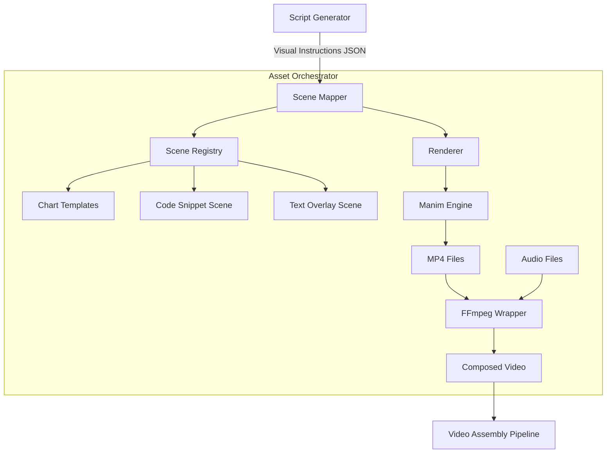
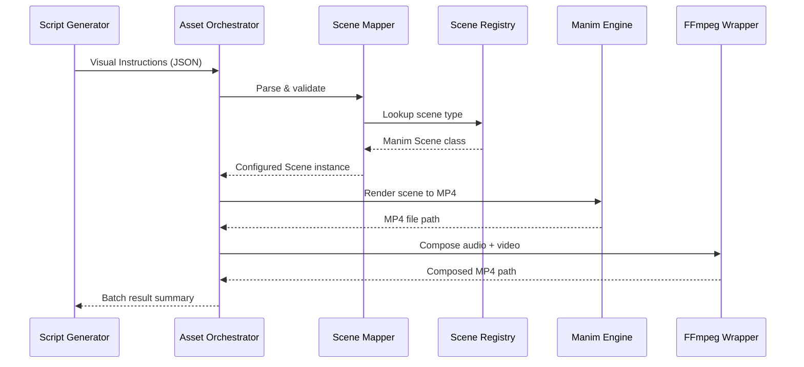

# Design Document: Asset Orchestrator

## Overview

The Asset Orchestrator is a Python module that transforms visual instructions from video scripts into production-ready video assets (1080p, 30fps MP4 files). It sits between the Script Generator (upstream) and the final video assembly pipeline (downstream) in the Faceless Technical Media Engine.

### Core Objectives

1. **Visual Instruction Parsing**: Accept structured visual instructions and map them to the correct Manim Scene class
2. **Code-Generated Visuals**: Render all animations via Manim — no generic AI stock footage
3. **Reusable Chart Templates**: Provide bar, line, and pie chart templates with a consistent dark-background video aesthetic
4. **Audio/Video Composition**: Wrap FFmpeg to combine narration audio with rendered MP4 animations
5. **Pipeline Resilience**: Continue processing a batch when individual instructions fail, with full error reporting

### Design Principles

- **Registry-Driven**: Scene types are resolved through a pluggable registry, making it easy to add new animation types
- **Fail-Per-Item**: A single bad instruction never blocks the rest of the batch
- **Config-Over-Code**: Render resolution, frame rate, codecs, and bitrates are all configurable — not hardcoded
- **Observable**: Every render and composition step is logged with timing and context

## Architecture

### System Components



### Data Flow



### Component Responsibilities

**Scene Mapper** (`asset_orchestrator/scene_mapper.py`):
- Parse and validate Visual_Instruction dictionaries
- Resolve instruction types to Manim Scene classes via the Scene Registry
- Serialize/deserialize Visual_Instructions to/from JSON
- Raise `ValidationError` for missing fields, `UnknownSceneTypeError` for bad types, `ParseError` for malformed JSON

**Scene Registry** (`asset_orchestrator/scene_registry.py`):
- Maintain a `dict[str, type]` mapping from instruction type strings to Manim Scene classes
- Ship with built-in types: `bar_chart`, `line_chart`, `pie_chart`, `code_snippet`, `text_overlay`
- Support runtime registration via `register(type_key, scene_class)`
- Raise `DuplicateSceneTypeError` on key collision

**Chart Templates** (`asset_orchestrator/chart_templates.py`):
- `BarChartScene`: Labeled axes, title, data bars with values above each bar
- `LineChartScene`: Labeled axes, title, data points with connecting lines
- `PieChartScene`: Labeled segments, title, percentage values
- All templates: dark gray background, white text, accent colors, 1080p/30fps
- Auto-group categories into "Other" when count > 10
- Truncate titles > 60 chars with ellipsis

**Code Snippet Scene** (`asset_orchestrator/code_snippet_scene.py`):
- Render syntax-highlighted code blocks as Manim animations
- Dark background consistent with chart templates

**Text Overlay Scene** (`asset_orchestrator/text_overlay_scene.py`):
- Render text overlays with configurable font size, position, and animation
- Dark background consistent with chart templates

**Renderer** (`asset_orchestrator/renderer.py`):
- Invoke Manim to render a configured Scene to MP4
- Apply `Render_Config` (resolution, fps, output dir)
- Sanitize titles for filenames (non-alphanumeric → underscore)
- Return absolute path of rendered MP4
- Raise `RenderError` on Manim failure with full error output

**FFmpeg Wrapper** (`asset_orchestrator/ffmpeg_wrapper.py`):
- Compose audio + video into a single MP4
- Loop video when audio is longer; trim video when audio is shorter
- Preserve 1080p/30fps in output
- Apply `Composition_Config` (codecs, bitrates, output path)
- Validate file existence before invoking FFmpeg
- Validate FFmpeg is on PATH
- Create output directory if missing

**Orchestrator** (`asset_orchestrator/orchestrator.py`):
- Batch-process a list of Visual_Instructions
- Continue on per-item failure, collect results
- Return summary of successes and failures
- Clean up temp files on render failure
- Log every step with timing

**Exceptions** (`asset_orchestrator/exceptions.py`):
- Custom exception hierarchy rooted at `AssetOrchestratorError`

**Config** (`asset_orchestrator/config.py`):
- `RenderConfig` and `CompositionConfig` dataclasses
- Defaults: 1080p, 30fps, H.264, AAC, 5 Mbps video, 192 kbps audio

**Logger** (`asset_orchestrator/logger.py`):
- Configurable log levels (DEBUG, INFO, WARNING, ERROR)
- Log instruction receipt, render start/complete with elapsed ms, FFmpeg commands, errors with full context

## Components and Interfaces

### Scene Mapper

```python
class SceneMapper:
    """Parses Visual_Instructions and resolves them to Manim Scene instances."""

    def __init__(self, registry: SceneRegistry):
        """
        Args:
            registry: Scene registry for type lookups.
        """

    def map(self, instruction: dict) -> ManimScene:
        """
        Validate a Visual_Instruction and return a configured Manim Scene.

        Args:
            instruction: Dict with keys: type, title, data, style.

        Returns:
            An instantiated Manim Scene configured with the instruction's
            title, data, and style.

        Raises:
            ValidationError: If required fields are missing.
            UnknownSceneTypeError: If type is not in the registry.
        """

    def serialize(self, instruction: dict) -> str:
        """
        Serialize a Visual_Instruction dict to a JSON string.

        Args:
            instruction: Visual_Instruction dict.

        Returns:
            JSON string.
        """

    def deserialize(self, json_str: str) -> dict:
        """
        Deserialize a JSON string to a Visual_Instruction dict.

        Args:
            json_str: JSON string.

        Returns:
            Visual_Instruction dict.

        Raises:
            ParseError: If JSON is malformed.
        """
```

### Scene Registry

```python
class SceneRegistry:
    """Maps instruction type strings to Manim Scene classes."""

    def __init__(self):
        """Initialize with built-in scene types."""

    def get(self, type_key: str) -> type:
        """
        Look up a Scene class by type key.

        Args:
            type_key: Instruction type string (e.g. "bar_chart").

        Returns:
            The Manim Scene class.

        Raises:
            UnknownSceneTypeError: If type_key is not registered.
        """

    def register(self, type_key: str, scene_class: type) -> None:
        """
        Register a new scene type at runtime.

        Args:
            type_key: Instruction type string.
            scene_class: Manim Scene class.

        Raises:
            DuplicateSceneTypeError: If type_key already registered.
        """

    def list_types(self) -> list[str]:
        """Return all registered type keys."""
```

### Chart Templates

```python
class BarChartScene(Scene):
    """Manim Scene for bar chart animations."""

    def __init__(self, title: str, data: dict, style: dict | None = None):
        """
        Args:
            title: Chart title (truncated at 60 chars + ellipsis).
            data: {"labels": [...], "values": [...]}.
            style: Optional overrides for colors, font sizes.
        """

    def construct(self) -> None:
        """Build the bar chart animation."""


class LineChartScene(Scene):
    """Manim Scene for line chart animations."""

    def __init__(self, title: str, data: dict, style: dict | None = None):
        """
        Args:
            title: Chart title.
            data: {"labels": [...], "values": [...]}.
            style: Optional overrides.
        """

    def construct(self) -> None:
        """Build the line chart animation."""


class PieChartScene(Scene):
    """Manim Scene for pie chart animations."""

    def __init__(self, title: str, data: dict, style: dict | None = None):
        """
        Args:
            title: Chart title.
            data: {"labels": [...], "values": [...]}.
                  Groups smallest into "Other" when > 10 categories.
            style: Optional overrides.
        """

    def construct(self) -> None:
        """Build the pie chart animation."""
```

### Renderer

```python
class Renderer:
    """Renders Manim Scenes to MP4 files."""

    def __init__(self, config: RenderConfig):
        """
        Args:
            config: Render configuration (resolution, fps, output dir).
        """

    def render(self, scene: Scene, instruction: dict) -> str:
        """
        Render a Manim Scene to MP4.

        Args:
            scene: Configured Manim Scene instance.
            instruction: Original Visual_Instruction (for filename derivation).

        Returns:
            Absolute file path of the rendered MP4.

        Raises:
            RenderError: If Manim rendering fails.
        """

    @staticmethod
    def sanitize_filename(title: str) -> str:
        """
        Replace non-alphanumeric characters with underscores.

        Args:
            title: Raw title string.

        Returns:
            Sanitized filename-safe string.
        """
```

### FFmpeg Wrapper

```python
class FFmpegWrapper:
    """Composes audio and video files using FFmpeg."""

    def __init__(self, config: CompositionConfig | None = None):
        """
        Args:
            config: Composition config. Uses defaults if None.

        Raises:
            EnvironmentError: If FFmpeg is not found on PATH.
        """

    def compose(self, audio_path: str, video_path: str, output_path: str | None = None) -> str:
        """
        Combine audio and video into a single MP4.

        - Loops video if audio is longer.
        - Trims video if audio is shorter.
        - Preserves 1080p/30fps.

        Args:
            audio_path: Path to audio file.
            video_path: Path to MP4 video file.
            output_path: Optional output path. Derived if None.

        Returns:
            Absolute file path of the composed MP4.

        Raises:
            FileNotFoundError: If audio or video file missing.
            CompositionError: If FFmpeg command fails.
        """
```

### Orchestrator

```python
class AssetOrchestrator:
    """Batch-processes Visual_Instructions into composed video assets."""

    def __init__(
        self,
        render_config: RenderConfig | None = None,
        composition_config: CompositionConfig | None = None,
        log_level: str = "INFO",
    ):
        """
        Args:
            render_config: Manim render settings. Defaults if None.
            composition_config: FFmpeg composition settings. Defaults if None.
            log_level: Logging level.
        """

    def process_instruction(self, instruction: dict, audio_path: str | None = None) -> dict:
        """
        Process a single Visual_Instruction.

        Args:
            instruction: Visual_Instruction dict.
            audio_path: Optional audio file to compose with rendered video.

        Returns:
            {"status": "success", "output_path": str} or
            {"status": "error", "error": str, "instruction": dict}
        """

    def process_batch(self, instructions: list[dict], audio_paths: list[str] | None = None) -> dict:
        """
        Process a batch of Visual_Instructions.

        Continues on per-item failure.

        Args:
            instructions: List of Visual_Instruction dicts.
            audio_paths: Optional parallel list of audio file paths.

        Returns:
            {
                "total": int,
                "succeeded": int,
                "failed": int,
                "results": [...]
            }
        """
```

## Data Models

### Visual_Instruction

```python
@dataclass
class VisualInstruction:
    """A structured directive from a video script."""
    type: str          # e.g. "bar_chart", "line_chart", "pie_chart", "code_snippet", "text_overlay"
    title: str         # Chart/scene title
    data: dict         # Payload — shape depends on type (e.g. {"labels": [...], "values": [...]})
    style: dict | None = None  # Optional style overrides (colors, font sizes)
```

### Render_Config

```python
@dataclass
class RenderConfig:
    """Manim rendering parameters."""
    width: int = 1920
    height: int = 1080
    fps: int = 30
    output_dir: str = "output/renders"
    output_format: str = "mp4"
```

### Composition_Config

```python
@dataclass
class CompositionConfig:
    """FFmpeg composition parameters."""
    video_codec: str = "libx264"
    audio_codec: str = "aac"
    video_bitrate: str = "5M"
    audio_bitrate: str = "192k"
    output_dir: str = "output/composed"
```

### Batch Result

```python
@dataclass
class BatchResult:
    """Summary of a batch processing run."""
    total: int
    succeeded: int
    failed: int
    results: list[dict]  # Per-instruction result dicts
```


## Correctness Properties

*A property is a characteristic or behavior that should hold true across all valid executions of a system — essentially, a formal statement about what the system should do. Properties serve as the bridge between human-readable specifications and machine-verifiable correctness guarantees.*

### Property 1: Valid instruction acceptance

*For any* dictionary containing the keys `type`, `title`, `data` (and optionally `style`), where `type` is a registered scene type, the Scene Mapper should accept the instruction without raising an exception.

**Validates: Requirements 1.1**

### Property 2: Type validation matches registry membership

*For any* Visual_Instruction, the Scene Mapper should raise `UnknownSceneTypeError` if and only if the `type` field is not present in the Scene Registry. The error message should contain the invalid type name and the list of all valid types.

**Validates: Requirements 1.2, 1.3**

### Property 3: Missing fields reported in ValidationError

*For any* dictionary that is missing one or more of the required fields (`type`, `title`, `data`), the Scene Mapper should raise a `ValidationError` whose message lists exactly the missing field names.

**Validates: Requirements 1.5**

### Property 4: Registry maps types to class references

*For any* registered type key, the Scene Registry's `get()` method should return a class (not an instance), and that class should be a subclass of Manim's Scene.

**Validates: Requirements 2.1**

### Property 5: Mapper returns configured scene with instruction data

*For any* valid Visual_Instruction, the Scene Mapper should return a Manim Scene instance whose `title`, `data`, and `style` attributes match the corresponding fields of the input instruction.

**Validates: Requirements 2.2, 2.5**

### Property 6: Runtime registration round-trip

*For any* new type key and Scene subclass, after calling `register(key, cls)`, calling `get(key)` should return `cls`.

**Validates: Requirements 2.3**

### Property 7: Duplicate registration raises error

*For any* type key already present in the Scene Registry, calling `register()` with that key should raise `DuplicateSceneTypeError`.

**Validates: Requirements 2.4**

### Property 8: Category grouping into "Other" for large datasets

*For any* chart data with more than 10 categories, the chart template should produce at most 11 segments (the top 10 by value plus an "Other" segment), and the "Other" segment's value should equal the sum of all grouped categories.

**Validates: Requirements 3.4**

### Property 9: Title truncation at 60 characters

*For any* title string longer than 60 characters, the displayed title should be the first 60 characters followed by "...". For any title of 60 characters or fewer, the title should be unchanged.

**Validates: Requirements 3.7**

### Property 10: Render output is 1080p at 30fps

*For any* Manim Scene render, the render configuration passed to Manim should specify 1920×1080 resolution and 30 frames per second.

**Validates: Requirements 3.6, 4.1**

### Property 11: Filename derived from type and sanitized title

*For any* Visual_Instruction, the output MP4 filename should contain the instruction's `type` and a sanitized version of the `title`, and the file should reside in the configured output directory.

**Validates: Requirements 3.8, 4.2**

### Property 12: Filename sanitization replaces non-alphanumeric characters

*For any* string, the `sanitize_filename` function should return a string containing only alphanumeric characters and underscores. Applying `sanitize_filename` twice should produce the same result as applying it once (idempotence).

**Validates: Requirements 4.5**

### Property 13: RenderError contains error output and instruction

*For any* Manim rendering failure, the raised `RenderError` should contain both the Manim error output string and the Visual_Instruction dict that caused the failure.

**Validates: Requirements 4.3**

### Property 14: All output paths are absolute

*For any* successful render or composition, the returned file path should be an absolute path (starts with `/`).

**Validates: Requirements 4.4, 5.8**

### Property 15: Missing input files raise FileNotFoundError

*For any* file path that does not exist on disk, passing it as either the audio or video argument to `FFmpegWrapper.compose()` should raise `FileNotFoundError` with the missing path in the message.

**Validates: Requirements 5.5, 5.6**

### Property 16: FFmpeg command reflects CompositionConfig

*For any* `CompositionConfig` with custom video codec, audio codec, video bitrate, and audio bitrate, the FFmpeg command constructed by the wrapper should contain the corresponding codec and bitrate flags.

**Validates: Requirements 5.9, 6.1**

### Property 17: Output directory created if missing

*For any* output path whose parent directory does not exist, the FFmpeg Wrapper should create the directory before writing the file, and the directory should exist after the call.

**Validates: Requirements 6.4**

### Property 18: Visual_Instruction JSON round-trip

*For any* valid Visual_Instruction dictionary, serializing it to JSON and then deserializing the JSON string should produce a dictionary equal to the original.

**Validates: Requirements 7.1, 7.2, 7.3**

### Property 19: Invalid JSON raises ParseError with position

*For any* string that is not valid JSON, calling `deserialize()` should raise a `ParseError` whose message contains the character position of the syntax error.

**Validates: Requirements 7.4**

### Property 20: Batch continues on per-item failure

*For any* batch of N Visual_Instructions where K instructions are invalid, the orchestrator should still process all N instructions (not stop at the first failure), and the result should contain exactly N entries.

**Validates: Requirements 8.1**

### Property 21: Batch summary invariant

*For any* batch processing result, `total` should equal `succeeded + failed`, and `total` should equal the length of the `results` list.

**Validates: Requirements 8.3**

### Property 22: Temp file cleanup on render failure

*For any* render that fails after creating temporary files, those temporary files should not exist on disk after the failure is handled.

**Validates: Requirements 8.4**

### Property 23: Logging includes instruction type, title, and render timing

*For any* Visual_Instruction processed by the orchestrator, the log output should contain the instruction's `type` and `title`, and for completed renders, the elapsed time in milliseconds.

**Validates: Requirements 9.1, 9.2**

### Property 24: FFmpeg commands logged before execution

*For any* FFmpeg composition, the log output should contain the full FFmpeg command string before the command is executed.

**Validates: Requirements 9.3**

### Property 25: Errors logged at ERROR level with full context

*For any* exception during processing, the log should contain an ERROR-level entry with the full stack trace, the Visual_Instruction that caused the error, and the error details.

**Validates: Requirements 8.2, 9.4**

### Property 26: Configurable log levels

*For any* valid log level (DEBUG, INFO, WARNING, ERROR), the orchestrator should accept the configuration and only emit log entries at or above that level.

**Validates: Requirements 9.5**

## Error Handling

### Exception Hierarchy

```python
class AssetOrchestratorError(Exception):
    """Base exception for all asset orchestrator errors."""
    pass

class ValidationError(AssetOrchestratorError):
    """Raised when a Visual_Instruction is missing required fields."""
    def __init__(self, missing_fields: list[str]):
        self.missing_fields = missing_fields
        super().__init__(f"Missing required fields: {', '.join(missing_fields)}")

class UnknownSceneTypeError(AssetOrchestratorError):
    """Raised when instruction type is not in the Scene Registry."""
    def __init__(self, invalid_type: str, valid_types: list[str]):
        self.invalid_type = invalid_type
        self.valid_types = valid_types
        super().__init__(
            f"Unknown scene type '{invalid_type}'. "
            f"Valid types: {', '.join(valid_types)}"
        )

class DuplicateSceneTypeError(AssetOrchestratorError):
    """Raised when registering a scene type that already exists."""
    def __init__(self, type_key: str):
        self.type_key = type_key
        super().__init__(f"Scene type '{type_key}' is already registered")

class RenderError(AssetOrchestratorError):
    """Raised when Manim rendering fails."""
    def __init__(self, error_output: str, instruction: dict):
        self.error_output = error_output
        self.instruction = instruction
        super().__init__(f"Render failed: {error_output}")

class CompositionError(AssetOrchestratorError):
    """Raised when FFmpeg composition fails."""
    def __init__(self, error_output: str, command: str):
        self.error_output = error_output
        self.command = command
        super().__init__(f"FFmpeg composition failed: {error_output}")

class ParseError(AssetOrchestratorError):
    """Raised when JSON deserialization fails."""
    def __init__(self, position: int, message: str):
        self.position = position
        super().__init__(f"JSON parse error at position {position}: {message}")
```

### Error Handling Strategies

**Validation Errors (Scene Mapper)**:
- Check required fields before registry lookup
- Raise `ValidationError` with the exact list of missing fields
- Raise `UnknownSceneTypeError` with the bad type and all valid types

**Render Failures (Manim)**:
- Catch Manim subprocess errors
- Clean up any temporary files created during the failed render
- Wrap the error in `RenderError` with the Manim stderr output and the instruction
- Log at ERROR level with full context

**Composition Failures (FFmpeg)**:
- Validate input file existence before invoking FFmpeg
- Check FFmpeg is on PATH at wrapper initialization
- Catch subprocess errors and wrap in `CompositionError`
- Log the full FFmpeg command and stderr output

**Batch Processing**:
- Wrap each instruction in a try/except
- On failure: log the error, record it in results, continue to next instruction
- On success: record the output path in results
- After all instructions: return `BatchResult` with counts and per-item details
- Clean up temp files for any failed renders

### Logging Strategy

**Log Levels**:
- DEBUG: Detailed Manim/FFmpeg command arguments, file paths
- INFO: Instruction received (type + title), render start/complete with elapsed ms, composition complete
- WARNING: Title truncation, category grouping into "Other"
- ERROR: Render failures, composition failures, validation errors — all with full stack trace and instruction context

## Testing Strategy

### Dual Testing Approach

The Asset Orchestrator uses both unit testing and property-based testing:

- **Unit tests**: Verify specific examples (chart rendering, FFmpeg integration), edge cases (empty data, missing FFmpeg), and error conditions
- **Property tests**: Verify universal properties across randomly generated inputs (validation, serialization, filename sanitization, batch invariants)

Together they provide comprehensive coverage — unit tests catch concrete bugs, property tests verify general correctness.

### Property-Based Testing

**Library**: **Hypothesis** (already in `requirements.txt`)

**Configuration**:
- Minimum 100 iterations per property test
- Each test references its design document property
- Tag format: `# Feature: asset-orchestrator, Property {number}: {property_text}`

**Example Property Test Structure**:

```python
from hypothesis import given, settings, strategies as st

# Feature: asset-orchestrator, Property 12: Filename sanitization replaces non-alphanumeric characters
@given(title=st.text(min_size=1, max_size=200))
@settings(max_examples=100)
def test_sanitize_filename_only_alnum_and_underscores(title):
    """Property 12: For any string, sanitize_filename returns only alnum + underscores."""
    result = Renderer.sanitize_filename(title)
    assert all(c.isalnum() or c == '_' for c in result)

# Feature: asset-orchestrator, Property 12: Filename sanitization is idempotent
@given(title=st.text(min_size=1, max_size=200))
@settings(max_examples=100)
def test_sanitize_filename_idempotent(title):
    """Property 12: sanitize_filename(sanitize_filename(x)) == sanitize_filename(x)."""
    once = Renderer.sanitize_filename(title)
    twice = Renderer.sanitize_filename(once)
    assert once == twice
```

**Priority Properties for Implementation**:

1. **Property 18**: JSON round-trip (critical for pipeline data integrity)
2. **Property 12**: Filename sanitization (idempotence + character set)
3. **Property 21**: Batch summary invariant (core orchestration correctness)
4. **Property 20**: Batch continues on failure (pipeline resilience)
5. **Property 2**: Type validation matches registry (input validation)
6. **Property 8**: Category grouping (data transformation correctness)
7. **Property 9**: Title truncation (string processing correctness)

### Unit Testing

**Framework**: **pytest** (already in `requirements.txt`)

**Unit Test Focus Areas**:

1. **Specific Examples**:
   - Each built-in scene type ("bar_chart", "line_chart", etc.) is in the registry
   - Default CompositionConfig values match spec (H.264, AAC, 5M, 192k)
   - FFmpeg missing from PATH raises EnvironmentError
   - Bar chart with 3 categories renders expected Manim objects

2. **Edge Cases**:
   - Empty data dict passed to chart template
   - Title of exactly 60 characters (no truncation)
   - Title of 61 characters (truncation)
   - Batch with 0 instructions
   - Batch where all instructions fail
   - Batch where all instructions succeed
   - Data with exactly 10 categories (no "Other" grouping)
   - Data with 11 categories (triggers "Other" grouping)

3. **Integration Points**:
   - End-to-end: instruction → scene mapping → render → compose
   - Config loading with custom output directories
   - Logger integration at different levels

4. **Error Conditions**:
   - Missing `type` field raises ValidationError
   - Unregistered type raises UnknownSceneTypeError
   - Duplicate registration raises DuplicateSceneTypeError
   - Invalid JSON raises ParseError with position
   - Non-existent audio/video file raises FileNotFoundError

### Mocking Strategy

**Manim Mocking**:
- Mock `subprocess.run` calls to Manim to avoid actual rendering in unit tests
- Create fixtures that return fake MP4 file paths
- Simulate render failures by having the mock raise subprocess errors

**FFmpeg Mocking**:
- Mock `subprocess.run` calls to FFmpeg
- Mock `shutil.which("ffmpeg")` for PATH detection tests
- Create temporary audio/video files for integration tests

### Test Organization

```
tests/
├── unit/
│   ├── test_scene_mapper.py         # Scene Mapper validation tests
│   ├── test_scene_registry.py       # Registry CRUD tests
│   ├── test_chart_templates.py      # Chart template construction tests
│   ├── test_renderer.py             # Renderer + filename sanitization tests
│   ├── test_ffmpeg_wrapper.py       # FFmpeg wrapper tests
│   └── test_orchestrator.py         # Batch processing tests
├── property/
│   ├── test_props_validation.py     # Properties 1-3 (input validation)
│   ├── test_props_registry.py       # Properties 4-7 (registry)
│   ├── test_props_charts.py         # Properties 8-9 (chart data transforms)
│   ├── test_props_rendering.py      # Properties 10-14 (render output)
│   ├── test_props_ffmpeg.py         # Properties 15-17 (FFmpeg)
│   ├── test_props_serialization.py  # Properties 18-19 (JSON round-trip)
│   ├── test_props_batch.py          # Properties 20-22 (batch processing)
│   └── test_props_logging.py        # Properties 23-26 (observability)
└── conftest.py                      # Shared fixtures
```

### Coverage Goals

- **Line Coverage**: Minimum 85% for all modules
- **Property Coverage**: 100% of correctness properties implemented as tests
- **Critical Path Coverage**: 100% for Scene Mapper, Renderer, FFmpeg Wrapper, and Orchestrator batch logic
