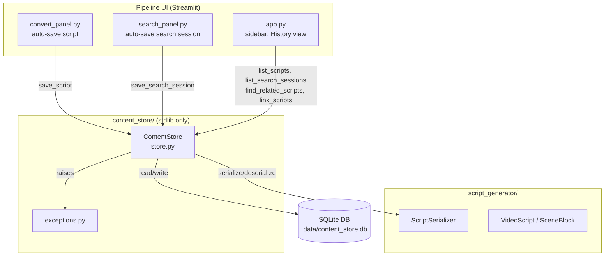
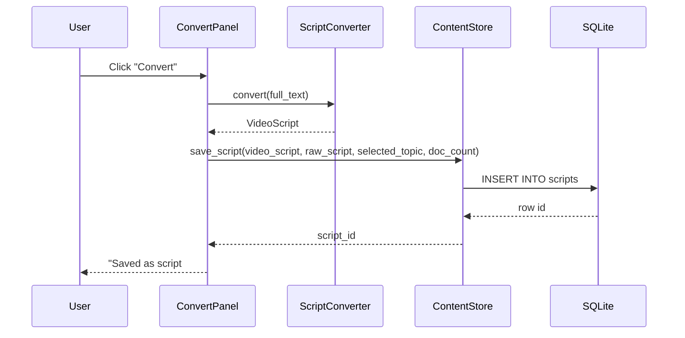
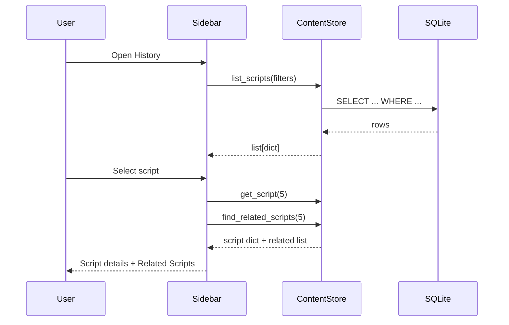

# Design Document: Content Store

## Overview

The Content Store is a standalone Python package (`content_store/`) that provides local SQLite-backed persistence for the Faceless Technical Media Engine pipeline. It captures pipeline artifacts — converted video scripts, research search sessions, and cross-reference links — so the user can browse production history, correlate past work, and avoid duplicating effort.

The module uses only Python's standard library `sqlite3` (zero external dependencies) and has no Streamlit imports, keeping it testable in isolation. All public methods return plain dictionaries for easy consumption by the Streamlit UI layer.

Integration with the existing pipeline happens at three points:
1. `convert_panel.py` — auto-saves the script after successful conversion
2. `search_panel.py` — auto-saves the search session after successful search
3. `app.py` sidebar — adds a History section for browsing and linking past artifacts

## Architecture



### Data Flow: Auto-Save on Conversion



### Data Flow: History View



## Components and Interfaces

### content_store/exceptions.py

```python
class ContentStoreError(Exception):
    """Base exception for all content store errors."""
    pass
```

### content_store/store.py — ContentStore class

```python
class ContentStore:
    """SQLite-backed persistence for pipeline artifacts.

    Uses WAL journal mode and enforces foreign keys.
    All public query methods return plain dicts.
    """

    def __init__(self, db_path: str = ".data/content_store.db") -> None:
        """Open (or create) the database at db_path.

        Creates parent directories if missing.
        Enables WAL mode and foreign keys.
        Creates tables if they do not exist.
        """

    def close(self) -> None:
        """Close the database connection."""

    def __enter__(self) -> "ContentStore":
        """Context manager entry."""

    def __exit__(self, exc_type, exc_val, exc_tb) -> None:
        """Context manager exit — calls close()."""

    # --- Script CRUD ---

    def save_script(
        self,
        video_script: "VideoScript",
        raw_script: str,
        selected_topic: dict | None,
        documents_used: int,
    ) -> int:
        """Insert a script record. Returns the new row id.

        Serializes video_script via ScriptSerializer.
        Computes scene_count from len(video_script.scenes).
        Sets created_at to current UTC time.
        Raises ContentStoreError on failure.
        """

    def get_script(self, script_id: int) -> dict | None:
        """Return a single script record as a dict, or None if not found."""

    def list_scripts(
        self,
        *,
        category: str | None = None,
        keyword: str | None = None,
        start_date: str | None = None,
        end_date: str | None = None,
    ) -> list[dict]:
        """Return script records matching filters, ordered by created_at DESC.

        category: match against selected_topic_json -> category field.
        keyword: case-insensitive LIKE match on title or raw_script.
        start_date / end_date: inclusive ISO 8601 date range on created_at.
        """

    # --- Search Session CRUD ---

    def save_search_session(self, search_results: dict) -> int:
        """Insert a search session record. Returns the new row id.

        Computes topics_found from len(search_results.get("topics", [])).
        Sets query_date to current UTC time.
        Raises ContentStoreError on failure.
        """

    def get_search_session(self, session_id: int) -> dict | None:
        """Return a single search session record as a dict, or None."""

    def list_search_sessions(self) -> list[dict]:
        """Return all search session records ordered by query_date DESC."""

    # --- Script Links ---

    def link_scripts(
        self,
        source_id: int,
        target_id: int,
        link_type: str,
        note: str | None = None,
    ) -> int:
        """Create a directional link between two scripts. Returns the link row id.

        Validates both script ids exist.
        Raises ContentStoreError if either id is missing or link is duplicate.
        Sets created_at to current UTC time.
        """

    def get_script_links(self, script_id: int) -> list[dict]:
        """Return explicit link records for a script (both directions).

        Returns empty list if script_id does not exist.
        """

    def find_related_scripts(self, script_id: int) -> list[dict]:
        """Find scripts related to the given script through:
        1. Explicit links (both directions) — relationship_type="linked"
        2. Same category in selected_topic_json — relationship_type="same_category"
        3. Overlapping title keywords — relationship_type="keyword_overlap"

        Each result dict contains: id, title, created_at, word_count,
        scene_count, relationship_type. "linked" results also include
        link_type and note.

        A script appearing in multiple relationship types is included
        once per distinct type.

        Returns empty list if script_id does not exist.
        """
```

### content_store/__init__.py

```python
from content_store.store import ContentStore
from content_store.exceptions import ContentStoreError

__all__ = ["ContentStore", "ContentStoreError"]
```

### Pipeline UI Integration Points

#### convert_panel.py changes

After successful conversion (inside the `try` block of `_run_conversion`, after setting `pipeline.video_script`):

```python
# Auto-save script to content store
try:
    from content_store import ContentStore
    with ContentStore() as store:
        doc_count = sum(1 for d in pipeline.parsed_documents if d.get("success"))
        script_id = store.save_script(
            video_script=video_script,
            raw_script=pipeline.raw_script,
            selected_topic=pipeline.selected_topic,
            documents_used=doc_count,
        )
    st.success(f"Script saved to history (#{script_id})")
except Exception as exc:
    logger.warning("[Convert] Auto-save failed: %s", exc)
    st.warning(f"Auto-save failed: {exc}")
```

#### search_panel.py changes

After successful search (inside `_run_search`, after setting `pipeline.search_results`):

```python
# Auto-save search session
try:
    from content_store import ContentStore
    with ContentStore() as store:
        session_id = store.save_search_session(results)
    logger.info("[Search] Search session saved (id=%d)", session_id)
except Exception as exc:
    logger.warning("[Search] Search session save failed: %s", exc)
```

#### app.py sidebar changes

Add a History section in the sidebar after the existing "Start New Pipeline" button:

```python
st.sidebar.divider()
st.sidebar.subheader("History")
# Script history list with filters
# Search session history list
# Related scripts view on script selection
# Link creation controls
```

## Data Models

### SQLite Schema

```sql
-- Enable WAL mode (executed via PRAGMA on connection open)
-- PRAGMA journal_mode=WAL;
-- PRAGMA foreign_keys=ON;

CREATE TABLE IF NOT EXISTS scripts (
    id              INTEGER PRIMARY KEY AUTOINCREMENT,
    title           TEXT    NOT NULL,
    raw_script      TEXT    NOT NULL,
    video_script_json TEXT  NOT NULL,
    selected_topic_json TEXT,
    documents_used  INTEGER NOT NULL DEFAULT 0,
    created_at      TEXT    NOT NULL,  -- ISO 8601 UTC
    word_count      INTEGER NOT NULL,
    scene_count     INTEGER NOT NULL
);

CREATE TABLE IF NOT EXISTS search_sessions (
    id                  INTEGER PRIMARY KEY AUTOINCREMENT,
    search_results_json TEXT    NOT NULL,
    query_date          TEXT    NOT NULL,  -- ISO 8601 UTC
    topics_found        INTEGER NOT NULL
);

CREATE TABLE IF NOT EXISTS script_links (
    id                INTEGER PRIMARY KEY AUTOINCREMENT,
    source_script_id  INTEGER NOT NULL REFERENCES scripts(id),
    target_script_id  INTEGER NOT NULL REFERENCES scripts(id),
    link_type         TEXT    NOT NULL,  -- "continuation", "deep_dive", "see_also", "related"
    note              TEXT,
    created_at        TEXT    NOT NULL,  -- ISO 8601 UTC
    UNIQUE(source_script_id, target_script_id, link_type)
);
```

### Row-to-Dict Mapping

All query methods use `sqlite3.Row` as the row factory and convert each row to a plain `dict` before returning. This keeps the public API free of sqlite3 types.

```python
conn.row_factory = sqlite3.Row
# In each query method:
return [dict(row) for row in cursor.fetchall()]
```

### Key Data Shapes

Script record dict:
```python
{
    "id": 1,
    "title": "How Kubernetes Autoscaling Actually Works",
    "raw_script": "...",
    "video_script_json": "{...}",          # ScriptSerializer output
    "selected_topic_json": "{...}" | None, # json.dumps(selected_topic)
    "documents_used": 3,
    "created_at": "2025-01-15T14:30:00+00:00",
    "word_count": 1200,
    "scene_count": 7,
}
```

Search session record dict:
```python
{
    "id": 1,
    "search_results_json": "{...}",  # json.dumps(search_results)
    "query_date": "2025-01-15T14:00:00+00:00",
    "topics_found": 5,
}
```

Related script result dict:
```python
{
    "id": 3,
    "title": "K8s HPA Deep Dive",
    "created_at": "2025-01-16T10:00:00+00:00",
    "word_count": 950,
    "scene_count": 6,
    "relationship_type": "linked",  # or "same_category" or "keyword_overlap"
    "link_type": "deep_dive",       # only for "linked"
    "note": "Follow-up video",      # only for "linked"
}
```

## Correctness Properties

*A property is a characteristic or behavior that should hold true across all valid executions of a system — essentially, a formal statement about what the system should do. Properties serve as the bridge between human-readable specifications and machine-verifiable correctness guarantees.*

### Property 1: Script serialization round-trip

*For any* valid VideoScript object, raw script string, selected topic dictionary, and document count, saving a script record via `save_script` and then retrieving it via `get_script` and deserializing the `video_script_json` field with `ScriptSerializer.deserialize` shall produce a VideoScript equivalent to the original.

**Validates: Requirements 11.1, 2.2, 4.2, 4.5, 6.6**

### Property 2: Search session round-trip

*For any* valid search results dictionary (containing a "topics" list), saving a search session via `save_search_session` and then retrieving it via `get_search_session` and deserializing the `search_results_json` field with `json.loads` shall produce a dictionary equivalent to the original.

**Validates: Requirements 11.2, 3.2, 5.4, 7.2**

### Property 3: Computed fields are correct

*For any* saved script record, the stored `scene_count` shall equal `len(video_script.scenes)` and the stored `word_count` shall equal `video_script.total_word_count`. *For any* saved search session record, the stored `topics_found` shall equal `len(search_results.get("topics", []))`.

**Validates: Requirements 4.3, 5.2**

### Property 4: All stored timestamps are valid ISO 8601 UTC

*For any* saved script record, search session record, or script link record, the `created_at` (or `query_date`) field shall be a valid ISO 8601 timestamp string that can be parsed by `datetime.fromisoformat`.

**Validates: Requirements 2.4, 3.3, 4.4, 5.3, 13.6**

### Property 5: List queries return results in descending chronological order

*For any* set of inserted script records, `list_scripts()` shall return them ordered by `created_at` descending. *For any* set of inserted search session records, `list_search_sessions()` shall return them ordered by `query_date` descending.

**Validates: Requirements 6.1, 7.1**

### Property 6: Category filter returns only matching scripts

*For any* set of script records with various categories in `selected_topic_json`, calling `list_scripts(category=C)` shall return only scripts whose `selected_topic_json` contains `"category": C`, and shall return all such scripts.

**Validates: Requirements 6.2**

### Property 7: Keyword filter returns only matching scripts

*For any* set of script records and any keyword string K, calling `list_scripts(keyword=K)` shall return only scripts whose `title` or `raw_script` contains K (case-insensitive), and shall return all such scripts.

**Validates: Requirements 6.3**

### Property 8: Date range filter returns only scripts within range

*For any* set of script records and any inclusive date range [start, end], calling `list_scripts(start_date=start, end_date=end)` shall return only scripts whose `created_at` falls within the range, and shall return all such scripts.

**Validates: Requirements 6.4**

### Property 9: Explicit links are discoverable in both directions

*For any* two scripts A and B with an explicit link from A to B, calling `find_related_scripts(A)` shall include B with `relationship_type="linked"`, and calling `find_related_scripts(B)` shall include A with `relationship_type="linked"`. Similarly, `get_script_links` for either script shall include the link record.

**Validates: Requirements 14.1, 14.6**

### Property 10: Same-category scripts are discovered

*For any* script S with a category C in its `selected_topic_json`, calling `find_related_scripts(S.id)` shall include all other scripts that also have category C, each with `relationship_type="same_category"`.

**Validates: Requirements 14.2**

### Property 11: Keyword-overlap scripts are discovered

*For any* script S, calling `find_related_scripts(S.id)` shall include all other scripts whose title shares at least one non-trivial word with S's title, each with `relationship_type="keyword_overlap"`.

**Validates: Requirements 14.3**

### Property 12: Scripts appearing in multiple relationship types are included once per type

*For any* script that is related to a given script through both an explicit link and a shared category, `find_related_scripts` shall include that script twice — once with `relationship_type="linked"` and once with `relationship_type="same_category"`.

**Validates: Requirements 14.5**

### Property 13: Foreign key enforcement on script links

*For any* `source_id` or `target_id` that does not exist in the `scripts` table, calling `link_scripts` shall raise a `ContentStoreError`.

**Validates: Requirements 12.2, 13.2, 13.3**

### Property 14: Unique constraint on script links

*For any* existing link with (`source_id`, `target_id`, `link_type`), attempting to create a duplicate link with the same combination shall raise a `ContentStoreError`.

**Validates: Requirements 12.3, 13.4**

## Error Handling

### Exception Hierarchy

```
ContentStoreError (content_store.exceptions)
└── Base exception for all content store failures
```

A single exception type is sufficient since the content store is a focused data layer. The caller (pipeline UI) catches `ContentStoreError` generically and displays a warning.

### Error Scenarios and Handling

| Scenario | Method | Behavior |
|---|---|---|
| DB file path not writable | `__init__` | Raises `ContentStoreError` with OS error details |
| Schema creation fails | `__init__` | Raises `ContentStoreError` |
| INSERT fails (disk full, constraint violation) | `save_script`, `save_search_session` | Raises `ContentStoreError` with descriptive message |
| Foreign key violation on link | `link_scripts` | Raises `ContentStoreError` identifying the missing script id |
| Duplicate link | `link_scripts` | Raises `ContentStoreError` indicating duplicate |
| Non-existent id on get | `get_script`, `get_search_session` | Returns `None` |
| Non-existent id on find/links | `find_related_scripts`, `get_script_links` | Returns empty list `[]` |
| Connection already closed | Any method | Raises `ContentStoreError` wrapping the sqlite3 error |

### Pipeline UI Error Handling Strategy

The pipeline UI wraps all content store calls in try/except:

- **Auto-save failures** (convert_panel, search_panel): Log a warning, display `st.warning()`, and allow the pipeline to continue. Auto-save is non-blocking.
- **History view failures**: Display `st.error()` in the sidebar. The main pipeline panels remain functional.
- **Link creation failures**: Display `st.warning()` with error details. The History view remains usable.

### Transaction Safety

- Each `save_*` and `link_scripts` call is a single INSERT wrapped in an implicit sqlite3 transaction.
- `find_related_scripts` performs multiple SELECTs but is read-only, so no transaction coordination is needed.
- WAL mode ensures readers don't block writers and vice versa.

## Testing Strategy

### Dual Testing Approach

Both unit tests and property-based tests are required for comprehensive coverage.

**Unit tests** cover:
- Database initialization (WAL mode, foreign keys, table creation) — Requirements 1.1–1.4
- Schema column verification — Requirements 2.1, 3.1, 12.1
- Context manager behavior — Requirement 10.4
- Module isolation (no non-stdlib imports) — Requirement 10.1
- Error conditions: closed connection, missing script ids, duplicate links — Requirements 4.6, 5.5, 6.7, 7.3, 13.3, 13.4, 14.7
- Accepted link_type values — Requirement 12.4
- Pipeline UI integration: auto-save called on conversion, search session saved on search — Requirements 8.1, 8.4

**Property-based tests** cover:
- All 14 correctness properties defined above
- Each property test runs a minimum of 100 iterations
- Each test is tagged with: `Feature: content-store, Property {N}: {title}`

### Property-Based Testing Library

Use **Hypothesis** (`hypothesis` Python library) for property-based testing. It provides:
- `@given` decorator for generating random inputs
- `@settings(max_examples=100)` for minimum iteration count
- Built-in strategies for strings, integers, dictionaries, datetimes
- Composite strategies for generating valid `VideoScript` and search result objects

### Test File Organization

```
tests/unit/
├── test_content_store.py          # Unit tests for ContentStore
├── test_content_store_props.py    # Property-based tests (Hypothesis)
└── test_content_store_ui.py       # Integration tests for pipeline UI hooks
```

### Generator Strategy

Custom Hypothesis strategies will be needed for:

```python
@st.composite
def video_scripts(draw):
    """Generate valid VideoScript instances."""
    title = draw(st.text(min_size=1, max_size=100))
    scene_count = draw(st.integers(min_value=1, max_value=10))
    scenes = [
        SceneBlock(
            scene_number=i + 1,
            narration_text=draw(st.text(min_size=1, max_size=500)),
            visual_instruction={"type": "text_overlay", "title": draw(st.text(min_size=1))},
        )
        for i in range(scene_count)
    ]
    return VideoScript(
        title=title,
        scenes=scenes,
        generated_at=draw(st.datetimes(timezones=st.just(timezone.utc))),
        total_word_count=sum(len(s.narration_text.split()) for s in scenes),
        metadata={},
    )

@st.composite
def search_results_dicts(draw):
    """Generate valid search results dictionaries."""
    topic_count = draw(st.integers(min_value=0, max_value=10))
    topics = [
        {
            "topic_name": draw(st.text(min_size=1, max_size=50)),
            "category": draw(st.sampled_from(["tech", "finance", "science", "gaming"])),
            "trend_score": draw(st.floats(min_value=0, max_value=100)),
            "video_count": draw(st.integers(min_value=0, max_value=1000)),
        }
        for _ in range(topic_count)
    ]
    return {"topics": topics}
```

### Property Test Tagging

Each property test must include a docstring tag referencing the design property:

```python
@given(vs=video_scripts(), raw=st.text(min_size=1), topic=search_results_dicts())
@settings(max_examples=100)
def test_script_round_trip(vs, raw, topic):
    """Feature: content-store, Property 1: Script serialization round-trip"""
    ...
```

### Test Isolation

Each property test creates a fresh `ContentStore` with a temporary database file (using `tempfile.mkdtemp()`) and closes it after the test. This ensures no state leaks between test runs.
