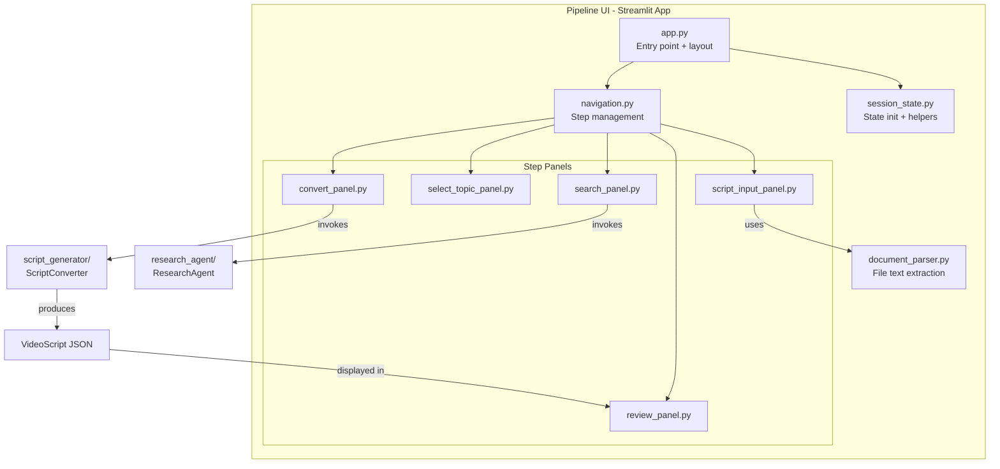
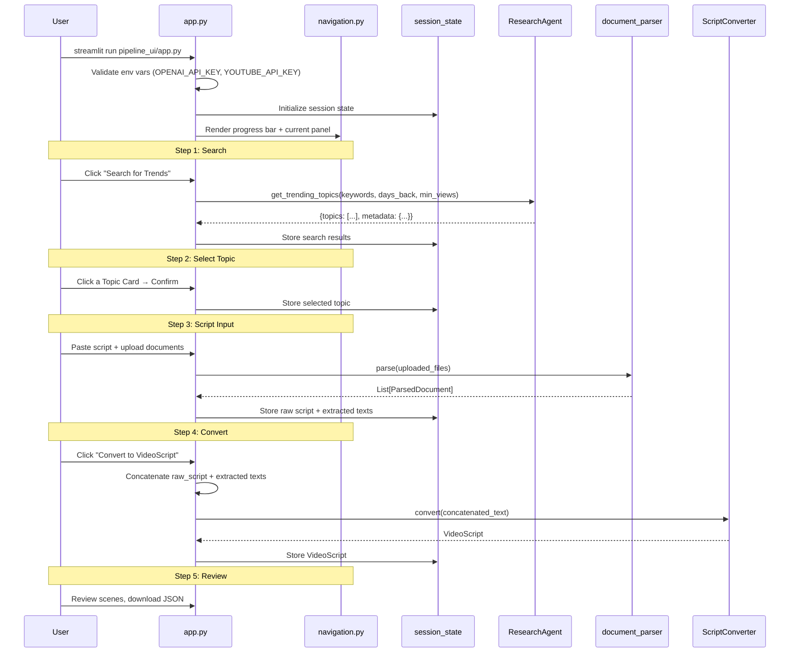

# Design Document: Pipeline UI

## Overview

The Pipeline UI is a Streamlit-based local web application that provides a human-in-the-loop interface for the Faceless Technical Media Engine's content production pipeline. It connects the existing `research_agent` and `script_generator` modules through a guided 5-step workflow: Search → Select Topic → Script Input → Convert → Review.

### Core Objectives

1. **Guided Workflow**: Present the pipeline as a linear, step-by-step process with clear navigation and state preservation
2. **Module Integration**: Wrap existing `ResearchAgent` and `ScriptConverter` classes without modifying their interfaces
3. **Document Parsing**: Extract plain text from uploaded files (PDF, XLSX, CSV, TXT, MD, DOCX) to enrich LLM context
4. **Local-First Simplicity**: Single-command startup, no database, no auth — just Streamlit session state

### Design Principles

- **Thin UI Layer**: The UI delegates all business logic to existing modules; it only handles presentation and orchestration
- **Session State as Single Source of Truth**: All pipeline data lives in `st.session_state` — no external persistence
- **Fail Gracefully**: Surface errors from underlying modules as user-friendly messages with retry options
- **Minimal Dependencies**: Only add libraries needed for document parsing; reuse everything else

## Architecture

### System Architecture



### Module Layout

```
pipeline_ui/
├── __init__.py
├── app.py                    # Streamlit entry point, env validation, layout
├── navigation.py             # Step enum, progress bar, step transitions
├── session_state.py          # Session state initialization and accessors
├── document_parser.py        # Multi-format text extraction
├── panels/
│   ├── __init__.py
│   ├── search_panel.py       # Step 1: Research Agent trigger + pitch display
│   ├── select_topic_panel.py # Step 2: Topic card selection + confirmation
│   ├── script_input_panel.py # Step 3: Text area + file upload
│   ├── convert_panel.py      # Step 4: Script conversion trigger
│   └── review_panel.py       # Step 5: VideoScript display + JSON download
```

### Data Flow



## Components and Interfaces

### 1. `app.py` — Entry Point

Responsibilities:
- Load `.env` via `python-dotenv`
- Validate required env vars (`OPENAI_API_KEY`, `YOUTUBE_API_KEY`); show error banner if missing
- Initialize session state via `session_state.init()`
- Render the progress indicator and delegate to the current step's panel
- Render "Start New Pipeline" button with confirmation dialog

```python
def main() -> None:
    """Streamlit entry point."""
    st.set_page_config(page_title="Pipeline UI", layout="wide")
    load_dotenv()
    
    missing = validate_env_vars(["OPENAI_API_KEY", "YOUTUBE_API_KEY"])
    if missing:
        st.error(f"Missing required environment variables: {', '.join(missing)}")
        st.stop()
    
    init_session_state()
    render_progress_bar()
    render_current_panel()
```

### 2. `navigation.py` — Step Management

Defines the pipeline steps and controls transitions.

```python
from enum import IntEnum

class PipelineStep(IntEnum):
    SEARCH = 0
    SELECT_TOPIC = 1
    SCRIPT_INPUT = 2
    CONVERT = 3
    REVIEW = 4

STEP_LABELS = ["Search", "Select Topic", "Script Input", "Convert", "Review"]

def can_advance(current_step: PipelineStep, session: dict) -> bool:
    """Check if the current step is complete and user can advance."""
    ...

def go_to_step(step: PipelineStep) -> None:
    """Navigate to a specific step (only if <= max completed step)."""
    ...

def render_progress_bar() -> None:
    """Render a horizontal step indicator showing current/completed steps."""
    ...
```

### 3. `session_state.py` — State Management

Initializes and provides typed accessors for all pipeline state stored in `st.session_state`.

```python
from dataclasses import dataclass, field
from typing import Optional, List
from script_generator.models import VideoScript

@dataclass
class PipelineData:
    """All pipeline state stored in session."""
    current_step: int = 0
    max_completed_step: int = -1  # highest step completed
    
    # Step 1: Search
    search_results: Optional[dict] = None       # raw ResearchAgent output
    
    # Step 2: Select Topic
    selected_topic: Optional[dict] = None       # chosen topic dict
    
    # Step 3: Script Input
    raw_script: str = ""
    parsed_documents: List[dict] = field(default_factory=list)  # [{filename, text, char_count}]
    
    # Step 4: Convert
    video_script: Optional[VideoScript] = None
    conversion_metadata: Optional[dict] = None  # {model, prompt_tokens, completion_tokens}
    
    # Step 5: Review — uses video_script from above

def init_session_state() -> None:
    """Initialize session state with PipelineData if not present."""
    if "pipeline" not in st.session_state:
        st.session_state.pipeline = PipelineData()

def get_pipeline() -> PipelineData:
    """Return the current PipelineData from session state."""
    return st.session_state.pipeline

def clear_session_state() -> None:
    """Reset all pipeline state."""
    st.session_state.pipeline = PipelineData()
```

### 4. `document_parser.py` — Multi-Format Text Extraction

A pure-function module that extracts plain text from uploaded files. Each format has a dedicated extractor. No Streamlit dependency — this is testable in isolation.

```python
from dataclasses import dataclass
from typing import List

SUPPORTED_EXTENSIONS = {".pdf", ".xlsx", ".csv", ".txt", ".md", ".docx"}

@dataclass
class ParsedDocument:
    filename: str
    text: str
    char_count: int
    success: bool
    error: Optional[str] = None

def parse_file(filename: str, content: bytes) -> ParsedDocument:
    """Extract text from a single file based on its extension.
    
    Returns a ParsedDocument with success=False and error message
    if the format is unsupported or extraction fails.
    """
    ...

def parse_files(files: List[tuple[str, bytes]]) -> List[ParsedDocument]:
    """Parse multiple files, returning results for each (including failures)."""
    return [parse_file(name, data) for name, data in files]

def concatenate_extracted_text(documents: List[ParsedDocument]) -> str:
    """Concatenate successful extractions with document boundary markers.
    
    Format:
    --- Document: filename.pdf ---
    <extracted text>
    --- End Document: filename.pdf ---
    """
    ...

# Internal extractors
def _extract_pdf(content: bytes) -> str: ...      # PyPDF2 / pypdf
def _extract_xlsx(content: bytes) -> str: ...     # openpyxl
def _extract_csv(content: bytes) -> str: ...      # csv stdlib
def _extract_txt(content: bytes) -> str: ...      # UTF-8 decode
def _extract_docx(content: bytes) -> str: ...     # python-docx
```

**Library choices for document parsing:**
| Format | Library | Rationale |
|--------|---------|-----------|
| PDF | `pypdf` | Lightweight, pure Python, no system deps |
| XLSX | `openpyxl` | Standard for .xlsx, read-only mode is fast |
| CSV | `csv` (stdlib) | No external dep needed |
| TXT/MD | Built-in | UTF-8 decode of bytes |
| DOCX | `python-docx` | Standard for .docx parsing |

### 5. Step Panels

Each panel is a function that receives no arguments and reads/writes `st.session_state.pipeline`.

**`search_panel.py`** — Invokes `ResearchAgent.get_trending_topics()`, displays results as Topic Cards.

```python
def render_search_panel() -> None:
    """Step 1: Trigger research and display story pitches."""
    pipeline = get_pipeline()
    
    col1, col2 = st.columns([3, 1])
    with col1:
        st.subheader("Trend Research")
    
    if st.button("Search for Trends"):
        with st.spinner("Researching trending topics..."):
            try:
                agent = ResearchAgent()
                results = agent.get_trending_topics()
                pipeline.search_results = results
                pipeline.max_completed_step = max(pipeline.max_completed_step, 0)
            except Exception as e:
                st.error(f"Research failed: {e}")
                _suggest_recovery(e)
                return
    
    if pipeline.search_results:
        _render_topic_cards(pipeline.search_results["topics"])
        if st.button("Regenerate Pitches"):
            # Re-invoke with same raw trends
            ...
```

**`select_topic_panel.py`** — Displays selectable topic cards, stores selection.

**`script_input_panel.py`** — Text area for raw script, file uploader, document parsing display.

**`convert_panel.py`** — Concatenates script + extracted text, invokes `ScriptConverter.convert()`.

```python
def render_convert_panel() -> None:
    pipeline = get_pipeline()
    
    if st.button("Convert to VideoScript"):
        # Build concatenated input
        full_text = pipeline.raw_script
        if pipeline.parsed_documents:
            extracted = concatenate_extracted_text(
                [ParsedDocument(**d) for d in pipeline.parsed_documents]
            )
            full_text += "\n\n--- SUPPLEMENTARY DOCUMENT CONTEXT ---\n" + extracted
        
        with st.spinner("Converting script via GPT-4o-mini..."):
            try:
                converter = ScriptConverter()
                video_script = converter.convert(full_text)
                pipeline.video_script = video_script
                pipeline.max_completed_step = max(pipeline.max_completed_step, 3)
                go_to_step(PipelineStep.REVIEW)
            except (ParseError, ValidationError) as e:
                st.error(f"Conversion failed: {e}")
                st.info("You can edit your script and retry.")
```

**`review_panel.py`** — Displays VideoScript metadata, scene blocks, JSON download.

```python
def render_review_panel() -> None:
    pipeline = get_pipeline()
    vs = pipeline.video_script
    
    st.subheader(vs.title)
    st.caption(f"Words: {vs.total_word_count} | Generated: {vs.generated_at.isoformat()}")
    
    for scene in vs.scenes:
        with st.expander(f"Scene {scene.scene_number}", expanded=True):
            st.write(scene.narration_text)
            vi = scene.visual_instruction
            st.code(f"Type: {vi.get('type')} | Title: {vi.get('title')}")
            st.json(vi.get("data", {}))
    
    # JSON download
    serializer = ScriptSerializer()
    json_str = serializer.serialize(vs)
    st.download_button("Download VideoScript JSON", json_str, 
                       file_name="video_script.json", mime="application/json")
    
    with st.expander("Raw JSON"):
        st.code(json_str, language="json")
    
    if st.button("Back to Script"):
        go_to_step(PipelineStep.SCRIPT_INPUT)
```


## Data Models

### PipelineStep Enum

```python
class PipelineStep(IntEnum):
    SEARCH = 0
    SELECT_TOPIC = 1
    SCRIPT_INPUT = 2
    CONVERT = 3
    REVIEW = 4
```

### PipelineData (Session State)

```python
@dataclass
class PipelineData:
    current_step: int = 0
    max_completed_step: int = -1
    search_results: Optional[dict] = None       # ResearchAgent output
    selected_topic: Optional[dict] = None       # Single topic from search_results["topics"]
    raw_script: str = ""
    parsed_documents: List[dict] = field(default_factory=list)
    video_script: Optional[VideoScript] = None
    conversion_metadata: Optional[dict] = None
```

The `search_results` field stores the raw dict returned by `ResearchAgent.get_trending_topics()`:

```json
{
  "topics": [
    {
      "topic_name": "string",
      "category": "string",
      "category_confidence": 0.85,
      "trend_score": 72.5,
      "video_count": 12,
      "top_videos": [...],
      "fetched_at": "2024-01-15T10:30:00Z",
      "finance_context": { ... }
    }
  ],
  "metadata": {
    "query_date": "string",
    "total_videos_analyzed": 150,
    "average_trend_score": 45.2,
    "macro_mode_enabled": false,
    "authority_channels_checked": 0
  }
}
```

The `selected_topic` field stores a single topic dict from the `topics` array above.

### ParsedDocument

```python
@dataclass
class ParsedDocument:
    filename: str
    text: str
    char_count: int
    success: bool
    error: Optional[str] = None
```

The `parsed_documents` list in PipelineData stores serialized versions of these (as dicts) since Streamlit session state works best with simple types.

### Concatenated LLM Input Format

When the user clicks "Convert to VideoScript", the raw script and extracted document text are concatenated:

```
<raw script text>

--- SUPPLEMENTARY DOCUMENT CONTEXT ---
--- Document: report.pdf ---
<extracted text from report.pdf>
--- End Document: report.pdf ---
--- Document: data.xlsx ---
<extracted text from data.xlsx>
--- End Document: data.xlsx ---
```

This concatenated string is passed directly to `ScriptConverter.convert()`.

### Existing Models (Consumed, Not Modified)

- **`VideoScript`** from `script_generator.models` — title, scenes, generated_at, total_word_count, metadata
- **`SceneBlock`** from `script_generator.models` — scene_number, narration_text, visual_instruction (dict)
- **`TrendingTopic`** from `research_agent.models` — topic_name, category, trend_score, video_count, top_videos, finance_context
- **`ResearchAgent`** from `research_agent.agent` — `get_trending_topics(keywords, days_back, min_views, macro_mode) -> dict`
- **`ScriptConverter`** from `script_generator.converter` — `convert(raw_script: str) -> VideoScript`


## Correctness Properties

*A property is a characteristic or behavior that should hold true across all valid executions of a system — essentially, a formal statement about what the system should do. Properties serve as the bridge between human-readable specifications and machine-verifiable correctness guarantees.*

### Property 1: Environment variable validation

*For any* subset of the required environment variables (`OPENAI_API_KEY`, `YOUTUBE_API_KEY`) that is missing, `validate_env_vars()` should return exactly the set of missing variable names, and when all are present it should return an empty list.

**Validates: Requirements 1.4, 1.5**

### Property 2: Backward navigation is allowed only for completed steps

*For any* pipeline state with `max_completed_step = N`, calling `go_to_step(S)` should succeed for all `S <= N` and fail for all `S > current_step` where step `S` has not been completed.

**Validates: Requirements 2.3**

### Property 3: Navigation preserves prior step data

*For any* pipeline state and any backward navigation to step `S`, the values of all data fields associated with steps `<= S` should be identical before and after the navigation.

**Validates: Requirements 2.4**

### Property 4: Step completion gating

*For any* pipeline state, `can_advance(current_step)` should return `False` when the step's completion criteria are not met (e.g., no search results for Search, no selected topic for Select Topic, empty raw script for Script Input, no VideoScript for Convert).

**Validates: Requirements 2.5, 5.3**

### Property 5: Plain text file round-trip

*For any* valid UTF-8 string, encoding it to bytes and then parsing it via `parse_file("test.txt", encoded_bytes)` or `parse_file("test.md", encoded_bytes)` or `parse_file("test.csv", encoded_bytes)` should return a `ParsedDocument` where `text` equals the original string and `success` is `True`.

**Validates: Requirements 6.6, 6.7**

### Property 6: PDF multi-page extraction completeness

*For any* valid PDF containing N pages each with distinct text content, `parse_file("doc.pdf", pdf_bytes)` should return a `ParsedDocument` whose `text` field contains the text content from all N pages.

**Validates: Requirements 6.4**

### Property 7: XLSX row extraction format

*For any* valid XLSX workbook with S sheets each containing R rows of C cells, `parse_file("data.xlsx", xlsx_bytes)` should return a `ParsedDocument` whose `text` contains comma-separated values for every row across all sheets.

**Validates: Requirements 6.5**

### Property 8: DOCX paragraph extraction completeness

*For any* valid DOCX document containing N paragraphs with distinct text, `parse_file("doc.docx", docx_bytes)` should return a `ParsedDocument` whose `text` field contains the text from all N paragraphs.

**Validates: Requirements 6.8**

### Property 9: Unsupported format rejection

*For any* filename whose extension is not in `SUPPORTED_EXTENSIONS`, `parse_file(filename, arbitrary_bytes)` should return a `ParsedDocument` with `success=False` and an `error` message that contains the unsupported extension.

**Validates: Requirements 6.9**

### Property 10: Batch parse resilience

*For any* list of files where some have valid content and some have corrupt/invalid content, `parse_files(file_list)` should return exactly `len(file_list)` results — one per input file — without short-circuiting on failures.

**Validates: Requirements 6.10**

### Property 11: Document concatenation boundary markers

*For any* list of `ParsedDocument` objects with `success=True`, `concatenate_extracted_text(docs)` should produce a string where each document's text is wrapped in `--- Document: {filename} ---` and `--- End Document: {filename} ---` markers, and the markers appear in the same order as the input list.

**Validates: Requirements 6.12, 7.1**

### Property 12: Error classification correctness

*For any* exception from the known hierarchy (`QuotaExceededError`, `NetworkError`, `AuthenticationError` → configuration errors; `ParseError`, `ValidationError` → recoverable errors), the error classifier should return the correct category.

**Validates: Requirements 9.2**

### Property 13: Session state reset

*For any* pipeline state (regardless of current step, stored data, or completed steps), calling `clear_session_state()` should produce a `PipelineData` equal to the default-constructed `PipelineData()`.

**Validates: Requirements 10.3**

## Error Handling

### Error Classification

The UI classifies errors into two categories to determine the appropriate user response:

| Category | Exception Types | User Action |
|----------|----------------|-------------|
| **Configuration** | `AuthenticationError` (research_agent or script_generator), missing env vars | Fix `.env` file, restart |
| **Recoverable** | `ParseError`, `ValidationError`, `NetworkError`, `QuotaExceededError` | Retry, edit input, wait |

### Error Handling Strategy by Step

**Step 1 (Search):**
- `QuotaExceededError` → Show quota reset time, suggest waiting
- `NetworkError` → Suggest checking network/API key
- `AuthenticationError` → Show missing key name, link to `.env`
- Generic `Exception` → Show message, offer retry button

**Step 3 (Script Input / Document Parsing):**
- Unsupported file format → Warning per file, skip and continue
- Extraction failure → Warning with filename + error, continue with remaining files
- No files fail the entire step — partial success is fine

**Step 4 (Convert):**
- `ParseError` / `ValidationError` → Show error details, suggest editing script, offer retry
- `AuthenticationError` → Configuration error banner
- `LLMError` → Show API error, suggest retry

### Error Display Pattern

All panels use a consistent pattern:

```python
try:
    # operation
except ConfigurationErrors as e:
    st.error(f"⚙️ Configuration error: {e}")
    st.info("Check your .env file and restart the application.")
except RecoverableErrors as e:
    st.error(f"❌ {e}")
    st.info("You can retry or edit your input.")
    # Offer retry button
```

### Logging

All errors are logged via `logging.getLogger("pipeline_ui")` with:
- Log level: ERROR
- Context: current pipeline step, error type, error message
- Format: `[{step}] {error_type}: {message}`

## Testing Strategy

### Testing Framework

- **Unit tests**: `pytest` (already in project)
- **Property-based tests**: `hypothesis` (already in project at v6.92.0)
- **Streamlit testing**: Unit test the logic functions directly; Streamlit widgets are not tested

### What to Test

The Pipeline UI is a thin UI layer. Most business logic lives in `research_agent` and `script_generator` which have their own test suites. The Pipeline UI tests focus on:

1. **`document_parser.py`** — The only new business logic module. Heavily tested.
2. **`navigation.py`** — Step transition logic, completion gating.
3. **`session_state.py`** — State initialization, clearing, data preservation.
4. **Error classification** — Correct categorization of exception types.
5. **Text concatenation** — Boundary marker formatting.

### Unit Tests

Specific examples and edge cases:

- `validate_env_vars` with all present, one missing, all missing
- `parse_file` with an empty PDF (0 pages)
- `parse_file` with a CSV containing unicode characters
- `parse_file` with a 0-byte file
- `can_advance` for each step with minimal valid/invalid state
- `concatenate_extracted_text` with an empty list
- `clear_session_state` produces default PipelineData
- Error classifier with each known exception type

### Property-Based Tests

Each correctness property maps to a single property-based test using `hypothesis`. Configuration:
- Minimum 100 examples per test (`@settings(max_examples=100)`)
- Each test tagged with a comment: `# Feature: pipeline-ui, Property {N}: {title}`

| Property | Test Strategy | Generator |
|----------|--------------|-----------|
| P1: Env var validation | Generate random subsets of required var names | `st.sets(st.sampled_from(REQUIRED_VARS))` |
| P2: Backward navigation | Generate random max_completed_step and target step | `st.integers(0, 4)` |
| P3: Navigation preserves data | Generate PipelineData with random fields, navigate backward | Custom `PipelineData` strategy |
| P4: Step completion gating | Generate PipelineData with random completeness per step | Custom strategy per step |
| P5: Plain text round-trip | Generate random UTF-8 strings | `st.text()` |
| P6: PDF multi-page extraction | Generate multi-page PDFs with random text per page | Custom PDF builder using `pypdf` |
| P7: XLSX row extraction | Generate workbooks with random sheets/rows/cells | Custom XLSX builder using `openpyxl` |
| P8: DOCX paragraph extraction | Generate DOCX with random paragraphs | Custom DOCX builder using `python-docx` |
| P9: Unsupported format rejection | Generate filenames with random non-supported extensions | `st.text().map(lambda s: f"file.{s}")` filtered |
| P10: Batch parse resilience | Generate mixed lists of valid and corrupt files | `st.lists(valid_or_corrupt_file)` |
| P11: Concatenation boundaries | Generate lists of ParsedDocuments with random filenames/text | Custom `ParsedDocument` strategy |
| P12: Error classification | Generate random exceptions from the known hierarchy | `st.sampled_from(KNOWN_EXCEPTIONS)` |
| P13: Session state reset | Generate random PipelineData, clear, compare to default | Custom `PipelineData` strategy |

### New Dependencies

Add to `requirements.txt`:

```
streamlit>=1.30.0
pypdf>=3.17.0
openpyxl>=3.1.2
python-docx>=1.1.0
```

### Test File Structure

```
tests/
├── unit/
│   ├── test_document_parser.py      # Unit tests for document_parser
│   ├── test_navigation.py           # Unit tests for step logic
│   └── test_session_state.py        # Unit tests for state management
├── property/
│   └── test_pipeline_ui_props.py    # All 13 property-based tests
```
