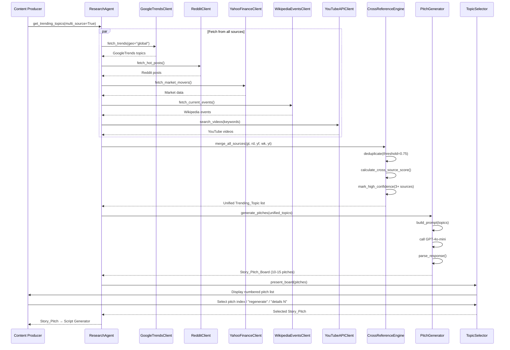

# Design Document: Research Agent

## Overview

The Research Agent is a Python-based data acquisition module that interfaces with the YouTube Data API v3 to discover and analyze trending technical topics. This module serves as the intelligence layer for the Faceless Technical Media Engine, ensuring all video content is grounded in real-time, data-driven insights rather than generic AI-generated content.

### Core Objectives

1. **Data-Driven Content Discovery**: Scrape YouTube API to identify trending technical topics with statistical significance
2. **Intelligent Rate Management**: Efficiently manage API quota (10,000 units/day) to prevent service interruptions
3. **Real-Time Trend Analysis**: Calculate trend scores based on engagement metrics and recency
4. **Macro-Economic Context**: Cross-reference technical trends with authority channels (business/finance news) to identify high-value topics
5. **Financial Intelligence**: Extract stock tickers and company mentions to provide business context
6. **Resilient Architecture**: Handle API failures, network issues, and quota exhaustion gracefully

### Design Principles

- **API-First**: All data must come from real-time API calls, never synthetic or generic content
- **Quota-Aware**: Every operation must consider API cost before execution
- **Fail-Safe**: Temporary failures should not crash the system; use caching and retries
- **Observable**: Comprehensive logging for debugging and monitoring

## Architecture

### System Components

```
┌─────────────────────────────────────────────────────────────────────────┐
│                          Research Agent                                 │
│                                                                         │
│  ┌──────────────┐      ┌──────────────┐      ┌──────────────────┐    │
│  │   Config     │      │    Logger    │      │  Authority       │    │
│  │   Manager    │      │              │      │  Channel Config  │    │
│  └──────────────┘      └──────────────┘      └──────────────────┘    │
│                                                                         │
│  ┌───────────────────────────────────────────────────────────────┐   │
│  │           YouTube API Client                                  │   │
│  │  ┌────────────────┐    ┌──────────────────┐                  │   │
│  │  │ API Rate       │    │  Request Builder │                  │   │
│  │  │ Limiter        │    │                  │                  │   │
│  │  └────────────────┘    └──────────────────┘                  │   │
│  │  ┌────────────────┐    ┌──────────────────┐                  │   │
│  │  │ Retry Handler  │    │  Response Parser │                  │   │
│  │  └────────────────┘    └──────────────────┘                  │   │
│  │  ┌────────────────┐    ┌──────────────────┐                  │   │
│  │  │ Channel Fetch  │    │  Finance Extract │                  │   │
│  │  └────────────────┘    └──────────────────┘                  │   │
│  └───────────────────────────────────────────────────────────────┘   │
│                                                                         │
│  ┌───────────────────────────────────────────────────────────────┐   │
│  │           Topic Analyzer                                      │   │
│  │  ┌────────────────┐    ┌──────────────────┐                  │   │
│  │  │ Trend Score    │    │  Classifier      │                  │   │
│  │  │ Calculator     │    │                  │                  │   │
│  │  └────────────────┘    └──────────────────┘                  │   │
│  │  ┌────────────────┐    ┌──────────────────┐                  │   │
│  │  │ Topic Ranker   │    │  Filter Engine   │                  │   │
│  │  └────────────────┘    └──────────────────┘                  │   │
│  └───────────────────────────────────────────────────────────────┘   │
│                                                                         │
│  ┌───────────────────────────────────────────────────────────────┐   │
│  │           Cross-Reference Engine (NEW)                        │   │
│  │  ┌────────────────┐    ┌──────────────────┐                  │   │
│  │  │ Topic Matcher  │    │  Similarity Calc │                  │   │
│  │  └────────────────┘    └──────────────────┘                  │   │
│  │  ┌────────────────┐    ┌──────────────────┐                  │   │
│  │  │ Macro Bonus    │    │  Stock Ticker    │                  │   │
│  │  │ Applicator     │    │  Extractor       │                  │   │
│  │  └────────────────┘    └──────────────────┘                  │   │
│  └───────────────────────────────────────────────────────────────┘   │
│                                                                         │
│  ┌───────────────────────────────────────────────────────────────┐   │
│  │           Topic Cache                                         │   │
│  │  ┌────────────────┐    ┌──────────────────┐                  │   │
│  │  │ Cache Manager  │    │  JSON Serializer │                  │   │
│  │  └────────────────┘    └──────────────────┘                  │   │
│  └───────────────────────────────────────────────────────────────┘   │
└─────────────────────────────────────────────────────────────────────────┘
                          │
                          ▼
                 ┌─────────────────┐
                 │  YouTube Data   │
                 │    API v3       │
                 └─────────────────┘
```

### Component Responsibilities

**YouTube API Client** (`research_agent/api_client.py`):
- Authenticate with YouTube Data API v3 using API key from environment
- Build and execute API requests (search, video details)
- Parse API responses into structured data
- Handle retries with exponential backoff for transient failures
- Raise appropriate exceptions for authentication and quota errors

**API Rate Limiter** (`research_agent/rate_limiter.py`):
- Track daily quota consumption (10,000 units limit)
- Calculate cost of operations before execution
- Prevent API calls when quota threshold exceeded (95%)
- Log warnings at 80% quota consumption
- Implement circuit breaker for quota exhaustion

**Topic Analyzer** (`research_agent/analyzer.py`):
- Calculate trend scores using weighted algorithm
- Classify topics into technical categories
- Rank topics by trend score
- Filter low-scoring topics (< 30)
- Group topics by category

**Topic Cache** (`research_agent/cache.py`):
- Store trending topics with timestamps
- Serve cached data when fresh (< 6 hours old)
- Persist cache to disk in JSON format
- Handle cache corruption gracefully
- Implement atomic writes to prevent data loss

**Config Manager** (`research_agent/config.py`):
- Load configuration from YAML/JSON files
- Provide default parameters when config missing
- Validate configuration schema
- Support environment variable overrides

**Logger** (`research_agent/logger.py`):
- Structured logging with configurable levels
- Log API requests with quota cost
- Log errors with full context and stack traces
- Support JSON output format for structured logging

**Cross-Reference Engine** (`research_agent/cross_reference.py`):
- Fetch latest videos from authority channels (The Economist, Bloomberg Tech, etc.)
- Match topics between technical searches and authority channel content
- Calculate semantic similarity using keyword overlap
- Apply 2x trend score bonus for cross-referenced topics
- Extract stock tickers ($SYMBOL format) from video metadata
- Identify mentioned companies and financial entities
- Calculate macro_relevance_score (0-1) based on authority channel presence

### Data Flow

**Standard Mode (macro_mode=False)**:
1. **Request Initiation**: User calls `ResearchAgent.get_trending_topics()`
2. **Cache Check**: Topic Cache checks if fresh data exists (< 6 hours)
3. **Quota Validation**: API Rate Limiter verifies sufficient quota available
4. **API Request**: YouTube API Client executes search query (cost: 100 units)
5. **Video Details**: Fetch detailed metrics for top videos (cost: 1 unit each)
6. **Trend Analysis**: Topic Analyzer calculates scores and classifies topics
7. **Ranking**: Topics sorted by trend score, filtered by threshold
8. **Caching**: Results stored in Topic Cache with timestamp
9. **Response**: Structured topic data returned to caller

**Macro Mode (macro_mode=True)**:
1. **Request Initiation**: User calls `ResearchAgent.get_trending_topics(macro_mode=True)`
2. **Cache Check**: Topic Cache checks if fresh data exists (< 6 hours)
3. **Quota Validation**: API Rate Limiter verifies sufficient quota available
4. **Technical Search**: YouTube API Client executes search query (cost: 100 units)
5. **Authority Channel Fetch**: Fetch latest 5 videos from each authority channel (cost: ~50 units)
6. **Video Details**: Fetch detailed metrics for all videos (cost: 1 unit each)
7. **Trend Analysis**: Topic Analyzer calculates base scores and classifies topics
8. **Cross-Reference**: Cross-Reference Engine identifies topic overlap
9. **Macro Bonus**: Apply 2x trend score bonus to cross-referenced topics
10. **Finance Extraction**: Extract stock tickers and company mentions
11. **Ranking**: Topics sorted by enhanced trend score, filtered by threshold
12. **Caching**: Results with finance_context stored in Topic Cache
13. **Response**: Structured topic data with macro intelligence returned to caller

## Components and Interfaces

### YouTube API Client

```python
class YouTubeAPIClient:
    """
    Client for interacting with YouTube Data API v3.
    Handles authentication, request execution, and error handling.
    """
    
    def __init__(self, api_key: str, rate_limiter: APIRateLimiter):
        """
        Initialize YouTube API client.
        
        Args:
            api_key: YouTube Data API key from environment
            rate_limiter: Rate limiter instance for quota management
            
        Raises:
            AuthenticationError: If API key is invalid or missing
        """
        
    def search_videos(
        self,
        query: str,
        published_after: datetime,
        published_before: datetime,
        max_results: int = 50
    ) -> List[Dict[str, Any]]:
        """
        Search for videos matching query within date range.
        
        Args:
            query: Search keywords
            published_after: Start date for video publication
            published_before: End date for video publication
            max_results: Maximum number of results to return
            
        Returns:
            List of video metadata dictionaries
            
        Raises:
            QuotaExceededError: If API quota exhausted
            NetworkError: If network connectivity lost
            ParseError: If response parsing fails
        """
        
    def get_video_details(self, video_ids: List[str]) -> List[Dict[str, Any]]:
        """
        Fetch detailed statistics for videos.
        
        Args:
            video_ids: List of YouTube video IDs
            
        Returns:
            List of video detail dictionaries with statistics
            
        Raises:
            QuotaExceededError: If API quota exhausted
            NetworkError: If network connectivity lost
        """
```

### API Rate Limiter

```python
class APIRateLimiter:
    """
    Manages YouTube API quota consumption and rate limiting.
    Implements circuit breaker pattern for quota exhaustion.
    """
    
    def __init__(self, daily_quota: int = 10000):
        """
        Initialize rate limiter with daily quota.
        
        Args:
            daily_quota: Maximum API units per day (default: 10000)
        """
        
    def check_quota(self, cost: int) -> bool:
        """
        Check if sufficient quota available for operation.
        
        Args:
            cost: API units required for operation
            
        Returns:
            True if quota available, False otherwise
        """
        
    def consume_quota(self, cost: int) -> None:
        """
        Consume quota for completed operation.
        
        Args:
            cost: API units consumed
            
        Raises:
            QuotaExceededError: If quota limit reached
        """
        
    def get_remaining_quota(self) -> int:
        """
        Get remaining quota units for current day.
        
        Returns:
            Remaining API units
        """
        
    def reset_quota(self) -> None:
        """
        Reset quota counter (called at midnight Pacific Time).
        """
```

### Topic Analyzer

```python
class TopicAnalyzer:
    """
    Analyzes video data to identify and score trending topics.
    Implements trend scoring algorithm and topic classification.
    """
    
    def analyze_trends(
        self,
        videos: List[Dict[str, Any]],
        min_score: int = 30
    ) -> List[Dict[str, Any]]:
        """
        Analyze videos to identify trending topics.
        
        Args:
            videos: List of video metadata with statistics
            min_score: Minimum trend score threshold (0-100)
            
        Returns:
            List of trending topics with scores, ranked by trend strength
        """
        
    def calculate_trend_score(self, video: Dict[str, Any]) -> float:
        """
        Calculate trend score for a single video.
        
        Formula:
        - View count weight: 40%
        - Engagement rate (likes + comments / views): 30%
        - Recency weight: 30% (2x multiplier for < 24 hours)
        - Normalized to 0-100 scale
        
        Args:
            video: Video metadata with statistics
            
        Returns:
            Trend score (0-100)
        """
        
    def classify_topic(
        self,
        video: Dict[str, Any]
    ) -> Tuple[str, float]:
        """
        Classify video into technical category.
        
        Categories:
        - Programming Languages
        - DevOps
        - Cloud Infrastructure
        - Software Architecture
        - Security
        - Data Engineering
        - Uncategorized (confidence < 0.6)
        
        Args:
            video: Video metadata with title, description, tags
            
        Returns:
            Tuple of (category, confidence_score)
        """
```

### Topic Cache

```python
class TopicCache:
    """
    Manages caching of trending topic data to reduce API calls.
    Implements TTL-based invalidation and atomic writes.
    """
    
    def __init__(self, cache_file: str = ".cache/topics.json", ttl_hours: int = 6):
        """
        Initialize topic cache.
        
        Args:
            cache_file: Path to cache file
            ttl_hours: Time-to-live for cached data in hours
        """
        
    def get(self, key: str) -> Optional[Dict[str, Any]]:
        """
        Retrieve cached topic data if fresh.
        
        Args:
            key: Cache key (e.g., query parameters hash)
            
        Returns:
            Cached data if fresh (< TTL), None otherwise
        """
        
    def set(self, key: str, data: Dict[str, Any]) -> None:
        """
        Store topic data in cache with timestamp.
        
        Args:
            key: Cache key
            data: Topic data to cache
        """
        
    def invalidate(self, key: str) -> None:
        """
        Remove specific entry from cache.
        
        Args:
            key: Cache key to invalidate
        """
        
    def clear(self) -> None:
        """
        Clear entire cache (used when corruption detected).
        """
```

### Research Agent (Main Interface)

```python
class ResearchAgent:
    """
    Main interface for trending topic discovery.
    Orchestrates API client, analyzer, cache, and cross-reference components.
    """
    
    def __init__(self, config: Optional[Dict[str, Any]] = None):
        """
        Initialize research agent with configuration.
        
        Args:
            config: Configuration dictionary or None for defaults
            
        Raises:
            AuthenticationError: If YouTube API key missing/invalid
        """
        
    def get_trending_topics(
        self,
        keywords: Optional[List[str]] = None,
        days_back: int = 7,
        min_views: int = 1000,
        macro_mode: bool = False
    ) -> Dict[str, Any]:
        """
        Discover trending technical topics from YouTube.
        
        Args:
            keywords: Seed keywords for search (None for defaults)
            days_back: Number of days to look back for videos
            min_views: Minimum view count threshold
            macro_mode: Enable authority channel cross-referencing
            
        Returns:
            Dictionary with structure:
            {
                "topics": [
                    {
                        "topic_name": str,
                        "category": str,
                        "trend_score": float,
                        "video_count": int,
                        "top_videos": [
                            {
                                "video_id": str,
                                "title": str,
                                "channel": str,
                                "view_count": int,
                                "published_at": str (ISO 8601)
                            }
                        ],
                        "fetched_at": str (ISO 8601),
                        "finance_context": {
                            "stock_tickers": List[str],
                            "mentioned_companies": List[str],
                            "macro_relevance_score": float,
                            "authority_channel_match": bool
                        }
                    }
                ],
                "metadata": {
                    "query_date": str,
                    "total_videos_analyzed": int,
                    "average_trend_score": float,
                    "macro_mode_enabled": bool,
                    "authority_channels_checked": int
                }
            }
            
        Raises:
            QuotaExceededError: If API quota exhausted
            NetworkError: If network connectivity lost
            SchemaValidationError: If output validation fails
        """
```

### Cross-Reference Engine (New Component)

```python
class CrossReferenceEngine:
    """
    Cross-references technical topics with authority channel content.
    Identifies macro trends and extracts financial context.
    """
    
    # Authority channel IDs (YouTube channel IDs)
    AUTHORITY_CHANNELS = {
        'The Economist': 'UC0p5jTq6Xx_DosDFxVXnWaQ',
        'Bloomberg Technology': 'UCrM7B7SL_g1edFOnmj-SDKg',
        'CNBC Television': 'UCvJJ_dzjViJCoLf5uKUTwoA',
        'Financial Times': 'UCRb3vTRz8RYCqGGq-Xt8Rkw',
        'Wall Street Journal': 'UCK7tptUDHh-RYDsdxO1-5QQ',
        'TechCrunch': 'UCCjyq_K1Xwfg8Lndy7lKMpA',
        'The Verge': 'UCddiUEpeqJcYeBxX1IVBKvQ'
    }
    
    def __init__(self, api_client: YouTubeAPIClient):
        """
        Initialize cross-reference engine.
        
        Args:
            api_client: YouTube API client for fetching authority content
        """
        
    def fetch_authority_content(
        self,
        max_videos_per_channel: int = 5
    ) -> List[Dict[str, Any]]:
        """
        Fetch latest videos from authority channels.
        
        Args:
            max_videos_per_channel: Number of recent videos to fetch per channel
            
        Returns:
            List of video metadata from authority channels
            
        Raises:
            QuotaExceededError: If API quota exhausted
        """
        
    def match_topics(
        self,
        technical_topics: List[Dict[str, Any]],
        authority_videos: List[Dict[str, Any]],
        similarity_threshold: float = 0.3
    ) -> Dict[str, bool]:
        """
        Identify topic overlap between technical and authority content.
        
        Uses keyword matching and semantic similarity to find cross-references.
        
        Args:
            technical_topics: Topics from technical searches
            authority_videos: Videos from authority channels
            similarity_threshold: Minimum similarity score for match (0-1)
            
        Returns:
            Dictionary mapping topic names to match status (True if matched)
        """
        
    def calculate_similarity(
        self,
        topic: Dict[str, Any],
        video: Dict[str, Any]
    ) -> float:
        """
        Calculate semantic similarity between topic and video.
        
        Uses keyword overlap, entity matching, and contextual analysis.
        
        Args:
            topic: Technical topic with metadata
            video: Authority channel video with metadata
            
        Returns:
            Similarity score (0-1)
        """
        
    def extract_stock_tickers(
        self,
        text: str
    ) -> List[str]:
        """
        Extract stock tickers from text (format: $SYMBOL).
        
        Args:
            text: Text to analyze (title, description, tags)
            
        Returns:
            List of stock ticker symbols (e.g., ['NVDA', 'AMZN', 'MSFT'])
        """
        
    def extract_companies(
        self,
        text: str
    ) -> List[str]:
        """
        Extract company names from text.
        
        Uses pattern matching and entity recognition.
        
        Args:
            text: Text to analyze
            
        Returns:
            List of company names (e.g., ['NVIDIA', 'Amazon', 'Microsoft'])
        """
        
    def build_finance_context(
        self,
        topic: Dict[str, Any],
        authority_match: bool,
        authority_videos: List[Dict[str, Any]]
    ) -> Dict[str, Any]:
        """
        Build finance_context dictionary for a topic.
        
        Args:
            topic: Technical topic with metadata
            authority_match: Whether topic matched authority content
            authority_videos: Matched authority videos (if any)
            
        Returns:
            Dictionary with structure:
            {
                "stock_tickers": List[str],
                "mentioned_companies": List[str],
                "macro_relevance_score": float (0-1),
                "authority_channel_match": bool
            }
        """
        
    def apply_macro_bonus(
        self,
        topics: List[Dict[str, Any]],
        match_status: Dict[str, bool]
    ) -> List[Dict[str, Any]]:
        """
        Apply 2x trend score bonus to cross-referenced topics.
        
        Args:
            topics: List of topics with trend scores
            match_status: Dictionary mapping topic names to match status
            
        Returns:
            Topics with enhanced trend scores (capped at 100)
        """
```

## Data Models

### Video Metadata

```python
@dataclass
class VideoMetadata:
    """Raw video data from YouTube API."""
    video_id: str
    title: str
    description: str
    channel_id: str
    channel_title: str
    published_at: datetime
    tags: List[str]
    view_count: int
    like_count: int
    comment_count: int
    duration: str  # ISO 8601 duration format
```

### Trending Topic

```python
@dataclass
class TrendingTopic:
    """Analyzed trending topic with score, classification, and finance context."""
    topic_name: str
    category: str
    category_confidence: float
    trend_score: float  # 0-100
    video_count: int
    top_videos: List[VideoMetadata]
    fetched_at: datetime
    finance_context: Dict[str, Any]  # NEW: Financial intelligence
    
    def to_dict(self) -> Dict[str, Any]:
        """Convert to dictionary for JSON serialization."""

@dataclass
class FinanceContext:
    """Financial context for a trending topic."""
    stock_tickers: List[str]  # e.g., ['NVDA', 'AMZN', 'MSFT']
    mentioned_companies: List[str]  # e.g., ['NVIDIA', 'Amazon', 'Microsoft']
    macro_relevance_score: float  # 0-1, based on authority channel presence
    authority_channel_match: bool  # True if topic appears in authority content
    
    def to_dict(self) -> Dict[str, Any]:
        """Convert to dictionary for JSON serialization."""
        return {
            'stock_tickers': self.stock_tickers,
            'mentioned_companies': self.mentioned_companies,
            'macro_relevance_score': self.macro_relevance_score,
            'authority_channel_match': self.authority_channel_match
        }
```

### API Quota State

```python
@dataclass
class QuotaState:
    """Current state of API quota consumption."""
    daily_limit: int
    consumed: int
    remaining: int
    reset_at: datetime
    last_updated: datetime
    
    def usage_percentage(self) -> float:
        """Calculate quota usage as percentage."""
        return (self.consumed / self.daily_limit) * 100
```

### Configuration Schema

```python
@dataclass
class ResearchAgentConfig:
    """Configuration for research agent."""
    youtube_api_key: str
    daily_quota_limit: int = 10000
    cache_ttl_hours: int = 6
    cache_file_path: str = ".cache/topics.json"
    default_keywords: List[str] = field(default_factory=lambda: [
        "python tutorial",
        "devops automation",
        "kubernetes deployment",
        "aws cloud",
        "docker container",
        "ci/cd pipeline"
    ])
    min_trend_score: int = 30
    min_view_count: int = 1000
    search_days_back: int = 7
    max_videos_per_query: int = 50
    log_level: str = "INFO"
    structured_logging: bool = False
    
    # NEW: Macro mode configuration
    macro_mode_enabled: bool = False
    authority_channels: Dict[str, str] = field(default_factory=lambda: {
        'The Economist': 'UC0p5jTq6Xx_DosDFxVXnWaQ',
        'Bloomberg Technology': 'UCrM7B7SL_g1edFOnmj-SDKg',
        'CNBC Television': 'UCvJJ_dzjViJCoLf5uKUTwoA',
        'Financial Times': 'UCRb3vTRz8RYCqGGq-Xt8Rkw',
        'Wall Street Journal': 'UCK7tptUDHh-RYDsdxO1-5QQ',
        'TechCrunch': 'UCCjyq_K1Xwfg8Lndy7lKMpA',
        'The Verge': 'UCddiUEpeqJcYeBxX1IVBKvQ'
    })
    max_videos_per_authority_channel: int = 5
    topic_similarity_threshold: float = 0.3
    macro_bonus_multiplier: float = 2.0
```


## Error Handling

### Exception Hierarchy

```python
class ResearchAgentError(Exception):
    """Base exception for all research agent errors."""
    pass

class AuthenticationError(ResearchAgentError):
    """Raised when API key is missing or invalid."""
    pass

class QuotaExceededError(ResearchAgentError):
    """Raised when YouTube API quota exhausted."""
    def __init__(self, reset_at: datetime):
        self.reset_at = reset_at
        super().__init__(f"API quota exceeded. Resets at {reset_at.isoformat()}")

class NetworkError(ResearchAgentError):
    """Raised when network connectivity is lost."""
    pass

class ParseError(ResearchAgentError):
    """Raised when API response parsing fails."""
    def __init__(self, raw_response: str):
        self.raw_response = raw_response
        super().__init__("Failed to parse API response")

class SchemaValidationError(ResearchAgentError):
    """Raised when output data fails schema validation."""
    def __init__(self, violations: List[str]):
        self.violations = violations
        super().__init__(f"Schema validation failed: {', '.join(violations)}")

class CacheCorruptionError(ResearchAgentError):
    """Raised when cache file is corrupted or unreadable."""
    pass
```

### Error Handling Strategies

**API Errors (5xx Server Errors)**:
- Retry up to 3 times with exponential backoff (1s, 2s, 4s)
- Log each retry attempt with context
- Raise NetworkError after final retry failure
- Preserve original error message in exception chain

**Network Timeouts**:
- Set 30-second timeout for all API requests
- Raise NetworkError with descriptive message
- Log timeout with request details
- Do not retry on timeout (user should retry entire operation)

**Quota Exhaustion**:
- Pre-flight check before every API call
- Raise QuotaExceededError with reset timestamp
- Implement circuit breaker: block calls for 1 hour after 403 quota error
- Log quota state at ERROR level

**Parse Errors**:
- Log raw API response at DEBUG level
- Raise ParseError with context
- Do not retry (indicates API contract change)
- Alert operator for manual investigation

**Cache Corruption**:
- Catch JSON decode errors when reading cache
- Delete corrupted cache file
- Log corruption event at WARNING level
- Fetch fresh data from API
- Continue operation without cache

**Partial Failures**:
- When analyzing multiple topics, catch exceptions per topic
- Log individual topic failures at WARNING level
- Continue processing remaining topics
- Include error count in metadata
- Return partial results with error summary

### Logging Strategy

**Log Levels**:
- DEBUG: API request/response details, cache hits/misses
- INFO: Successful operations, trend analysis results
- WARNING: Quota warnings (80%), cache corruption, partial failures
- ERROR: API errors, quota exhaustion, authentication failures

**Structured Log Fields**:
```json
{
  "timestamp": "2024-01-15T10:30:00Z",
  "level": "INFO",
  "component": "YouTubeAPIClient",
  "operation": "search_videos",
  "quota_cost": 100,
  "quota_remaining": 8500,
  "duration_ms": 245,
  "result_count": 50
}
```

**Critical Events to Log**:
1. API authentication success/failure
2. Every API request with quota cost
3. Quota threshold warnings (80%, 95%)
4. Cache hits and misses
5. Trend analysis results (topic count, average score)
6. All exceptions with full stack trace
7. Configuration loading and validation


## Correctness Properties

*A property is a characteristic or behavior that should hold true across all valid executions of a system—essentially, a formal statement about what the system should do. Properties serve as the bridge between human-readable specifications and machine-verifiable correctness guarantees.*

### Property 1: Invalid API keys raise AuthenticationError

*For any* invalid or missing API key (empty string, malformed format, None), initializing the YouTube API client should raise an AuthenticationError with a descriptive message.

**Validates: Requirements 1.2**

### Property 2: API endpoints use v3 version

*For any* API request made by the YouTube API client, the endpoint URL should contain "/youtube/v3/" indicating use of YouTube Data API v3.

**Validates: Requirements 1.3**

### Property 3: Date filtering respects query parameters

*For any* query with specified date range (published_after, published_before), all returned videos should have published_at timestamps within that range (inclusive).

**Validates: Requirements 2.1, 7.2**

### Property 4: Technical topic filtering

*For any* result set from the Topic Analyzer, all returned topics should be classified as technical topics (not generic entertainment, lifestyle, or non-technical content).

**Validates: Requirements 2.2**

### Property 5: Minimum video count per query

*For any* search query where sufficient videos exist in the date range, the API client should retrieve at least 50 videos to ensure statistical significance.

**Validates: Requirements 2.3**

### Property 6: Highest confidence category assignment

*For any* video that matches multiple technical categories, the assigned category should be the one with the highest confidence score among all matches.

**Validates: Requirements 2.4**

### Property 7: Topics sorted by trend score with tie-breaking

*For any* result set, topics should be sorted in descending order by trend_score, and when two topics have identical scores, the one with higher view_count should rank first.

**Validates: Requirements 2.5, 3.4**

### Property 8: Trend score incorporates all required metrics

*For any* video, the calculated trend_score should be a function of view_count, like-to-view ratio, and comment-to-view ratio (all three metrics must influence the score).

**Validates: Requirements 3.1**

### Property 9: Recency boost for recent videos

*For any* video published within the last 24 hours, its trend_score should be higher than an otherwise identical video (same views, likes, comments) published more than 24 hours ago, demonstrating the 2x recency multiplier.

**Validates: Requirements 3.2**

### Property 10: Trend score normalization

*For any* video, the calculated trend_score should be a value between 0 and 100 (inclusive), regardless of the raw metric values.

**Validates: Requirements 3.3**

### Property 11: Minimum trend score filtering

*For any* result set returned by the Research Agent, all topics should have trend_score >= 30 (the minimum threshold).

**Validates: Requirements 3.5, 7.3**

### Property 12: Quota consumption tracking accuracy

*For any* sequence of API operations, the total quota consumed (as tracked by the rate limiter) should equal the sum of individual operation costs (search: 100 units, video details: 1 unit per video).

**Validates: Requirements 4.1**

### Property 13: Pre-flight quota cost calculation

*For any* API operation, the rate limiter should calculate and check the operation cost before the API request is executed, not after.

**Validates: Requirements 4.4**

### Property 14: Cache round-trip preserves data

*For any* trending topic data, storing it in the cache and then retrieving it should produce equivalent data (including all fields: topic_name, category, trend_score, video_count, top_videos, and fetched_at timestamp).

**Validates: Requirements 5.1, 5.4**

### Property 15: Fresh cache prevents API calls

*For any* query where cached data exists and is less than 6 hours old, the Research Agent should return the cached results without making any YouTube API calls (quota consumption should be 0).

**Validates: Requirements 5.2**

### Property 16: Stale cache triggers API refresh

*For any* query where cached data is older than 6 hours, the Research Agent should make API calls to fetch fresh data (quota consumption should be > 0).

**Validates: Requirements 5.3**

### Property 17: Valid category classification

*For any* classified topic, the assigned category should be one of the predefined values: "Programming Languages", "DevOps", "Cloud Infrastructure", "Software Architecture", "Security", "Data Engineering", or "Uncategorized".

**Validates: Requirements 6.1**

### Property 18: Classification confidence bounds

*For any* topic classification, the confidence score should be a value between 0 and 1 (inclusive).

**Validates: Requirements 6.3**

### Property 19: Low confidence marked as uncategorized

*For any* topic classification with confidence score below 0.6, the assigned category should be "Uncategorized".

**Validates: Requirements 6.4**

### Property 20: Topics grouped by category

*For any* result set, topics should be organized such that all topics with the same category are grouped together in the output structure.

**Validates: Requirements 6.5**

### Property 21: Custom keywords accepted

*For any* list of seed keywords provided to the Research Agent, the agent should accept them and use them in the search query (verifiable by checking the API request parameters).

**Validates: Requirements 7.1**

### Property 22: View count filtering

*For any* minimum view count threshold specified, all returned videos should have view_count >= threshold.

**Validates: Requirements 7.3**

### Property 23: Configuration file parsing

*For any* valid YAML or JSON configuration file, the Research Agent should successfully parse and apply the configuration settings.

**Validates: Requirements 7.4**

### Property 24: Retry logic for server errors

*For any* API request that receives a 5xx server error, the YouTube API client should make exactly 3 retry attempts with exponential backoff delays (1s, 2s, 4s) before raising an exception.

**Validates: Requirements 8.1**

### Property 25: Parse errors logged and raised

*For any* API response that fails to parse, the Research Agent should log the raw response at DEBUG level and raise a ParseError exception.

**Validates: Requirements 8.3**

### Property 26: Exception logging includes stack trace

*For any* exception raised within the Research Agent, the logs should contain the full stack trace and contextual information about the operation that failed.

**Validates: Requirements 8.4**

### Property 27: Partial failure resilience

*For any* batch of topics being analyzed, if one topic analysis fails with an exception, the remaining topics should still be processed and included in the results.

**Validates: Requirements 8.5**

### Property 28: Output schema completeness

*For any* result returned by the Research Agent, each topic dictionary should contain all required keys: topic_name, category, trend_score, video_count, top_videos, and fetched_at.

**Validates: Requirements 9.1**

### Property 29: ISO 8601 timestamp formatting

*For any* timestamp in the JSON output (fetched_at, published_at), the format should match ISO 8601 standard (e.g., "2024-01-15T10:30:00Z").

**Validates: Requirements 9.2**

### Property 30: Top videos structure and limit

*For any* topic in the result set, the top_videos list should contain at most 5 videos, and each video should have all required fields: video_id, title, channel, view_count, and published_at.

**Validates: Requirements 9.3**

### Property 31: Schema validation errors include violations

*For any* output that fails schema validation, the raised SchemaValidationError should include a list of specific violations (which fields are missing or invalid).

**Validates: Requirements 9.5**

### Property 32: API request logging completeness

*For any* API request made to YouTube, the logs should contain an entry with timestamp, endpoint URL, and quota cost.

**Validates: Requirements 10.1**

### Property 33: Analysis results logged

*For any* completed trend analysis, the logs should contain an entry with the total topic count and average trend_score.

**Validates: Requirements 10.2**

### Property 34: Error logging at ERROR level

*For any* error or exception, the logs should contain an entry at ERROR level with full context about the failure.

**Validates: Requirements 10.3**

### Property 35: Configurable log levels

*For any* valid log level (DEBUG, INFO, WARNING, ERROR), the Research Agent should accept the configuration and filter log output accordingly.

**Validates: Requirements 10.4**

### Property 36: Structured logging JSON format

*For any* log entry when structured logging is enabled, the output should be valid JSON with consistent field names (timestamp, level, component, operation, etc.).

**Validates: Requirements 10.5**

### Property 37: Macro mode authority channel fetching

*For any* request with macro_mode enabled, the Research Agent should fetch videos from all configured authority channels (minimum 5 videos per channel).

**Validates: Requirements 3.6, 3.7**

### Property 38: Cross-reference bonus application

*For any* topic that appears in both technical searches AND authority channel content, the trend_score should be exactly 2x the base score (before normalization to 100).

**Validates: Requirements 3.9**

### Property 39: Stock ticker extraction format

*For any* extracted stock ticker, the format should match the pattern $[A-Z]{1,5} (dollar sign followed by 1-5 uppercase letters).

**Validates: Requirements 3.10**

### Property 40: Finance context structure completeness

*For any* topic in macro mode results, the finance_context should contain all required keys: stock_tickers, mentioned_companies, macro_relevance_score, and authority_channel_match.

**Validates: Requirements 3.11, 9.6**

### Property 41: Empty finance context in standard mode

*For any* request with macro_mode disabled, all topics should have finance_context with empty lists and macro_relevance_score of 0.0.

**Validates: Requirements 3.12, 9.7**

### Property 42: Macro relevance score bounds

*For any* topic, the macro_relevance_score should be a value between 0 and 1 (inclusive).

**Validates: Requirements 3.11**

### Property 43: Authority channel match consistency

*For any* topic with authority_channel_match=True, the macro_relevance_score should be greater than 0.

**Validates: Requirements 3.9, 3.11**


## Testing Strategy

### Dual Testing Approach

The Research Agent will employ both unit testing and property-based testing to ensure comprehensive coverage. These approaches are complementary:

- **Unit tests**: Verify specific examples, edge cases, and error conditions
- **Property tests**: Verify universal properties across all inputs

Together, they provide comprehensive coverage where unit tests catch concrete bugs and property tests verify general correctness.

### Property-Based Testing

**Library Selection**: Use **Hypothesis** for Python property-based testing. Hypothesis is the standard PBT library for Python with excellent support for generating complex data structures.

**Configuration**:
- Minimum 100 iterations per property test (due to randomization)
- Each property test must reference its design document property
- Tag format: `# Feature: research-agent, Property {number}: {property_text}`

**Example Property Test Structure**:

```python
from hypothesis import given, strategies as st
import hypothesis

# Feature: research-agent, Property 10: Trend score normalization
@given(
    view_count=st.integers(min_value=0, max_value=10_000_000),
    like_count=st.integers(min_value=0, max_value=1_000_000),
    comment_count=st.integers(min_value=0, max_value=100_000),
    published_hours_ago=st.integers(min_value=0, max_value=168)
)
@hypothesis.settings(max_examples=100)
def test_trend_score_normalization(view_count, like_count, comment_count, published_hours_ago):
    """Property 10: For any video, trend_score should be between 0 and 100."""
    video = create_test_video(
        view_count=view_count,
        like_count=like_count,
        comment_count=comment_count,
        published_hours_ago=published_hours_ago
    )
    
    analyzer = TopicAnalyzer()
    score = analyzer.calculate_trend_score(video)
    
    assert 0 <= score <= 100, f"Trend score {score} outside valid range [0, 100]"
```

**Property Test Coverage**:

Each of the 36 correctness properties should have a corresponding property-based test. Priority properties for initial implementation:

1. **Property 12**: Quota consumption tracking (critical for API management)
2. **Property 14**: Cache round-trip (critical for data integrity)
3. **Property 10**: Trend score normalization (core algorithm)
4. **Property 7**: Sorting with tie-breaking (core algorithm)
5. **Property 28**: Output schema completeness (integration point)

### Unit Testing

**Framework**: Use **pytest** for unit testing with fixtures for common test data.

**Unit Test Focus Areas**:

1. **Specific Examples**:
   - Valid API key authentication succeeds
   - Default configuration values applied when no config file provided
   - Quota exceeded error raised when limit reached
   - Cache corruption triggers fresh data fetch
   - Network timeout after 30 seconds

2. **Edge Cases**:
   - Empty search results (no videos found)
   - Single video in result set
   - All videos have identical trend scores
   - Cache file doesn't exist on first run
   - API returns malformed JSON
   - Video with zero views/likes/comments
   - Quota at exactly 80% threshold
   - Quota at exactly 95% threshold

3. **Integration Points**:
   - End-to-end flow: query → API → analysis → cache → output
   - Configuration loading from YAML and JSON files
   - Logger integration with different log levels
   - Exception propagation through component layers

4. **Error Conditions**:
   - Missing API key raises AuthenticationError
   - Invalid API key raises AuthenticationError
   - 5xx errors trigger retry logic
   - 403 quota error activates circuit breaker
   - Parse errors log raw response
   - Schema validation failures include violation details

**Example Unit Test**:

```python
import pytest
from research_agent import ResearchAgent, AuthenticationError

def test_missing_api_key_raises_authentication_error():
    """Unit test: Missing API key should raise AuthenticationError."""
    with pytest.raises(AuthenticationError, match="API key is required"):
        ResearchAgent(config={"youtube_api_key": None})

def test_default_configuration_applied():
    """Unit test: Default parameters used when no config provided."""
    agent = ResearchAgent()
    
    assert agent.config.search_days_back == 7
    assert agent.config.min_view_count == 1000
    assert agent.config.min_trend_score == 30
    assert len(agent.config.default_keywords) > 0
```

### Test Data Generation

**Strategies for Property Tests**:

```python
from hypothesis import strategies as st
from datetime import datetime, timedelta

# Video metadata strategy
video_metadata = st.fixed_dictionaries({
    'video_id': st.text(min_size=11, max_size=11, alphabet=st.characters(whitelist_categories=('Lu', 'Ll', 'Nd'))),
    'title': st.text(min_size=10, max_size=100),
    'description': st.text(min_size=0, max_size=500),
    'channel_title': st.text(min_size=3, max_size=50),
    'published_at': st.datetimes(
        min_value=datetime.now() - timedelta(days=30),
        max_value=datetime.now()
    ),
    'tags': st.lists(st.text(min_size=2, max_size=20), min_size=0, max_size=10),
    'view_count': st.integers(min_value=0, max_value=10_000_000),
    'like_count': st.integers(min_value=0, max_value=1_000_000),
    'comment_count': st.integers(min_value=0, max_value=100_000)
})

# API key strategy (for testing invalid keys)
invalid_api_keys = st.one_of(
    st.none(),
    st.just(""),
    st.text(max_size=5),  # Too short
    st.text(alphabet=st.characters(blacklist_characters='ABCDEFGHIJKLMNOPQRSTUVWXYZabcdefghijklmnopqrstuvwxyz0123456789'))  # Invalid characters
)
```

### Mocking Strategy

**YouTube API Mocking**:
- Use `responses` library to mock HTTP requests to YouTube API
- Create fixtures for common API responses (search results, video details, error responses)
- Mock quota exhaustion scenarios
- Mock network timeouts and server errors

**Example Mock**:

```python
import responses
import pytest

@pytest.fixture
def mock_youtube_search():
    """Mock YouTube search API response."""
    responses.add(
        responses.GET,
        'https://www.googleapis.com/youtube/v3/search',
        json={
            'items': [
                {
                    'id': {'videoId': 'test_video_1'},
                    'snippet': {
                        'title': 'Python Tutorial',
                        'description': 'Learn Python programming',
                        'channelTitle': 'Tech Channel',
                        'publishedAt': '2024-01-10T10:00:00Z'
                    }
                }
            ]
        },
        status=200
    )
```

### Test Organization

```
tests/
├── unit/
│   ├── test_api_client.py          # YouTube API client tests
│   ├── test_rate_limiter.py        # Rate limiter tests
│   ├── test_analyzer.py            # Topic analyzer tests
│   ├── test_cache.py               # Cache tests
│   ├── test_config.py              # Configuration tests
│   └── test_research_agent.py      # Integration tests
├── property/
│   ├── test_properties_api.py      # Properties 1-5, 12-13
│   ├── test_properties_analysis.py # Properties 6-11
│   ├── test_properties_cache.py    # Properties 14-16
│   ├── test_properties_classification.py  # Properties 17-20
│   ├── test_properties_config.py   # Properties 21-23
│   ├── test_properties_errors.py   # Properties 24-27
│   ├── test_properties_output.py   # Properties 28-31
│   └── test_properties_logging.py  # Properties 32-36
├── fixtures/
│   ├── api_responses.py            # Mock API response data
│   ├── test_videos.py              # Test video data
│   └── test_configs.py             # Test configuration files
└── conftest.py                     # Shared pytest fixtures
```

### Coverage Goals

- **Line Coverage**: Minimum 85% for all modules
- **Branch Coverage**: Minimum 80% for conditional logic
- **Property Coverage**: 100% of correctness properties implemented as tests
- **Critical Path Coverage**: 100% for API client, rate limiter, and trend scoring

### Continuous Integration

**Test Execution**:
- Run unit tests on every commit
- Run property tests on every pull request
- Run full test suite (unit + property) before release
- Generate coverage reports and fail if below thresholds

**Test Performance**:
- Unit tests should complete in < 30 seconds
- Property tests should complete in < 5 minutes
- Use pytest-xdist for parallel test execution

### Manual Testing Scenarios

While automated tests cover most functionality, these scenarios require manual verification:

1. **API Key Setup**: Verify clear error messages guide users to obtain YouTube API key
2. **Quota Reset Timing**: Verify quota resets at midnight Pacific Time
3. **Log Readability**: Verify log output is human-readable and actionable
4. **Configuration Examples**: Verify example config files work correctly
5. **Documentation Accuracy**: Verify code examples in documentation execute successfully


---

# Multi-Source Expansion (R11-R17)

## Overview Update

The Research Agent expands from a YouTube-only data source to a multi-source intelligence platform. Five data sources feed into a unified trend aggregation pipeline:

1. **Google Trends** (free, `pytrends`) — real-time trending searches globally
2. **Reddit** (free, public JSON API) — trending discussions across 9 subreddits
3. **Yahoo Finance** (free, `yfinance`) — market movers, sector performance
4. **Wikipedia Current Events** (free, `requests` + `BeautifulSoup`) — curated daily global news
5. **YouTube Data API v3** (existing) — trending video content

After aggregation, GPT-4o-mini synthesizes raw trends into Story Pitches, and a human-in-the-loop step lets the content producer select the final topic for the Script Generator.

## Architecture Update

### Multi-Source System Components

```
┌──────────────────────────────────────────────────────────────────────────────────┐
│                          Research Agent (Multi-Source)                            │
│                                                                                  │
│  ┌─────────────────────────────────────────────────────────────────────────────┐│
│  │                        Data Source Clients                                  ││
│  │  ┌──────────────┐ ┌──────────────┐ ┌──────────────┐ ┌──────────────┐      ││
│  │  │ Google Trends │ │   Reddit     │ │ Yahoo Finance│ │  Wikipedia   │      ││
│  │  │   Client     │ │   Client     │ │   Client     │ │Events Client │      ││
│  │  │  (pytrends)  │ │ (requests)   │ │  (yfinance)  │ │(BeautifulSoup│      ││
│  │  └──────┬───────┘ └──────┬───────┘ └──────┬───────┘ └──────┬───────┘      ││
│  │         │                │                │                │               ││
│  │         └────────────────┴────────┬───────┴────────────────┘               ││
│  │                                   │                                         ││
│  │  ┌──────────────┐                 │          ┌──────────────┐              ││
│  │  │ YouTube API  │─────────────────┤          │  API Rate    │              ││
│  │  │   Client     │                 │          │  Limiter     │              ││
│  │  └──────────────┘                 │          └──────────────┘              ││
│  └───────────────────────────────────┼─────────────────────────────────────────┘│
│                                      ▼                                          │
│  ┌─────────────────────────────────────────────────────────────────────────────┐│
│  │           Cross-Reference Engine (Extended)                                 ││
│  │  ┌────────────────┐  ┌──────────────────┐  ┌──────────────────┐           ││
│  │  │ Multi-Source    │  │  Deduplication   │  │  Trend Score     │           ││
│  │  │ Merger          │  │  (0.75 sim)      │  │  Calculator      │           ││
│  │  └────────────────┘  └──────────────────┘  └──────────────────┘           ││
│  │  ┌────────────────┐  ┌──────────────────┐                                  ││
│  │  │ Topic Matcher  │  │  Confidence      │                                  ││
│  │  │ (keyword+sim)  │  │  Marker (3+ src) │                                  ││
│  │  └────────────────┘  └──────────────────┘                                  ││
│  └─────────────────────────────────┬───────────────────────────────────────────┘│
│                                    ▼                                            │
│  ┌─────────────────────────────────────────────────────────────────────────────┐│
│  │           Pitch Generator (GPT-4o-mini)                                     ││
│  │  ┌────────────────┐  ┌──────────────────┐  ┌──────────────────┐           ││
│  │  │ Prompt Builder │  │  OpenAI Client   │  │  Pitch Parser    │           ││
│  │  └────────────────┘  └──────────────────┘  └──────────────────┘           ││
│  └─────────────────────────────────┬───────────────────────────────────────────┘│
│                                    ▼                                            │
│  ┌─────────────────────────────────────────────────────────────────────────────┐│
│  │           Human-in-the-Loop Selector                                        ││
│  │  ┌────────────────┐  ┌──────────────────┐  ┌──────────────────┐           ││
│  │  │ Pitch Board    │  │  Selection       │  │  Detail Viewer   │           ││
│  │  │ Renderer       │  │  Handler         │  │                  │           ││
│  │  └────────────────┘  └──────────────────┘  └──────────────────┘           ││
│  └─────────────────────────────────┬───────────────────────────────────────────┘│
│                                    ▼                                            │
│                          Selected Story_Pitch                                   │
│                          → Script Generator                                     │
└──────────────────────────────────────────────────────────────────────────────────┘
```

### Multi-Source Data Flow



## New Components and Interfaces

### Google Trends Client

```python
class GoogleTrendsClient:
    """
    Fetches trending topics from Google Trends using pytrends.
    No API key required.
    """
    
    def __init__(self, geo: str = "", hl: str = "en-US"):
        """
        Initialize Google Trends client.
        
        Args:
            geo: Geographic filter (ISO country code, empty for global)
            hl: Language for results
        """
    
    def fetch_trends(
        self,
        geo: str = "",
        hours: int = 24
    ) -> List[Dict[str, Any]]:
        """
        Fetch daily trending searches and real-time trends.
        
        Uses pytrends.trending_searches() and pytrends.realtime_trending_searches().
        
        Args:
            geo: Country code filter (default: global)
            hours: Lookback window in hours (default: 24)
            
        Returns:
            List of dicts with keys:
            - topic_name: str (lowercase normalized)
            - approximate_search_volume: int
            - related_queries: List[str]
            - source_url: str (Google Trends URL)
            
        Note:
            Logs warning and returns empty list if Google Trends is unreachable.
        """
    
    def _normalize_topic_name(self, name: str) -> str:
        """Normalize topic name to lowercase for deduplication."""
```

### Reddit Client

```python
class RedditClient:
    """
    Fetches trending posts from public Reddit subreddits via JSON API.
    No API key required. Uses descriptive User-Agent header.
    """
    
    DEFAULT_SUBREDDITS = [
        "worldnews", "economics", "technology", "science",
        "futurology", "geopolitics", "finance",
        "dataisbeautiful", "explainlikeimfive"
    ]
    
    def __init__(self, user_agent: str = "FacelessMediaEngine/1.0 (research-agent)"):
        """
        Initialize Reddit client with descriptive User-Agent.
        
        Args:
            user_agent: User-Agent header string
        """
    
    def fetch_hot_posts(
        self,
        subreddits: Optional[List[str]] = None,
        limit: int = 25
    ) -> List[Dict[str, Any]]:
        """
        Fetch hot posts from configured subreddits.
        
        Enforces 2-second minimum interval between requests.
        Skips private/unavailable subreddits with a warning.
        
        Args:
            subreddits: List of subreddit names (default: DEFAULT_SUBREDDITS)
            limit: Posts per subreddit (default: 25)
            
        Returns:
            List of dicts with keys:
            - title: str
            - score: int
            - comment_count: int
            - subreddit: str
            - permalink: str
            - created_utc: float (Unix timestamp)
        """
    
    def _fetch_subreddit(self, subreddit: str, limit: int) -> List[Dict[str, Any]]:
        """Fetch posts from a single subreddit. Raises on private/unavailable."""
```

### Yahoo Finance Client

```python
class YahooFinanceClient:
    """
    Fetches market data from Yahoo Finance using yfinance.
    No API key required.
    """
    
    MAJOR_INDICES = ["^GSPC", "^DJI", "^IXIC", "^RUT"]  # S&P500, Dow, Nasdaq, Russell
    SECTORS = [
        "XLK", "XLF", "XLV", "XLE", "XLI",  # Tech, Finance, Health, Energy, Industrial
        "XLY", "XLP", "XLU", "XLB", "XLRE"   # Discretionary, Staples, Utilities, Materials, Real Estate
    ]
    
    def __init__(self):
        """Initialize Yahoo Finance client."""
    
    def fetch_market_movers(self) -> Dict[str, Any]:
        """
        Fetch top gainers, losers, and most active stocks.
        
        Returns:
            Dict with keys:
            - gainers: List[Dict] — top gaining stocks
            - losers: List[Dict] — top losing stocks
            - most_active: List[Dict] — most actively traded
            - story_triggers: List[Dict] — stocks moving >5%
            
            Each stock dict has keys:
            - symbol: str
            - name: str
            - price: float
            - change_percent: float
            - volume: int
            - sector: str
            
        Note:
            Logs warning and returns empty dict if Yahoo Finance is unreachable.
        """
    
    def fetch_sector_performance(self) -> List[Dict[str, Any]]:
        """
        Fetch sector ETF performance data.
        
        Returns:
            List of dicts with keys:
            - sector: str
            - symbol: str
            - change_percent: float
            - volume: int
        """
    
    def enrich_finance_context(
        self,
        tickers: List[str]
    ) -> Dict[str, Dict[str, Any]]:
        """
        Enrich finance_context with real-time price data for detected tickers.
        
        Args:
            tickers: Stock ticker symbols detected from other sources
            
        Returns:
            Dict mapping ticker to price data:
            {
                "NVDA": {"price": 130.5, "change_percent": 3.2, "volume": 50000000}
            }
        """
```

### Wikipedia Events Client

```python
class WikipediaEventsClient:
    """
    Fetches curated daily events from Wikipedia Current Events portal.
    No API key required. Uses requests + BeautifulSoup.
    """
    
    BASE_URL = "https://en.wikipedia.org/wiki/Portal:Current_events"
    
    EVENT_CATEGORIES = [
        "Armed conflicts and attacks",
        "Disasters and accidents",
        "International relations",
        "Law and crime",
        "Politics and elections",
        "Science and technology",
        "Sports"
    ]
    
    def __init__(self):
        """Initialize Wikipedia Events client."""
    
    def fetch_current_events(
        self,
        date: Optional[datetime] = None
    ) -> List[Dict[str, Any]]:
        """
        Fetch events from Wikipedia Current Events portal.
        
        Falls back to previous day if current day's page is unavailable.
        
        Args:
            date: Target date (default: today)
            
        Returns:
            List of dicts with keys:
            - headline: str
            - category: str (one of EVENT_CATEGORIES)
            - date: str (ISO 8601)
            - related_links: List[str] (Wikipedia article URLs)
            - summary: str
            - named_entities: List[str] (people, places, organizations)
        """
    
    def _parse_events_page(self, html: str) -> List[Dict[str, Any]]:
        """Parse HTML from Current Events portal into structured records."""
    
    def _classify_event(self, text: str) -> str:
        """Classify event into one of EVENT_CATEGORIES."""
    
    def _extract_named_entities(self, text: str) -> List[str]:
        """Extract people, places, organizations from text."""
```

### Pitch Generator

```python
class PitchGenerator:
    """
    Uses OpenAI GPT-4o-mini to synthesize raw trends into Story Pitches.
    Reads OPENAI_API_KEY from environment.
    """
    
    MODEL = "gpt-4o-mini"
    
    def __init__(self):
        """
        Initialize Pitch Generator.
        
        Raises:
            AuthenticationError: If OPENAI_API_KEY is missing or invalid
        """
    
    def generate_pitches(
        self,
        unified_topics: List[Dict[str, Any]],
        count: int = 12
    ) -> "StoryPitchBoard":
        """
        Generate Story Pitches from unified trending topics.
        
        Args:
            unified_topics: Merged/deduplicated topics from CrossReferenceEngine
            count: Target number of pitches (10-15 range)
            
        Returns:
            StoryPitchBoard containing 10-15 ranked Story_Pitches
        """
    
    def _build_prompt(self, topics: List[Dict[str, Any]], count: int) -> str:
        """
        Build GPT-4o-mini prompt.
        
        Instructs the model to:
        - Generate curiosity-driven questions or provocative angles
        - Avoid clickbait, hyperbole, generic phrasing
        - Classify each pitch as recent_event or historic_topic
        - Include source trend references
        """
    
    def _parse_response(self, response_text: str, topics: List[Dict[str, Any]]) -> List["StoryPitch"]:
        """Parse GPT-4o-mini response into StoryPitch objects."""
    
    def _rank_pitches(self, pitches: List["StoryPitch"]) -> List["StoryPitch"]:
        """Rank pitches by estimated audience interest (trend_score × source_count)."""
```

### Topic Selector (Human-in-the-Loop)

```python
class TopicSelector:
    """
    Presents Story_Pitch_Board and handles human selection.
    Supports selection by index, "regenerate", and "details N" commands.
    """
    
    def __init__(self, pitch_generator: PitchGenerator):
        """
        Initialize topic selector.
        
        Args:
            pitch_generator: PitchGenerator for regeneration support
        """
    
    def present_and_select(
        self,
        board: "StoryPitchBoard",
        unified_topics: List[Dict[str, Any]]
    ) -> "StoryPitch":
        """
        Present pitch board and handle user selection loop.
        
        Supports commands:
        - Integer index: select that pitch
        - "regenerate": generate new pitches from same trends
        - "details N": show full source data for pitch N
        
        Args:
            board: StoryPitchBoard to present
            unified_topics: Original topics (for regeneration)
            
        Returns:
            Selected StoryPitch dataclass
        """
    
    def _render_board(self, board: "StoryPitchBoard") -> str:
        """Render pitch board as numbered list with title, hook, context_type, category."""
    
    def _show_details(self, pitch: "StoryPitch") -> str:
        """Render full source trend data for a pitch."""
```

### Cross-Reference Engine (Extended)

The existing `CrossReferenceEngine` is extended with multi-source merging capabilities:

```python
class CrossReferenceEngine:
    """
    Extended to support merging topics from all 5 data sources.
    Existing authority channel matching and finance context building are preserved.
    """
    
    # ... existing methods preserved ...
    
    def merge_all_sources(
        self,
        google_trends: List[Dict[str, Any]],
        reddit_posts: List[Dict[str, Any]],
        yahoo_finance: Dict[str, Any],
        wikipedia_events: List[Dict[str, Any]],
        youtube_topics: List[Dict[str, Any]]
    ) -> List[Dict[str, Any]]:
        """
        Merge topics from all 5 sources into a unified list.
        
        Args:
            google_trends: Topics from GoogleTrendsClient
            reddit_posts: Posts from RedditClient
            yahoo_finance: Market data from YahooFinanceClient
            wikipedia_events: Events from WikipediaEventsClient
            youtube_topics: Topics from existing YouTube pipeline
            
        Returns:
            Unified list of Trending_Topic dicts, deduplicated and scored
        """
    
    def deduplicate_topics(
        self,
        topics: List[Dict[str, Any]],
        similarity_threshold: float = 0.75
    ) -> List[Dict[str, Any]]:
        """
        Deduplicate topics using keyword matching and semantic similarity.
        
        When the same topic appears in multiple sources, merges into a single
        entry with a combined source list.
        
        Args:
            topics: Raw topic list from all sources
            similarity_threshold: Minimum similarity for dedup (default: 0.75)
            
        Returns:
            Deduplicated topic list with merged source metadata
        """
    
    def calculate_cross_source_score(
        self,
        topic: Dict[str, Any]
    ) -> float:
        """
        Calculate Trend_Score weighted by number of sources.
        
        Topics appearing in more sources score higher.
        Topics in 3+ sources get "high_confidence" flag.
        
        Args:
            topic: Merged topic with source list
            
        Returns:
            Cross-source Trend_Score (0-100)
        """
    
    def mark_high_confidence(
        self,
        topics: List[Dict[str, Any]]
    ) -> List[Dict[str, Any]]:
        """
        Mark topics appearing in 3+ sources as high_confidence.
        
        Args:
            topics: Deduplicated topic list
            
        Returns:
            Topics with high_confidence flag set
        """
```

## New Data Models

```python
@dataclass
class SourceTrend:
    """Reference to a raw trend from a specific data source."""
    source_name: str        # "google_trends", "reddit", "yahoo_finance", "wikipedia", "youtube"
    source_url: str         # URL to the original source
    fetched_at: datetime    # When this data was fetched
    raw_data: Dict[str, Any] = field(default_factory=dict)  # Source-specific metadata
    
    def to_dict(self) -> Dict[str, Any]:
        return {
            "source_name": self.source_name,
            "source_url": self.source_url,
            "fetched_at": self.fetched_at.isoformat() if isinstance(self.fetched_at, datetime) else self.fetched_at
        }


@dataclass
class StoryPitch:
    """A compelling video angle generated by GPT-4o-mini."""
    title: str                          # Curiosity-driven question or angle
    hook: str                           # One-sentence summary
    source_trends: List[SourceTrend]    # References to raw trend data
    context_type: str                   # "recent_event" or "historic_topic"
    category: str                       # Topic category
    data_note: str = ""                 # Note about data availability
    estimated_interest: float = 0.0     # Ranking score (trend_score × source_count)
    
    def to_dict(self) -> Dict[str, Any]:
        return {
            "title": self.title,
            "hook": self.hook,
            "source_trends": [st.to_dict() for st in self.source_trends],
            "context_type": self.context_type,
            "category": self.category,
            "data_note": self.data_note,
            "estimated_interest": self.estimated_interest
        }


@dataclass
class StoryPitchBoard:
    """Ranked list of Story Pitches for human selection."""
    pitches: List[StoryPitch]
    generated_at: datetime = field(default_factory=lambda: datetime.now(timezone.utc))
    source_topic_count: int = 0         # How many unified topics fed the generation
    
    def to_dict(self) -> Dict[str, Any]:
        return {
            "pitches": [p.to_dict() for p in self.pitches],
            "generated_at": self.generated_at.isoformat(),
            "source_topic_count": self.source_topic_count
        }


### Updated TrendingTopic (Extended Fields)

The existing `TrendingTopic` dataclass gains new fields for multi-source support:

```python
@dataclass
class TrendingTopic:
    """Extended with multi-source fields."""
    topic_name: str
    category: str
    category_confidence: float
    trend_score: float              # 0-100, now cross-source weighted
    video_count: int
    top_videos: List[VideoMetadata]
    fetched_at: datetime
    language: str = "EN"
    finance_context: Dict[str, Any] = field(default_factory=dict)
    # NEW multi-source fields
    source_count: int = 1           # Number of data sources reporting this topic
    sources: List[Dict[str, Any]] = field(default_factory=list)  # SourceTrend dicts
    high_confidence: bool = False   # True if 3+ sources
```

### Updated ResearchAgentConfig (Extended Fields)

```python
@dataclass
class ResearchAgentConfig:
    """Extended with multi-source configuration."""
    # ... existing fields preserved ...
    
    # NEW multi-source configuration
    google_trends_geo: str = ""                     # Geographic filter (empty = global)
    reddit_subreddits: List[str] = field(default_factory=lambda: [
        "worldnews", "economics", "technology", "science",
        "futurology", "geopolitics", "finance",
        "dataisbeautiful", "explainlikeimfive"
    ])
    reddit_posts_per_sub: int = 25
    reddit_rate_limit_seconds: float = 2.0
    yahoo_finance_story_trigger_pct: float = 5.0    # Flag stocks moving >5%
    dedup_similarity_threshold: float = 0.75        # For cross-source dedup
    high_confidence_min_sources: int = 3
    openai_api_key: str = ""                        # Loaded from OPENAI_API_KEY env var
    pitch_count: int = 12                           # Target 10-15 pitches
```

## Multi-Source Error Handling

Each new data source client follows the same resilience pattern:

- **Graceful degradation**: If any single source is unreachable, log a warning and continue with remaining sources. The pipeline never fails because one source is down.
- **Rate limiting**: Reddit enforces 2-second intervals between requests. Google Trends and Wikipedia have no explicit rate limits but use reasonable delays.
- **Authentication**: Only the Pitch Generator requires an API key (OPENAI_API_KEY). All data source clients are free and keyless.
- **Fallback**: Wikipedia falls back to previous day's events if today's page is unavailable.

### New Exception Types

```python
class SourceUnavailableError(ResearchAgentError):
    """Raised when a data source is temporarily unreachable. Non-fatal."""
    def __init__(self, source_name: str, reason: str):
        self.source_name = source_name
        super().__init__(f"Source '{source_name}' unavailable: {reason}")

class PitchGenerationError(ResearchAgentError):
    """Raised when GPT-4o-mini pitch generation fails."""
    pass
```


## Correctness Properties (R11-R17)

*A property is a characteristic or behavior that should hold true across all valid executions of a system — essentially, a formal statement about what the system should do. Properties serve as the bridge between human-readable specifications and machine-verifiable correctness guarantees.*

### Property 44: Google Trends output structure and normalization

*For any* trend returned by `GoogleTrendsClient.fetch_trends()`, the result dict should contain all required keys (`topic_name`, `approximate_search_volume`, `related_queries`, `source_url`), and the `topic_name` value should be lowercase.

**Validates: Requirements 11.4, 11.6**

### Property 45: Google Trends geographic filtering pass-through

*For any* valid ISO country code passed as the `geo` parameter, the `GoogleTrendsClient` should pass that code to the underlying pytrends request. When `geo` is empty, the request should be global (no geographic restriction).

**Validates: Requirements 11.2**

### Property 46: Reddit post output structure

*For any* post returned by `RedditClient.fetch_hot_posts()`, the result dict should contain all required keys: `title`, `score`, `comment_count`, `subreddit`, `permalink`, and `created_utc`.

**Validates: Requirements 12.4**

### Property 47: Reddit rate limiting enforcement

*For any* sequence of N subreddit fetches by the `RedditClient`, the elapsed wall-clock time between consecutive HTTP requests should be at least 2 seconds.

**Validates: Requirements 12.6**

### Property 48: Yahoo Finance market mover output structure

*For any* market mover returned by `YahooFinanceClient.fetch_market_movers()`, each stock dict should contain all required keys: `symbol`, `name`, `price`, `change_percent`, `volume`, and `sector`.

**Validates: Requirements 13.3**

### Property 49: Yahoo Finance story trigger flagging

*For any* stock with `abs(change_percent) > 5.0`, the stock should appear in the `story_triggers` list. *For any* stock with `abs(change_percent) <= 5.0`, the stock should NOT appear in `story_triggers`.

**Validates: Requirements 13.4**

### Property 50: Yahoo Finance ticker enrichment

*For any* list of stock ticker symbols passed to `enrich_finance_context()`, the returned dict should contain an entry for each valid ticker with `price`, `change_percent`, and `volume` fields.

**Validates: Requirements 13.6**

### Property 51: Wikipedia event output structure

*For any* event returned by `WikipediaEventsClient.fetch_current_events()`, the result dict should contain all required keys: `headline`, `category`, `date`, `related_links`, `summary`, and `named_entities`.

**Validates: Requirements 14.2**

### Property 52: Wikipedia event category validity

*For any* event returned by `WikipediaEventsClient`, the `category` field should be one of the 7 defined categories: "Armed conflicts and attacks", "Disasters and accidents", "International relations", "Law and crime", "Politics and elections", "Science and technology", or "Sports".

**Validates: Requirements 14.3**

### Property 53: Wikipedia named entity extraction returns strings

*For any* event summary text, `_extract_named_entities()` should return a list of strings (possibly empty), where each string is a non-empty entity name.

**Validates: Requirements 14.5**

### Property 54: Cross-source merge preserves all source topics

*For any* set of topics from 5 sources (Google Trends, Reddit, Yahoo Finance, Wikipedia, YouTube), after `merge_all_sources()`, every original topic should be represented in the unified list (either as its own entry or merged into a matching entry). No source data should be silently dropped.

**Validates: Requirements 15.1**

### Property 55: Cross-source deduplication threshold

*For any* two topics with keyword similarity >= 0.75, `deduplicate_topics()` should merge them into a single entry with a combined source list. *For any* two topics with similarity < 0.75, they should remain as separate entries.

**Validates: Requirements 15.2**

### Property 56: Merged topic source list preservation

*For any* topic that appears in N sources and is merged by `deduplicate_topics()`, the resulting merged topic should have exactly N entries in its `sources` list, each preserving the original `source_name`, `source_url`, and `fetched_at` metadata.

**Validates: Requirements 15.3, 15.6**

### Property 57: Cross-source score monotonicity and high-confidence marking

*For any* two topics where topic A appears in more sources than topic B (and all else is equal), topic A's cross-source `Trend_Score` should be >= topic B's. Additionally, *for any* topic with `source_count >= 3`, `high_confidence` should be `True`; for `source_count < 3`, `high_confidence` should be `False`.

**Validates: Requirements 15.4, 15.5**

### Property 58: Unified topic list sorted by Trend_Score

*For any* unified topic list returned by the Research Agent, topics should be sorted in descending order by cross-source `Trend_Score`.

**Validates: Requirements 15.7**

### Property 59: Story Pitch count bounds

*For any* call to `PitchGenerator.generate_pitches()`, the resulting `StoryPitchBoard` should contain between 10 and 15 `StoryPitch` entries (inclusive).

**Validates: Requirements 16.2**

### Property 60: Story Pitch structure completeness

*For any* `StoryPitch` in a `StoryPitchBoard`, the pitch should contain all required fields: `title` (non-empty string), `hook` (non-empty string), `source_trends` (non-empty list), `context_type` (either "recent_event" or "historic_topic"), and `category` (non-empty string).

**Validates: Requirements 16.3**

### Property 61: Story Pitch data_note consistency with context_type

*For any* `StoryPitch` with `context_type == "recent_event"`, the `data_note` should indicate real-time data availability. *For any* `StoryPitch` with `context_type == "historic_topic"`, the `data_note` should indicate historical context will be included.

**Validates: Requirements 16.4, 16.5**

### Property 62: Missing OPENAI_API_KEY raises AuthenticationError

*For any* missing or empty `OPENAI_API_KEY` environment variable, initializing the `PitchGenerator` should raise an `AuthenticationError` with a descriptive message.

**Validates: Requirements 16.9**

### Property 63: Story Pitches ranked by estimated interest

*For any* `StoryPitchBoard`, the pitches should be sorted in descending order by `estimated_interest` (derived from source Trend_Scores and source count).

**Validates: Requirements 16.10**

### Property 64: Pitch board rendering contains required fields

*For any* `StoryPitchBoard` rendered by `TopicSelector._render_board()`, the output string should contain a numbered entry for each pitch, and each entry should include the pitch's `title`, `hook`, `context_type`, and `category`.

**Validates: Requirements 17.1**

### Property 65: Valid pitch index selection returns correct pitch

*For any* `StoryPitchBoard` with N pitches and any valid index i (1 <= i <= N), selecting index i should return the `StoryPitch` at position i with all fields populated. *For any* index outside [1, N], the selector should signal an error.

**Validates: Requirements 17.2, 17.3, 17.4**

## Updated Testing Strategy (R11-R17)

### New Dependencies

Add to `requirements.txt`:
```
pytrends>=4.9.0
yfinance>=0.2.0
beautifulsoup4>=4.12.0
openai>=1.0.0
```

### Property-Based Testing (R11-R17)

**Library**: Hypothesis (same as existing)

**Configuration**: Minimum 100 iterations per property test. Each test tagged with:
`# Feature: research-agent, Property {number}: {property_text}`

**New Hypothesis Strategies**:

```python
# Google Trends topic strategy
google_trend = st.fixed_dictionaries({
    "topic_name": st.text(min_size=2, max_size=80).map(str.lower),
    "approximate_search_volume": st.integers(min_value=0, max_value=10_000_000),
    "related_queries": st.lists(st.text(min_size=2, max_size=40), min_size=0, max_size=5),
    "source_url": st.just("https://trends.google.com/trending")
})

# Reddit post strategy
reddit_post = st.fixed_dictionaries({
    "title": st.text(min_size=5, max_size=300),
    "score": st.integers(min_value=0, max_value=200_000),
    "comment_count": st.integers(min_value=0, max_value=50_000),
    "subreddit": st.sampled_from(["worldnews", "economics", "technology", "science",
                                   "futurology", "geopolitics", "finance",
                                   "dataisbeautiful", "explainlikeimfive"]),
    "permalink": st.text(min_size=10, max_size=100),
    "created_utc": st.floats(min_value=1700000000, max_value=1800000000)
})

# Yahoo Finance mover strategy
market_mover = st.fixed_dictionaries({
    "symbol": st.text(min_size=1, max_size=5, alphabet=st.characters(whitelist_categories=("Lu",))),
    "name": st.text(min_size=3, max_size=60),
    "price": st.floats(min_value=0.01, max_value=10000.0, allow_nan=False),
    "change_percent": st.floats(min_value=-50.0, max_value=50.0, allow_nan=False),
    "volume": st.integers(min_value=0, max_value=500_000_000),
    "sector": st.sampled_from(["Technology", "Finance", "Healthcare", "Energy", "Consumer"])
})

# Wikipedia event strategy
wiki_event = st.fixed_dictionaries({
    "headline": st.text(min_size=10, max_size=200),
    "category": st.sampled_from([
        "Armed conflicts and attacks", "Disasters and accidents",
        "International relations", "Law and crime",
        "Politics and elections", "Science and technology", "Sports"
    ]),
    "date": st.dates().map(lambda d: d.isoformat()),
    "related_links": st.lists(st.text(min_size=5, max_size=100), min_size=0, max_size=5),
    "summary": st.text(min_size=20, max_size=500),
    "named_entities": st.lists(st.text(min_size=2, max_size=50), min_size=0, max_size=10)
})

# Story Pitch strategy
story_pitch = st.fixed_dictionaries({
    "title": st.text(min_size=10, max_size=150),
    "hook": st.text(min_size=10, max_size=200),
    "source_trends": st.lists(st.fixed_dictionaries({
        "source_name": st.sampled_from(["google_trends", "reddit", "yahoo_finance", "wikipedia", "youtube"]),
        "source_url": st.text(min_size=10, max_size=100),
        "fetched_at": st.just("2024-01-15T10:00:00Z")
    }), min_size=1, max_size=5),
    "context_type": st.sampled_from(["recent_event", "historic_topic"]),
    "category": st.text(min_size=3, max_size=40),
    "estimated_interest": st.floats(min_value=0.0, max_value=100.0, allow_nan=False)
})
```

### Unit Testing (R11-R17)

**New Unit Test Focus Areas**:

1. **Specific Examples**:
   - Google Trends returns empty list when service is unreachable
   - Reddit skips private subreddit and continues
   - Yahoo Finance flags NVDA at +7% as story trigger
   - Wikipedia falls back to previous day when today's page is 404
   - PitchGenerator raises AuthenticationError when OPENAI_API_KEY is missing
   - TopicSelector handles "regenerate" command
   - TopicSelector handles "details 3" command

2. **Edge Cases**:
   - All 5 sources return empty results (pipeline still works)
   - Only 1 source returns data (no dedup needed)
   - Two topics with similarity exactly at 0.75 threshold
   - Stock with exactly 5.0% change (boundary for story trigger)
   - Pitch board with exactly 10 pitches (lower bound)
   - Pitch board with exactly 15 pitches (upper bound)
   - Invalid pitch index 0 and N+1

3. **Integration Points**:
   - End-to-end multi-source fetch → merge → deduplicate → score → pitch → select
   - Cross-source dedup correctly merges Reddit + Google Trends duplicate
   - Finance context enriched with Yahoo Finance real-time data
   - Selected StoryPitch has correct structure for Script Generator input

### Mocking Strategy (R11-R17)

```python
# Mock pytrends
@pytest.fixture
def mock_pytrends(monkeypatch):
    """Mock pytrends trending_searches response."""
    # Return DataFrame with trending search terms

# Mock Reddit JSON API
@responses.activate
def test_reddit_fetch():
    responses.add(
        responses.GET,
        "https://www.reddit.com/r/worldnews/hot.json",
        json={"data": {"children": [{"data": {...}}]}},
        status=200
    )

# Mock yfinance
@pytest.fixture
def mock_yfinance(monkeypatch):
    """Mock yfinance Ticker and download responses."""

# Mock Wikipedia HTML
@pytest.fixture
def mock_wikipedia_html():
    """Return sample Current Events portal HTML."""

# Mock OpenAI
@pytest.fixture
def mock_openai(monkeypatch):
    """Mock openai.ChatCompletion.create response."""
```

### Updated Test Organization

```
tests/
├── unit/
│   ├── ... (existing tests) ...
│   ├── test_google_trends_client.py
│   ├── test_reddit_client.py
│   ├── test_yahoo_finance_client.py
│   ├── test_wikipedia_events_client.py
│   ├── test_pitch_generator.py
│   ├── test_topic_selector.py
│   └── test_cross_reference_extended.py
├── property/
│   ├── ... (existing tests) ...
│   ├── test_properties_google_trends.py    # Properties 44-45
│   ├── test_properties_reddit.py           # Properties 46-47
│   ├── test_properties_yahoo_finance.py    # Properties 48-50
│   ├── test_properties_wikipedia.py        # Properties 51-53
│   ├── test_properties_cross_source.py     # Properties 54-58
│   ├── test_properties_pitch.py            # Properties 59-63
│   └── test_properties_selector.py         # Properties 64-65
└── fixtures/
    ├── ... (existing fixtures) ...
    ├── google_trends_responses.py
    ├── reddit_responses.py
    ├── yahoo_finance_responses.py
    ├── wikipedia_html_samples.py
    └── openai_responses.py
```
