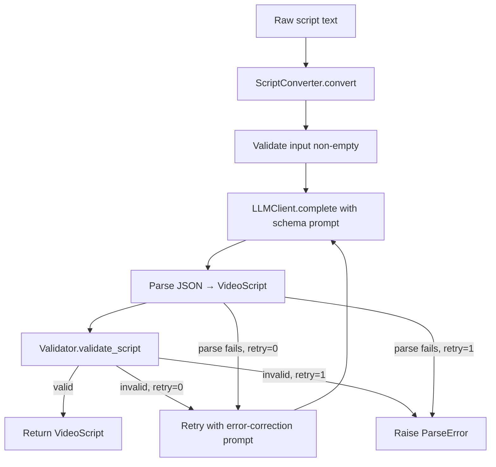
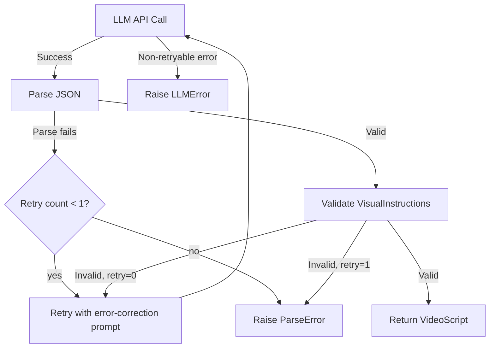

# Design Document: Script Converter

## Overview

The Script Converter sits between the user's creative process and the Asset Orchestrator: **User (Gemini Pro script) → Script Converter → Asset Orchestrator**. The user writes a video script externally (using Gemini Pro or any tool), pastes the raw text into the engine, and the Script Converter uses GPT-4o-mini to restructure it into a validated `VideoScript` JSON that the Asset Orchestrator can render directly.

This is a formatting/structuring task, not content generation. The LLM preserves the user's narration and maps visual cues to the Asset Orchestrator's scene types.

```
┌──────────────┐     raw text       ┌──────────────────┐     VideoScript      ┌─────────────────────┐
│  User writes  │ ────────────────▶  │  Script Converter │ ──────────────────▶  │  Asset Orchestrator │
│  (Gemini Pro) │                    │  (GPT-4o-mini)    │                      │  (Manim renderer)   │
└──────────────┘                    └──────────────────┘                      └─────────────────────┘
```

## Architecture



### Module Layout

```
script_generator/
├── __init__.py          # Public API: ScriptConverter, VideoScript, SceneBlock, etc.
├── config.py            # ConverterConfig dataclass
├── models.py            # VideoScript, SceneBlock dataclasses
├── converter.py         # ScriptConverter orchestrator class
├── llm_client.py        # OpenAI API wrapper (JSON mode)
├── validator.py         # VisualInstruction schema validation
├── serializer.py        # JSON ↔ VideoScript round-trip serialization
├── exceptions.py        # ValidationError, ParseError, AuthenticationError, LLMError
└── logger.py            # Logging factory
```

### Integration Points

| Boundary | Input | Output | Contract |
|---|---|---|---|
| User → Script Converter | Raw script text (string) | — | Non-empty string |
| Script Converter → Asset Orchestrator | — | `VideoScript` with validated `VisualInstruction` dicts | Each instruction matches `VisualInstruction(type, title, data, style?)` |
| Script Converter → OpenAI API | System prompt (schema) + user message (raw text) | JSON string matching `VideoScript` schema | Uses `openai` SDK, `response_format={"type": "json_object"}` |

## Components and Interfaces

### 1. ScriptConverter (`converter.py`)

The main orchestrator. Single public method `convert()`.

```python
class ScriptConverter:
    def __init__(self, config: ConverterConfig | None = None):
        """
        Loads config (env vars + overrides), initializes LLMClient,
        Validator, Serializer, Logger.
        Raises AuthenticationError if OPENAI_API_KEY is missing.
        Raises ValidationError for invalid config values.
        """

    def convert(self, raw_script: str) -> VideoScript:
        """
        1. Validate raw_script is non-empty
        2. Build system prompt with VideoScript schema + valid visual types
        3. Call LLMClient.complete(system_prompt, raw_script)
        4. Parse JSON response → VideoScript via Serializer
        5. Validate all VisualInstructions via Validator
        6. On parse/validation failure: retry once with error-correction prompt
        7. On second failure: raise ParseError
        8. Return validated VideoScript
        """
```

### 2. LLMClient (`llm_client.py`)

Thin wrapper around the `openai` Python SDK.

```python
class LLMClient:
    def __init__(self, api_key: str, model: str = "gpt-4o-mini"):
        """
        Initializes OpenAI client.
        Raises AuthenticationError if api_key is empty/None.
        """

    def complete(self, system_prompt: str, user_message: str) -> LLMResponse:
        """
        Calls openai.chat.completions.create() with JSON mode.
        Returns LLMResponse(content, prompt_tokens, completion_tokens, model).
        Raises LLMError for non-retryable API errors.
        """
```

`LLMResponse` is a simple dataclass:
```python
@dataclass
class LLMResponse:
    content: str          # Raw JSON string from the LLM
    prompt_tokens: int
    completion_tokens: int
    model: str
```

### 3. Validator (`validator.py`)

Validates `VisualInstruction` dicts against the Asset Orchestrator's expected schemas.

```python
class Validator:
    VALID_TYPES = {"bar_chart", "line_chart", "pie_chart", "code_snippet", "text_overlay"}

    def validate_script(self, script: VideoScript) -> list[str]:
        """
        Validates all scene blocks. Returns list of violation strings.
        Empty list = valid.
        """

    def validate_instruction(self, instruction: dict) -> list[str]:
        """
        Per-instruction validation:
        - type in VALID_TYPES
        - bar_chart/line_chart: data has labels (list[str]) and values (list[number]), equal length
        - pie_chart: same as above, but values must all be positive
        - code_snippet: data has code (non-empty str) and language (str)
        - text_overlay: data has text (non-empty str)
        """
```

### 4. Serializer (`serializer.py`)

Round-trip JSON serialization for `VideoScript`.

```python
class ScriptSerializer:
    def serialize(self, script: VideoScript) -> str:
        """Converts VideoScript to JSON string. Timestamps in ISO 8601."""

    def deserialize(self, json_str: str) -> VideoScript:
        """
        Parses JSON string to VideoScript.
        Raises ParseError if fields are missing or invalid.
        """
```

### 5. ConverterConfig (`config.py`)

```python
@dataclass
class ConverterConfig:
    openai_api_key: str = ""          # From OPENAI_API_KEY env var
    llm_model: str = "gpt-4o-mini"
    log_level: str = "INFO"
```

Config loading: reads `OPENAI_API_KEY` from env, merges with any overrides passed to constructor. Validates at init time.

### 6. Exceptions (`exceptions.py`)

```python
class ScriptConverterError(Exception): ...        # Base
class ValidationError(ScriptConverterError): ...   # Invalid input or visual instructions
class ParseError(ScriptConverterError): ...        # LLM response or JSON parse failure
class AuthenticationError(ScriptConverterError): ...  # Missing/invalid API key
class LLMError(ScriptConverterError): ...          # Non-retryable LLM API errors
```

## Data Models

### VideoScript

```python
@dataclass
class VideoScript:
    title: str
    scenes: list[SceneBlock]          # 5-10 scenes
    generated_at: datetime            # UTC timestamp
    total_word_count: int             # Sum of narration words across scenes
    metadata: dict                    # Optional extra context
```

### SceneBlock

```python
@dataclass
class SceneBlock:
    scene_number: int
    narration_text: str
    visual_instruction: dict          # {type, title, data, style?}
```

The `visual_instruction` dict follows the Asset Orchestrator's `VisualInstruction` schema:

| type | Required data keys | Constraints |
|---|---|---|
| `bar_chart` | `labels: list[str]`, `values: list[number]` | `len(labels) == len(values)` |
| `line_chart` | `labels: list[str]`, `values: list[number]` | `len(labels) == len(values)` |
| `pie_chart` | `labels: list[str]`, `values: list[number]` | `len(labels) == len(values)`, all values > 0 |
| `code_snippet` | `code: str`, `language: str` | `code` non-empty |
| `text_overlay` | `text: str` | `text` non-empty |

## Correctness Properties

### Property 1: Serialization round-trip

*For any* valid `VideoScript` object, calling `ScriptSerializer.serialize()` then `ScriptSerializer.deserialize()` shall produce a `VideoScript` that is equivalent to the original (same title, scene count, narration texts, visual instructions, and generated_at timestamp in ISO 8601).

**Validates: Requirements 5.1, 5.2, 5.3, 5.5**

### Property 2: Invalid JSON deserialization raises ParseError

*For any* JSON string that is missing required `VideoScript` fields (title, scenes) or contains fields of the wrong type, `ScriptSerializer.deserialize()` shall raise a `ParseError` with a description of the violation.

**Validates: Requirements 5.4**

### Property 3: Visual instruction validation correctness

*For any* `VisualInstruction` dict, `Validator.validate_instruction()` shall return an empty violations list if and only if: the `type` is in `{bar_chart, line_chart, pie_chart, code_snippet, text_overlay}`, and the `data` dict conforms to the type's schema (charts: `labels` list[str] and `values` list[number] of equal length; pie_chart values all positive; code_snippet: non-empty `code` str and `language` str; text_overlay: non-empty `text` str).

**Validates: Requirements 3.3, 3.4, 4.2, 4.3, 4.4, 4.5, 4.6**

### Property 4: System prompt contains schema and valid types

*For any* call to `ScriptConverter.convert()`, the system prompt sent to the LLM shall contain the VideoScript JSON schema definition and all five valid visual instruction type names (`bar_chart`, `line_chart`, `pie_chart`, `code_snippet`, `text_overlay`).

**Validates: Requirements 2.1**

### Property 5: Configuration defaults

*For any* `ConverterConfig` created without explicit overrides, the config shall have `llm_model="gpt-4o-mini"` and `log_level="INFO"`.

**Validates: Requirements 7.2, 7.3**

## Error Handling

### Error Hierarchy

All exceptions inherit from `ScriptConverterError` to allow callers to catch all module errors with a single handler.

| Exception | Trigger | Recovery |
|---|---|---|
| `AuthenticationError` | Missing/invalid `OPENAI_API_KEY` at init | Fatal — caller must fix env |
| `ValidationError` | Empty raw script input or invalid config | Caller fixes input/config |
| `ParseError` | LLM response not valid JSON or missing required fields, after 1 retry | Caller can retry or adjust raw script |
| `LLMError` | Non-retryable OpenAI API error (e.g., 400 bad request) | Caller inspects error details |

### Retry Strategy



### Logging on Error

Every exception path logs at ERROR level with:
- Raw script length (characters) for context
- Full stack trace
- Component name (e.g., `llm_client`, `validator`, `serializer`)

## Testing Strategy

### Property-Based Testing

Library: **Hypothesis** (`hypothesis` Python package)

| Property | Test Strategy |
|---|---|
| P1: Serialization round-trip | Generate random `VideoScript`, serialize → deserialize, assert equality |
| P2: Invalid JSON | Generate JSON strings with randomly removed/corrupted fields, assert `ParseError` raised |
| P3: Validation correctness | Generate random `VisualInstruction` dicts (both valid and invalid), assert validator returns correct pass/fail |
| P4: System prompt schema | Mock LLM, call `convert()`, inspect system prompt for schema and type names |
| P5: Config defaults | Create `ConverterConfig` with no overrides, assert defaults |

### Unit Tests

- Validator: per-type pass/fail examples, unknown type, aggregate violations
- Serializer: round-trip with known object, ParseError on missing fields, ISO 8601 timestamps
- LLMClient: AuthenticationError on empty key, LLMError on bad request (mocked)
- ScriptConverter: empty input raises ValidationError, successful conversion (mocked LLM), retry on parse failure (mocked), retry on validation failure (mocked)
- Config: defaults, env var loading, invalid config raises ValidationError

### Test File Layout

```
tests/unit/
├── test_converter.py           # ScriptConverter integration tests (mocked LLM)
├── test_serializer_sg.py       # P1, P2 property tests + examples
├── test_validator_sg.py        # P3 property tests + per-type examples
├── test_llm_client_sg.py       # Auth + error handling tests
└── test_config_sg.py           # P5 property tests + defaults
```
