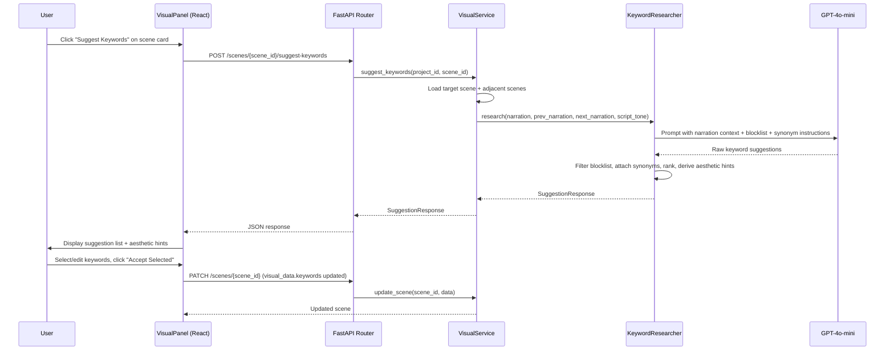
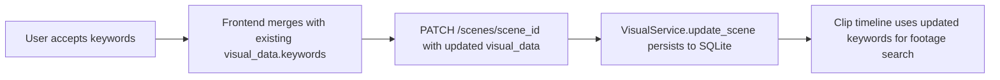

# Design Document: Keyword Suggestion Tool

## Overview

The Keyword Suggestion Tool adds a per-scene "Suggest Keywords" button to the Visual Panel that triggers a context-aware keyword researcher. The researcher analyzes the target scene's narration plus surrounding scenes (before/after) to produce ranked, visually specific keyword suggestions. Users accept, edit, or dismiss suggestions — accepted keywords are persisted into the scene's `visual_data.keywords` array for use by the clip timeline and stock footage search pipeline.

The system enforces anti-pattern rules (blocking generic clichés like "man in office"), generates visual synonyms for niche/proprietary terms, and provides aesthetic hints to maintain visual consistency across scenes.

### Key Design Decisions

1. **Single new API endpoint** — `POST /api/projects/{project_id}/scenes/{scene_id}/suggest-keywords`. All keyword research logic lives server-side; the frontend only renders suggestions and sends accepted keywords back via the existing `PATCH` scene endpoint.
2. **Enhanced KeywordResearcher class** — A new module `asset_orchestrator/keyword_researcher.py` replaces the simple `keyword_extractor.py` for suggestion use cases. The existing extractor remains for backward-compatible auto-extraction during renders.
3. **LLM-driven with fallback** — GPT-4o-mini generates context-aware suggestions. On failure, a simple noun/adjective extraction fallback ensures the endpoint never errors out silently.
4. **Blocklist as data, not code** — The anti-pattern blocklist is a constant list in the researcher module, easily extensible without code changes.
5. **Frontend state is local** — Suggestion lists are ephemeral React state. Only accepted keywords are persisted to the database.

## Architecture



### Component Boundaries

- **Frontend (VisualPanel)**: Renders the suggestion UI, manages selection state, sends accepted keywords via existing PATCH endpoint. No keyword logic lives here.
- **API Router (visuals.py)**: Thin route handler — validates scene exists and is a stock type, delegates to VisualService.
- **VisualService**: Orchestrates scene lookup (target + neighbors), calls KeywordResearcher, returns structured response.
- **KeywordResearcher**: Pure logic module — takes narration strings, returns ranked suggestions with synonyms and aesthetic hints. Owns the blocklist and LLM prompt.

## Components and Interfaces

### 1. KeywordResearcher (`asset_orchestrator/keyword_researcher.py`)

New module. Core research engine.

```python
from pydantic import BaseModel

class KeywordSuggestion(BaseModel):
    keyword: str
    rank: int
    original_term: str | None = None
    visual_synonym: str | None = None

class SuggestionResponse(BaseModel):
    suggestions: list[KeywordSuggestion]
    aesthetic_hints: list[str]

class KeywordResearcher:
    """Context-aware keyword researcher with anti-pattern enforcement."""

    BLOCKLIST: list[str]  # Banned generic patterns

    def __init__(self, use_llm: bool = True) -> None: ...

    def research(
        self,
        narration: str,
        prev_narration: str | None = None,
        next_narration: str | None = None,
        script_tone: str | None = None,
    ) -> SuggestionResponse:
        """Generate ranked keyword suggestions from narration context.
        
        Returns 5-8 suggestions with visual synonyms and 2-3 aesthetic hints.
        Falls back to simple noun extraction if LLM fails.
        """
        ...

    def _research_with_llm(
        self,
        narration: str,
        prev_narration: str | None,
        next_narration: str | None,
        script_tone: str | None,
    ) -> SuggestionResponse: ...

    def _research_fallback(self, narration: str) -> SuggestionResponse: ...

    def _filter_blocklist(self, suggestions: list[KeywordSuggestion], narration: str) -> list[KeywordSuggestion]:
        """Replace any blocklisted keywords with context-derived alternatives. Logs replacements."""
        ...

    def _is_blocked(self, keyword: str) -> bool:
        """Check if keyword matches any blocklist pattern (case-insensitive substring match)."""
        ...
```

### 2. API Endpoint (`studio_api/routers/visuals.py`)

New route added to existing router.

```python
class SuggestKeywordsResponse(BaseModel):
    suggestions: list[dict]  # [{keyword, rank, original_term, visual_synonym}]
    aesthetic_hints: list[str]

@router.post("/{scene_id}/suggest-keywords", response_model=SuggestKeywordsResponse)
def suggest_keywords(
    scene_id: int,
    project_id: str = Depends(_verify_project),
    service: VisualService = Depends(_get_visual_service),
) -> SuggestKeywordsResponse:
    """Generate context-aware keyword suggestions for a stock footage scene."""
    ...
```

Returns:
- `200` with `SuggestionResponse` on success
- `404` if scene not found
- `422` if scene is not a stock footage type

### 3. VisualService Extension (`studio_api/services/visual_service.py`)

New method on existing class.

```python
def suggest_keywords(self, project_id: str, scene_id: int) -> SuggestionResponse:
    """Load scene + neighbors, call KeywordResearcher, return suggestions.
    
    Raises ValueError if scene not found or not a stock type.
    """
    ...
```

### 4. Frontend API Client (`frontend/src/api/visuals.ts`)

New function.

```typescript
export interface KeywordSuggestion {
  keyword: string
  rank: number
  original_term: string | null
  visual_synonym: string | null
}

export interface SuggestKeywordsResponse {
  suggestions: KeywordSuggestion[]
  aesthetic_hints: string[]
}

export const suggestKeywords = (projectId: string, sceneId: number) =>
  client.post<SuggestKeywordsResponse>(
    `/projects/${projectId}/scenes/${sceneId}/suggest-keywords`
  ).then(r => r.data)
```

### 5. VisualPanel UI Changes (`frontend/src/components/visual/VisualPanel.tsx`)

New state and UI elements within each stock-type scene card:

- `suggestingScene: number | null` — tracks which scene has an in-flight suggestion request
- `suggestions: Record<number, SuggestKeywordsResponse>` — cached suggestion responses per scene
- `selectedSuggestions: Record<number, Set<number>>` — which suggestions are selected per scene
- `editedKeywords: Record<string, string>` — inline-edited keyword text (keyed by `sceneId-rank`)

UI additions per scene card:
- "Suggest Keywords" button (visible for stock types, disabled while loading)
- Suggestion list panel (collapsible, shows rank + keyword + synonym)
- Aesthetic hints display
- "Accept Selected" and "Dismiss" action buttons


## Data Models

### Backend Models

#### KeywordSuggestion (Pydantic)

```python
class KeywordSuggestion(BaseModel):
    keyword: str                          # The suggested search term
    rank: int                             # 1 = most relevant
    original_term: str | None = None      # Niche term before synonym mapping (e.g., "ASML EUV")
    visual_synonym: str | None = None     # Stock-searchable equivalent (e.g., "semiconductor cleanroom laser")
    category: str | None = None           # Keyword category: "subject", "environment", "action", "abstract"
    source_hints: dict[str, str] | None = None  # Per-source optimized queries (e.g., {"pexels": "...", "pixabay": "..."})
```

#### NarrativeBeat (Pydantic)

```python
class NarrativeBeat(BaseModel):
    beat: str                             # Visual moment implied by narration (e.g., "reveal of chip under microscope")
    timestamp_hint: str | None = None     # Timing within scene: "early", "mid", "late"
    suggested_keywords: list[str] = []    # Keywords matching this beat
```

#### SuggestionResponse (Pydantic)

```python
class SuggestionResponse(BaseModel):
    suggestions: list[KeywordSuggestion]  # 5-8 ranked suggestions
    aesthetic_hints: list[str]            # 2-3 style modifiers (e.g., "dark lighting", "macro close-up")
    keyword_categories: dict[str, list[str]] = {}  # Categorized keyword map (subject, environment, action, abstract)
    narrative_beats: list[NarrativeBeat] = []       # 2-4 narrative beats with timing and matching keywords
```

#### Blocklist (constant)

```python
BLOCKLIST: list[str] = [
    "man in office",
    "woman at desk",
    "business meeting",
    "people shaking hands",
    "generic office",
    "happy team",
    "thumbs up",
    "woman at computer",
]
```

### Frontend Types

```typescript
export interface KeywordSuggestion {
  keyword: string
  rank: number
  original_term: string | null
  visual_synonym: string | null
  category: string | null          // "subject" | "environment" | "action" | "abstract"
  source_hints: Record<string, string> | null  // per-source optimized queries
}

export interface NarrativeBeat {
  beat: string
  timestamp_hint: string | null    // "early" | "mid" | "late"
  suggested_keywords: string[]
}

export interface SuggestKeywordsResponse {
  suggestions: KeywordSuggestion[]
  aesthetic_hints: string[]
  keyword_categories: Record<string, string[]>  // categorized keyword map
  narrative_beats: NarrativeBeat[]
}
```

### Database Impact

No schema changes. Accepted keywords are stored in the existing `visual_data` JSON column on the `scenes` table via the existing `PATCH /scenes/{scene_id}` endpoint. The `visual_data.keywords` array is already used by the clip timeline and stock footage pipeline.

### LLM Prompt Structure

The KeywordResearcher sends a structured prompt to GPT-4o-mini:

```
System: You are a stock footage keyword researcher for technical video production.
You generate visually specific, concrete keywords for stock footage searches.

Rules:
- Return 5-8 keywords ranked by relevance
- Prefer technical, specific, visually concrete terms
- NEVER suggest generic clichés: {blocklist}
- For niche/proprietary terms, provide a visual_synonym mapping
- Derive 2-3 aesthetic hints from the overall tone

User:
Target scene narration: {narration}
Previous scene narration: {prev_narration or "N/A"}
Next scene narration: {next_narration or "N/A"}
Script tone: {script_tone or "technical, analytical"}

Return JSON:
{
  "suggestions": [{"keyword": "...", "rank": 1, "original_term": null, "visual_synonym": null}, ...],
  "aesthetic_hints": ["dark lighting", "macro close-up"]
}
```

The LLM response is parsed as JSON. If parsing fails, the fallback extractor is used.

### Data Flow for Keyword Acceptance



Accepted keywords are prepended to the existing `visual_data.keywords` array, so they take priority in clip timeline searches.


## Correctness Properties

*A property is a characteristic or behavior that should hold true across all valid executions of a system — essentially, a formal statement about what the system should do. Properties serve as the bridge between human-readable specifications and machine-verifiable correctness guarantees.*

### Property 1: Suggest button visibility by visual type and render status

*For any* scene with a stock footage visual type (stock_video, stock_with_text, stock_with_stat, stock_quote) and *for any* render status (PENDING, RUNNING, RENDERED, FAILED), the "Suggest Keywords" button shall be present. *For any* scene with a non-stock visual type, the button shall be absent.

**Validates: Requirements 1.1, 1.4**

### Property 2: Suggestion count and aesthetic hint count bounds

*For any* valid narration text input, the KeywordResearcher shall return between 5 and 8 keyword suggestions (inclusive), each with a unique integer rank from 1 to N, and between 2 and 3 aesthetic hints (inclusive).

**Validates: Requirements 2.6, 7.1**

### Property 3: Keyword merge ordering on acceptance

*For any* list of existing keywords in a scene's visual_data and *for any* non-empty list of accepted keywords, the resulting keywords array after acceptance shall equal the accepted keywords concatenated before the existing keywords, with no duplicates removed and no reordering within either group.

**Validates: Requirements 3.6, 3.8, 8.2**

### Property 4: Dismiss preserves scene state

*For any* scene with suggestions displayed, dismissing the suggestion list shall leave the scene's visual_data.keywords array identical to its state before the suggestion request was made.

**Validates: Requirements 3.7**

### Property 5: Neighbor narration context assembly

*For any* ordered list of scenes in a project and *for any* target scene at index i, the suggest-keywords endpoint shall pass: the scene at index i-1's narration as prev_narration (or None if i=0), and the scene at index i+1's narration as next_narration (or None if i is the last scene).

**Validates: Requirements 4.2**

### Property 6: Response schema structure

*For any* successful suggest-keywords response, each suggestion entry shall contain: keyword (non-empty string), rank (positive integer), original_term (string or null), and visual_synonym (string or null). The response shall also contain an aesthetic_hints field that is a list of strings.

**Validates: Requirements 4.4, 7.3**

### Property 7: Non-stock scene type rejection

*For any* scene whose visual_type is not in the set {stock_video, stock_with_text, stock_with_stat, stock_quote}, calling the suggest-keywords endpoint shall return HTTP 422.

**Validates: Requirements 4.6**

### Property 8: Blocklist filtering

*For any* keyword suggestion output from the KeywordResearcher, no suggestion's keyword field shall match (case-insensitive substring) any entry in the blocklist. If the LLM produces a blocklisted keyword, it shall be replaced with an alternative, and the output shall contain no blocklisted terms.

**Validates: Requirements 5.2**

### Property 9: Visual synonym structural consistency

*For any* keyword suggestion that has a non-null visual_synonym, the original_term field shall also be non-null. Conversely, if original_term is null, then visual_synonym shall also be null.

**Validates: Requirements 6.2**

### Property 10: Keyword persistence round trip

*For any* set of accepted keywords written to a scene via the PATCH endpoint, subsequently fetching that scene via the GET endpoint shall return a visual_data.keywords array whose first N elements are exactly the accepted keywords in the same order.

**Validates: Requirements 8.4**

## Error Handling

| Scenario | Component | Behavior |
|---|---|---|
| LLM call fails (timeout, API error, rate limit) | KeywordResearcher | Falls back to simple noun/adjective extraction from narration. Logs warning. Returns valid SuggestionResponse with fallback results. |
| LLM returns unparseable JSON | KeywordResearcher | Catches JSON parse error, falls back to simple extraction. Logs warning with raw response. |
| Scene not found | API Router | Returns HTTP 404 with `{"type": "not_found", "message": "Scene {id} not found"}` |
| Scene is not a stock footage type | API Router | Returns HTTP 422 with `{"type": "validation_error", "message": "Keyword suggestions are only available for stock footage scenes"}` |
| Project not found | API Router (existing `_verify_project`) | Returns HTTP 404 |
| Network error on frontend API call | VisualPanel | Displays error message on scene card, re-enables "Suggest Keywords" button |
| Empty narration text | KeywordResearcher | Returns generic technical keywords from title/visual_data. Does not error. |
| PATCH to save accepted keywords fails | VisualPanel | Displays error toast, keeps suggestion list open so user can retry |

## Testing Strategy

### Property-Based Testing

Use `hypothesis` (Python) for backend property tests and `fast-check` (TypeScript) for frontend property tests. Each property test runs a minimum of 100 iterations.

**Backend property tests** (`tests/property/test_keyword_researcher_properties.py`):

- **Feature: video-script-schema, Property 2**: Generate random narration strings → call `KeywordResearcher.research()` (with mocked LLM returning valid structured JSON) → assert 5-8 suggestions with unique ranks 1..N and 2-3 aesthetic hints
- **Feature: video-script-schema, Property 5**: Generate random lists of scenes (1-20 scenes) with random narration text → for each scene index, call `suggest_keywords` service method → assert correct prev/next narration passed to researcher
- **Feature: video-script-schema, Property 6**: Generate random SuggestionResponse objects → serialize to JSON → assert each entry has required fields with correct types
- **Feature: video-script-schema, Property 7**: Generate random non-stock visual types → call suggest-keywords endpoint → assert HTTP 422
- **Feature: video-script-schema, Property 8**: Generate random keyword lists that include blocklisted terms → pass through `_filter_blocklist` → assert no output keyword matches any blocklist entry
- **Feature: video-script-schema, Property 9**: Generate random SuggestionResponse objects → assert visual_synonym is non-null iff original_term is non-null

**Frontend property tests** (`tests/property/test_keyword_merge.test.ts`):

- **Feature: video-script-schema, Property 1**: Generate random visual types and render statuses → assert button visibility matches stock-type membership
- **Feature: video-script-schema, Property 3**: Generate random existing keyword arrays and random accepted keyword arrays → merge → assert result equals `[...accepted, ...existing]`
- **Feature: video-script-schema, Property 4**: Generate random scene states → simulate dismiss → assert visual_data unchanged
- **Feature: video-script-schema, Property 10**: Generate random keyword arrays → save via API → reload → assert first N elements match

### Unit Tests

Unit tests cover specific examples, edge cases, and integration points:

- KeywordResearcher with mocked LLM: verify prompt includes prev/next narration when provided
- KeywordResearcher fallback: verify noun extraction produces reasonable keywords from sample narration
- Blocklist: verify each specific blocklist entry is caught (e.g., "man in office" → replaced)
- Blocklist logging: verify log output contains original and replacement keyword
- API endpoint: 404 for nonexistent scene, 422 for data_chart scene type
- First scene (no prev): verify prev_narration is None
- Last scene (no next): verify next_narration is None
- Empty narration: verify fallback produces non-empty keywords
- Frontend: "Accept Selected" calls PATCH with correct payload
- Frontend: inline edit modifies keyword text before acceptance

