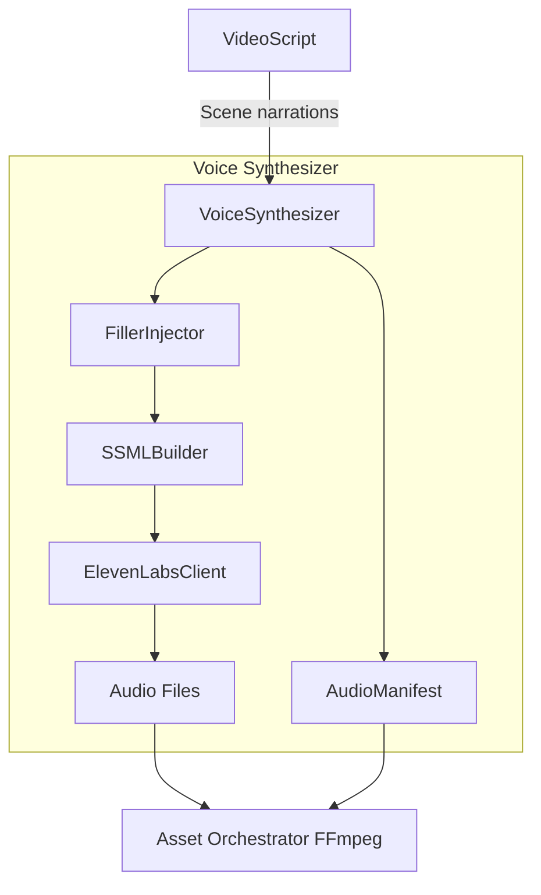
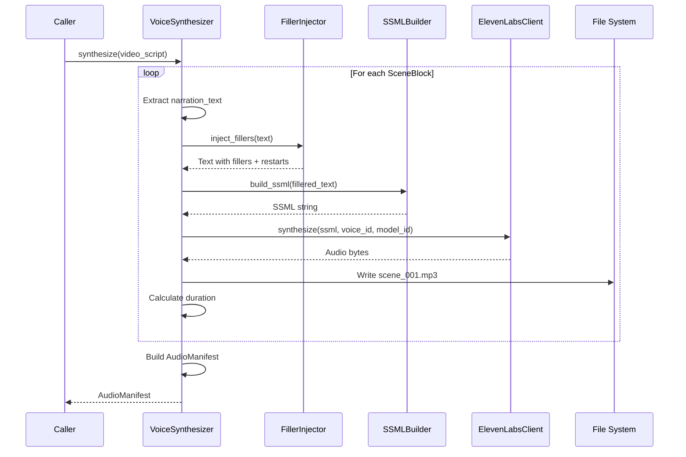
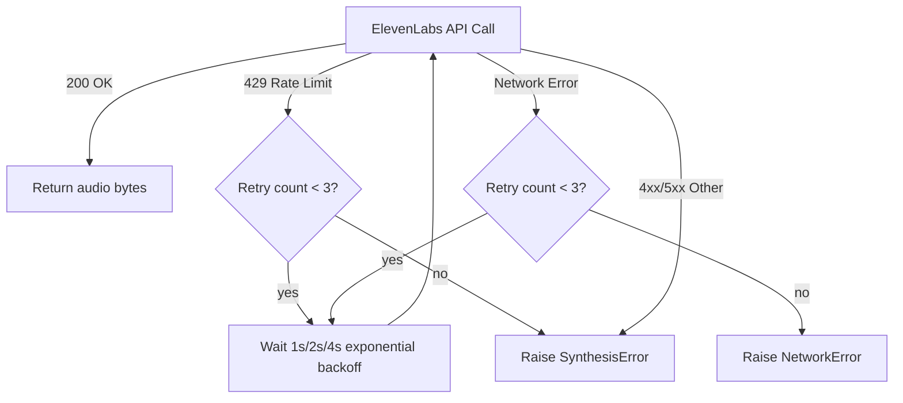

# Design Document: Voice Synthesizer

## Overview

The Voice Synthesizer sits between the Script Converter and the Asset Orchestrator's FFmpeg composition step: **VideoScript → Voice Synthesizer → Audio Files → FFmpeg Wrapper → Composed Video**. It takes the `narration_text` from each `SceneBlock` in a `VideoScript`, injects conversational filler and natural speech patterns via SSML, synthesizes audio through the ElevenLabs API, and outputs per-scene audio files with a manifest for downstream composition.

The key differentiator is the Filler Injection system — instead of producing clean, robotic TTS output, the module deliberately introduces "uh", "hmm", thinking pauses, and mid-sentence restarts to make the AI voice sound like a real person explaining something off the cuff.

```
┌──────────────────┐   narration text    ┌─────────────────────┐   per-scene MP3s    ┌─────────────────────┐
│  Script Converter │ ─────────────────▶  │  Voice Synthesizer  │ ─────────────────▶  │  Asset Orchestrator │
│  (VideoScript)    │                     │  (SSML + ElevenLabs)│                     │  (FFmpeg compose)   │
└──────────────────┘                     └─────────────────────┘                     └─────────────────────┘
```

## Architecture

### System Components



### Data Flow



### Module Layout

```
voice_synthesizer/
├── __init__.py              # Public API exports
├── config.py                # VoiceConfig dataclass
├── models.py                # SceneAudio, AudioManifest dataclasses
├── synthesizer.py           # VoiceSynthesizer orchestrator class
├── ssml_builder.py          # SSMLBuilder — SSML wrapping + pacing
├── filler_injector.py       # FillerInjector — conversational filler + restarts
├── elevenlabs_client.py     # ElevenLabsClient — API wrapper
├── exceptions.py            # SynthesisError, AuthenticationError, etc.
└── logger.py                # Logging factory
```

### Integration Points

| Boundary | Input | Output | Contract |
|---|---|---|---|
| Script Converter → Voice Synthesizer | `VideoScript` dataclass | — | Contains `scenes: list[SceneBlock]` with `narration_text` |
| Voice Synthesizer → File System | Audio bytes | `output/audio/scene_001.mp3` | MP3 files, one per scene |
| Voice Synthesizer → Asset Orchestrator | `AudioManifest` | — | Maps scene_number → absolute audio file path |
| Voice Synthesizer → ElevenLabs API | SSML string + voice config | Raw audio bytes | Uses `elevenlabs` SDK or REST API |

## Components and Interfaces

### 1. VoiceSynthesizer (`synthesizer.py`)

The main orchestrator. Single public method `synthesize()`.

```python
class VoiceSynthesizer:
    def __init__(self, config: VoiceConfig | None = None):
        """
        Loads config (env vars + overrides), initializes FillerInjector,
        SSMLBuilder, ElevenLabsClient, Logger.
        Raises AuthenticationError if ELEVENLABS_API_KEY is missing.
        Raises ValidationError for invalid config values.
        """

    def synthesize(self, video_script: VideoScript) -> AudioManifest:
        """
        Synthesize narration audio for all scenes in a VideoScript.

        1. Extract narration_text from each SceneBlock (in scene_number order)
        2. Skip scenes with empty/whitespace narration (log warning)
        3. For each scene:
           a. Inject conversational fillers (if enabled)
           b. Build SSML with pacing controls
           c. Call ElevenLabs API to synthesize audio
           d. Write audio bytes to output file
           e. Calculate duration from written file
           f. Create SceneAudio entry
        4. On per-scene failure: log error, record failed entry, continue
        5. Build and return AudioManifest with all entries + metadata

        Returns:
            AudioManifest with per-scene audio paths and summary metadata.
        """
```

### 2. FillerInjector (`filler_injector.py`)

Injects conversational filler words, thinking pauses, and mid-sentence restarts into plain narration text to simulate natural human speech.

```python
class FillerInjector:
    DEFAULT_FILLERS = [
        "uh", "um", "hmm", "so", "like", "you know",
        "basically", "right", "I mean", "well",
    ]

    # Patterns that should never have fillers injected inside them
    PROTECTED_PATTERNS = [
        r'`[^`]+`',           # Inline code
        r'"[^"]*"',           # Quoted strings
        r"'[^']*'",           # Single-quoted strings
        r'\b[A-Z][a-z]+(?:\s+[A-Z][a-z]+)+\b',  # Proper nouns (multi-word)
        r'\b[A-Z]{2,}\b',    # Acronyms
    ]

    def __init__(
        self,
        filler_density: float = 0.15,
        restart_probability: float = 0.05,
        min_thinking_pause_ms: int = 150,
        max_thinking_pause_ms: int = 500,
        filler_vocabulary: list[str] | None = None,
        seed: int | None = None,
    ):
        """
        Args:
            filler_density: Probability of inserting a filler at each
                eligible point (0.0–1.0).
            restart_probability: Probability of a mid-sentence restart
                at each eligible point (0.0–1.0).
            min_thinking_pause_ms: Minimum thinking pause before fillers.
            max_thinking_pause_ms: Maximum thinking pause before fillers.
            filler_vocabulary: Override default filler words.
            seed: Random seed for deterministic output (None = random).
        """

    def inject(self, text: str) -> str:
        """
        Insert filler words, thinking pauses, and occasional mid-sentence
        restarts into the narration text.

        1. Identify protected spans (code refs, quotes, proper nouns)
        2. Identify eligible insertion points (clause boundaries,
           before conjunctions, after introductory phrases)
        3. At each eligible point, roll filler_density probability:
           - If hit: pick random filler, prepend thinking pause marker
        4. At each eligible point, roll restart_probability:
           - If hit: truncate current clause, insert pause + filler,
             rephrase remainder
        5. Return modified text with pause markers (converted to SSML
           break elements by SSMLBuilder)

        Returns:
            Text with filler words and pause markers inserted.
        """

    def _find_insertion_points(self, text: str, protected_spans: list[tuple[int, int]]) -> list[int]:
        """Find character positions eligible for filler insertion."""

    def _generate_restart(self, clause: str) -> str:
        """Generate a mid-sentence restart for a clause."""
```

### 3. SSMLBuilder (`ssml_builder.py`)

Transforms narration text (with or without filler markers) into valid SSML.

```python
class SSMLBuilder:
    VALID_RATES = {"x-slow", "slow", "medium", "fast", "x-fast"}

    def __init__(
        self,
        sentence_pause_ms: int = 400,
        paragraph_pause_ms: int = 800,
        speaking_rate: str = "medium",
    ):
        """
        Args:
            sentence_pause_ms: Pause duration after sentences.
            paragraph_pause_ms: Pause duration after paragraphs.
            speaking_rate: Prosody rate (x-slow|slow|medium|fast|x-fast|percentage).
        """

    def build(self, text: str) -> str:
        """
        Convert narration text to SSML.

        1. Escape XML special characters (&, <, >, ", ')
        2. Convert thinking pause markers to <break> elements
        3. Insert sentence-boundary <break> elements
        4. Insert paragraph-boundary <break> elements
        5. Wrap in <prosody rate="..."> element
        6. Wrap in <speak> root element

        Returns:
            Valid SSML string.
        """

    def _escape_xml(self, text: str) -> str:
        """Escape XML special characters."""

    def _insert_sentence_breaks(self, text: str) -> str:
        """Insert <break> after sentence boundaries."""

    def _insert_paragraph_breaks(self, text: str) -> str:
        """Insert <break> after paragraph boundaries (double newline)."""
```

### 4. ElevenLabsClient (`elevenlabs_client.py`)

Thin wrapper around the ElevenLabs Text-to-Speech API.

```python
class ElevenLabsClient:
    BASE_URL = "https://api.elevenlabs.io/v1"
    SUPPORTED_FORMATS = {
        "mp3_44100_128", "mp3_44100_192", "pcm_16000", "pcm_24000"
    }

    def __init__(
        self,
        api_key: str,
        voice_id: str = "21m00Tcm4TlvDq8ikWAM",  # "Rachel" default
        model_id: str = "eleven_multilingual_v2",
        stability: float = 0.5,
        similarity_boost: float = 0.75,
        style: float = 0.0,
        output_format: str = "mp3_44100_128",
    ):
        """
        Args:
            api_key: ElevenLabs API key.
            voice_id: Voice ID for synthesis.
            model_id: Model ID.
            stability: Voice stability (0.0–1.0).
            similarity_boost: Similarity boost (0.0–1.0).
            style: Style exaggeration (0.0–1.0).
            output_format: Audio output format.

        Raises:
            AuthenticationError: If api_key is empty or None.
        """

    def synthesize(self, ssml_text: str) -> bytes:
        """
        Call ElevenLabs TTS endpoint with SSML text.

        Args:
            ssml_text: SSML-annotated narration text.

        Returns:
            Raw audio bytes in the configured format.

        Raises:
            SynthesisError: If API returns an error after retries.
            NetworkError: If network connectivity fails after retries.
        """

    def _call_api(self, ssml_text: str) -> bytes:
        """
        Make the actual HTTP request to ElevenLabs.
        Retries up to 3 times on HTTP 429 with exponential backoff (1s, 2s, 4s).
        """
```

### 5. VoiceConfig (`config.py`)

```python
@dataclass
class VoiceConfig:
    # API settings
    elevenlabs_api_key: str = ""       # From ELEVENLABS_API_KEY env var
    voice_id: str = "21m00Tcm4TlvDq8ikWAM"  # "Rachel" default
    model_id: str = "eleven_multilingual_v2"

    # Voice tuning
    stability: float = 0.5
    similarity_boost: float = 0.75
    style: float = 0.0

    # SSML pacing
    sentence_pause_ms: int = 400
    paragraph_pause_ms: int = 800
    speaking_rate: str = "medium"

    # Filler injection
    filler_enabled: bool = True
    filler_density: float = 0.15
    restart_probability: float = 0.05
    min_thinking_pause_ms: int = 150
    max_thinking_pause_ms: int = 500
    filler_seed: int | None = None
    filler_vocabulary: list[str] | None = None

    # Output
    output_format: str = "mp3_44100_128"
    output_dir: str = "output/audio"
    log_level: str = "INFO"
```

Config loading: reads `ELEVENLABS_API_KEY` from env, merges with constructor overrides. Validates ranges at init time.

### 6. Exceptions (`exceptions.py`)

```python
class VoiceSynthesizerError(Exception):
    """Base exception for all voice synthesizer errors."""

class AuthenticationError(VoiceSynthesizerError):
    """Raised when ELEVENLABS_API_KEY is missing or invalid."""

class SynthesisError(VoiceSynthesizerError):
    """Raised when ElevenLabs API returns an error after retries."""
    def __init__(self, scene_number: int, message: str):
        self.scene_number = scene_number
        super().__init__(f"Scene {scene_number}: {message}")

class NetworkError(VoiceSynthesizerError):
    """Raised when network connectivity fails after retries."""

class ValidationError(VoiceSynthesizerError):
    """Raised for invalid configuration values."""
```

## Data Models

### SceneAudio

```python
@dataclass
class SceneAudio:
    """A single scene's synthesized audio result."""
    scene_number: int
    file_path: str | None       # Absolute path, None if synthesis failed
    duration_seconds: float     # 0.0 if failed
    char_count: int             # Character count of narration text
    error: str | None = None    # Error message if synthesis failed

    def to_dict(self) -> dict:
        return {
            "scene_number": self.scene_number,
            "file_path": self.file_path,
            "duration_seconds": self.duration_seconds,
            "char_count": self.char_count,
            "error": self.error,
        }
```

### AudioManifest

```python
@dataclass
class AudioManifest:
    """Manifest mapping scenes to audio files with summary metadata."""
    entries: list[SceneAudio]
    total_duration_seconds: float
    total_scenes_synthesized: int
    total_scenes_failed: int
    total_characters_processed: int
    generated_at: datetime          # UTC, ISO 8601

    def get_audio_path(self, scene_number: int) -> str | None:
        """Return file path for a scene number, or None if not found/failed."""
        for entry in self.entries:
            if entry.scene_number == scene_number:
                return entry.file_path
        return None

    def to_dict(self) -> dict:
        return {
            "entries": [e.to_dict() for e in self.entries],
            "total_duration_seconds": self.total_duration_seconds,
            "total_scenes_synthesized": self.total_scenes_synthesized,
            "total_scenes_failed": self.total_scenes_failed,
            "total_characters_processed": self.total_characters_processed,
            "generated_at": self.generated_at.isoformat(),
        }
```


## Filler Injection — Detailed Design

The filler injection system is the core differentiator. It transforms clean narration into something that sounds like a person thinking while talking.

### Insertion Point Detection

Eligible insertion points are positions in the text where a human would naturally pause, hesitate, or add a filler word:

1. Before coordinating conjunctions: "and", "but", "or", "so", "yet"
2. After introductory clauses: "However,", "In fact,", "Basically,", "So,", "Now,"
3. At clause boundaries: before relative pronouns ("which", "that", "where"), after commas that separate independent clauses
4. Before transitional phrases: "on the other hand", "in other words", "for example"

### Protected Span Detection

Before inserting fillers, the injector identifies spans that must not be modified:

- Inline code: `` `code here` ``
- Quoted strings: `"quoted text"` or `'quoted text'`
- Proper nouns: Multi-word capitalized sequences (e.g., "United States", "Google Cloud")
- Acronyms: All-caps sequences of 2+ letters (e.g., "API", "GPU", "NVIDIA")

Any insertion point that falls within a protected span is skipped.

### Filler Word Selection

Fillers are selected randomly from the vocabulary with weighted distribution to avoid repetition:

| Filler | Weight | Usage Context |
|---|---|---|
| "uh" | 0.20 | General hesitation |
| "um" | 0.15 | Thinking pause |
| "so" | 0.15 | Transitional |
| "like" | 0.10 | Casual emphasis |
| "you know" | 0.10 | Seeking agreement |
| "basically" | 0.08 | Simplification |
| "right" | 0.07 | Confirmation seeking |
| "I mean" | 0.07 | Clarification |
| "well" | 0.05 | Deliberation |
| "hmm" | 0.03 | Deep thought |

### Mid-Sentence Restart Mechanics

When a restart is triggered (at `restart_probability` rate):

1. Select a clause boundary in the current sentence
2. Take the first 2–5 words of the clause as the "false start"
3. Append an interruption marker ("—")
4. Insert a thinking pause + filler word
5. Rephrase the clause (repeat the same content, slightly restructured)

Example transformations:
- Input: `"This technology will fundamentally change cloud computing."`
- Output: `"This technology will— uh, what I mean is, this technology is going to fundamentally change cloud computing."`

- Input: `"The data shows a clear upward trend in GPU demand."`
- Output: `"The data shows a clear— hmm, basically the data points to a clear upward trend in GPU demand."`

### Pause Marker Format

The FillerInjector outputs text with embedded pause markers that the SSMLBuilder converts to `<break>` elements:

- `{{pause:250ms}}` → `<break time="250ms"/>`
- Thinking pauses before fillers: `{{pause:150ms}}` to `{{pause:500ms}}` (randomized)

## Correctness Properties

### Property 1: SSML output is well-formed XML

*For any* narration text input, the SSMLBuilder output shall be parseable as valid XML with a `<speak>` root element.

**Validates: Requirements 2.1**

### Property 2: Sentence boundaries receive pause breaks

*For any* narration text containing N sentence-ending punctuation marks (`.`, `!`, `?` followed by whitespace or end-of-string), the SSML output shall contain at least N `<break>` elements with the configured sentence pause duration.

**Validates: Requirements 2.2, 2.3**

### Property 3: Paragraph boundaries receive longer pauses

*For any* narration text containing M paragraph boundaries (double newlines), the SSML output shall contain at least M `<break>` elements with the configured paragraph pause duration, and paragraph pauses shall be longer than sentence pauses.

**Validates: Requirements 2.4**

### Property 4: XML special characters are escaped

*For any* narration text containing `&`, `<`, `>`, `"`, or `'`, the SSML output shall contain the corresponding XML entities (`&amp;`, `&lt;`, `&gt;`, `&quot;`, `&apos;`) and shall remain valid XML.

**Validates: Requirements 2.7**

### Property 5: Filler density controls insertion rate

*For any* narration text with at least 10 eligible insertion points, the ratio of actual filler insertions to eligible points shall be within ±0.10 of the configured `filler_density` (statistical property, tested over multiple runs with fixed seed).

**Validates: Requirements 9.3**

### Property 6: Protected spans are never modified

*For any* narration text containing inline code, quoted strings, proper nouns, or acronyms, those spans shall appear unchanged in the filler-injected output.

**Validates: Requirements 9.9**

### Property 7: Deterministic output with fixed seed

*For any* narration text and fixed random seed, calling `FillerInjector.inject()` twice shall produce identical output.

**Validates: Requirements 9.10**

### Property 8: Audio manifest scene count invariant

*For any* VideoScript with N non-empty scenes, the AudioManifest shall contain exactly N entries (including both successful and failed syntheses), and `total_scenes_synthesized + total_scenes_failed == N`.

**Validates: Requirements 5.1, 5.2**

### Property 9: Audio file naming convention

*For any* successfully synthesized scene with scene_number S, the output file shall be named `scene_{S:03d}.mp3` and reside in the configured output directory.

**Validates: Requirements 4.1, 4.2**

### Property 10: get_audio_path returns correct path or None

*For any* AudioManifest, `get_audio_path(scene_number)` shall return the file_path of the matching entry if it exists and succeeded, or None if the scene is not found or failed.

**Validates: Requirements 5.3**

### Property 11: Config validation rejects out-of-range values

*For any* VoiceConfig with stability, similarity_boost, style, filler_density, or restart_probability outside the 0.0–1.0 range, initialization shall raise a ValidationError.

**Validates: Requirements 7.9, 7.10**

### Property 12: Partial results on scene failure

*For any* VideoScript where K out of N scenes fail synthesis, the AudioManifest shall still contain N entries, with K entries having `file_path=None` and a non-empty `error` field, and `total_scenes_failed == K`.

**Validates: Requirements 6.1, 6.2, 6.6**

## Error Handling

### Exception Hierarchy

All exceptions inherit from `VoiceSynthesizerError` to allow callers to catch all module errors with a single handler.

| Exception | Trigger | Recovery |
|---|---|---|
| `AuthenticationError` | Missing/invalid `ELEVENLABS_API_KEY` at init | Fatal — caller must fix env |
| `ValidationError` | Invalid config values (out-of-range floats, bad speaking rate) | Caller fixes config |
| `SynthesisError` | ElevenLabs API error after 3 retries for a scene | Per-scene — logged, recorded in manifest, pipeline continues |
| `NetworkError` | Network connectivity failure after retries | Per-scene — same as SynthesisError |

### Retry Strategy



### Per-Scene Failure Handling

The VoiceSynthesizer wraps each scene's synthesis in a try/except. On failure:
1. Log at ERROR level with scene number, character count, and error details
2. Create a `SceneAudio` entry with `file_path=None` and `error=str(exception)`
3. Continue to next scene
4. Include failed entries in the final AudioManifest

## Testing Strategy

### Property-Based Testing

Library: **Hypothesis**

| Property | Test Strategy |
|---|---|
| P1: Well-formed SSML | Generate random text, build SSML, parse with `xml.etree.ElementTree` |
| P2: Sentence breaks | Generate text with random sentence counts, verify break count |
| P3: Paragraph breaks | Generate text with random paragraph counts, verify break count and duration |
| P4: XML escaping | Generate text with XML special chars, verify entities in output |
| P5: Filler density | Generate long text, inject with fixed seed, measure insertion ratio |
| P6: Protected spans | Generate text with code/quotes/proper nouns, verify unchanged |
| P7: Deterministic seed | Generate text, inject twice with same seed, assert equal |
| P8: Manifest count | Generate VideoScript with N scenes, mock API, verify manifest entries |
| P9: File naming | Generate scene numbers, verify filename pattern |
| P10: get_audio_path | Generate manifest, query each scene number, verify correct path |
| P11: Config validation | Generate out-of-range floats, verify ValidationError |
| P12: Partial results | Generate VideoScript, fail K scenes, verify manifest |

### Unit Tests

- SSMLBuilder: sentence breaks, paragraph breaks, XML escaping, prosody rate wrapping
- FillerInjector: filler insertion at clause boundaries, protected span preservation, mid-sentence restarts, empty text handling, deterministic seed
- ElevenLabsClient: AuthenticationError on missing key, retry on 429, SynthesisError after retries, successful synthesis (mocked)
- VoiceSynthesizer: full pipeline with mocked API, empty scene skipping, partial failure handling, manifest generation
- VoiceConfig: defaults, env var loading, range validation

### Test File Layout

```
tests/unit/
├── test_ssml_builder.py          # SSML generation tests
├── test_filler_injector.py       # Filler injection tests
├── test_elevenlabs_client.py     # API client tests (mocked)
├── test_voice_synthesizer.py     # Orchestrator integration tests
└── test_voice_config.py          # Configuration tests
```

### Mocking Strategy

- Mock `requests.post` for ElevenLabs API calls — return fake audio bytes
- Mock `mutagen` or audio duration calculation — return fixed durations
- Use `tmp_path` pytest fixture for output directory isolation
- Use fixed random seeds for deterministic filler injection tests
